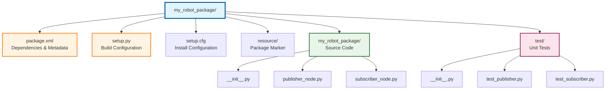
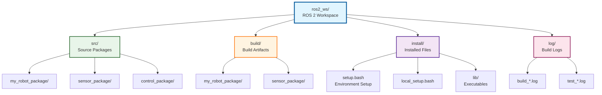

# Building ROS 2 Packages with Python

## Prerequisites
- Completed Nodes, Topics, and Services chapter
- Understanding of publisher-subscriber pattern
- ROS 2 Humble installed and configured
- Basic Python 3.10+ programming knowledge

## Introduction

In the previous chapters, you learned to write individual ROS 2 nodes that communicate through topics and services. While these scripts work perfectly for learning and experimentation, professional robotics development requires more structure. **Packages** are the fundamental unit of organization in ROS 2, transforming loose collections of Python files into reusable, shareable software components.

Think of packages as the difference between having random recipe cards scattered across your kitchen versus a well-organized cookbook with an index, ingredient lists, and proper instructions. Packages bundle your nodes, launch files, configuration, and dependencies into a coherent unit that others (or your future self) can install, build, and run with a single command. They enable version control, dependency management, and the professional workflows used by robotics teams at companies like Boston Dynamics, Waymo, and NASA's Jet Propulsion Laboratory.

By the end of this chapter, you'll create a complete turtlesim controller package from scratch—writing nodes, configuring metadata, building with `colcon`, and launching multi-node systems. This is where your robotics code becomes production-ready.

## Package Structure

Before creating your first package, understanding its anatomy is essential. A ROS 2 Python package follows a standardized directory structure that build tools, IDEs, and other developers immediately recognize. This consistency is what makes ROS 2 packages shareable across teams and organizations.



*Figure 1: ROS 2 package directory showing package.xml, setup.py, src with Python modules, test folder*

### Key Files and Directories

**package.xml** - The package manifest file that defines metadata and dependencies. This XML file declares which other ROS 2 packages your code requires (like `rclpy`, `geometry_msgs`, or `sensor_msgs`), the package version, maintainer information, and license. When you run `colcon build`, this file tells the build system what to install before compiling your package. Think of it as your package's ID card and shopping list combined.

**setup.py** - The Python build configuration file that defines entry points for executables. This is where you tell ROS 2 which Python scripts should become runnable commands. For example, if you write a `publisher_node.py` file, you configure `setup.py` to create a `publisher_node` executable that users can launch with `ros2 run my_package publisher_node`. It follows standard Python packaging conventions from `setuptools`, making ROS 2 packages compatible with Python's ecosystem.

**setup.cfg** - A companion file to `setup.py` that specifies installation paths. It ensures your package installs into the correct directories within the ROS 2 workspace (`install/lib/my_package/` for executables, `install/share/my_package/` for data files). You rarely need to modify this file manually—the package creation tool generates it with sensible defaults.

**resource/** - A directory containing a marker file with your package name. This empty file signals to ROS 2 tools that this directory is indeed a valid package. It's part of the ROS 2 package discovery mechanism. While it seems redundant, it enables workspace overlay features and prevents false-positive package detections.

**my_robot_package/** (source directory) - The Python module containing your node implementations. This directory **must** have the same name as your package and include an `__init__.py` file to make it a proper Python module. All your `.py` node files go here. When you import code between nodes (like `from my_robot_package.utils import helper_function`), Python uses this module structure.

**test/** - Contains unit tests for your nodes. Following test-driven development practices, this directory mirrors your source structure with corresponding test files. Tests validate that your nodes publish correct message types, subscribe to expected topics, and handle edge cases. They're optional during initial learning but essential for production code.

### Package Naming Conventions

ROS 2 package names must use **lowercase with underscores** (snake_case): `my_robot_controller`, not `MyRobotController` or `my-robot-controller`. This convention ensures compatibility across filesystems and build tools. Avoid generic names like `utils` or `nodes`—instead, prefix with your project name: `turtlesim_controller`, `warehouse_navigator`.

### Why This Structure Matters

This standardized layout enables powerful features. Build tools like `colcon` automatically find all packages in your workspace by scanning for `package.xml` files. IDEs like VSCode with ROS extensions auto-complete imports because they recognize the source directory structure. Other developers instantly understand where to find node implementations, tests, and dependencies. Most importantly, this structure makes your package distributable—you can push it to GitHub, and anyone with ROS 2 can clone, build, and run it with three commands.

## Creating a Package

Now that you understand package anatomy, let's create your first package. ROS 2 provides a command-line tool that scaffolds the entire structure automatically.

### The Package Creation Command

```bash
ros2 pkg create --build-type ament_python my_robot_controller
```

This single command generates a complete package skeleton with all required files. Let's break down the arguments:

- **`ros2 pkg create`** - The ROS 2 package creation utility
- **`--build-type ament_python`** - Specifies a Python package (alternative: `ament_cmake` for C++)
- **`my_robot_controller`** - Your package name (must be lowercase with underscores)

**Output**:
```
going to create a new package
package name: my_robot_controller
destination directory: /home/user/ros2_ws/src
package format: 3
version: 0.0.0
description: TODO: Package description
maintainer: ['user <user@todo.todo>']
licenses: ['TODO: License declaration']
build type: ament_python
dependencies: []
creating folder ./my_robot_controller
creating ./my_robot_controller/package.xml
creating source and test folder
creating folder ./my_robot_controller/my_robot_controller
creating ./my_robot_controller/setup.py
creating ./my_robot_controller/setup.cfg
creating folder ./my_robot_controller/resource
creating ./my_robot_controller/resource/my_robot_controller
creating ./my_robot_controller/my_robot_controller/__init__.py
creating folder ./my_robot_controller/test
creating ./my_robot_controller/test/test_copyright.py
creating ./my_robot_controller/test/test_flake8.py
creating ./my_robot_controller/test/test_pep257.py
```

### Optional Arguments

You can provide additional metadata during creation:

```bash
ros2 pkg create --build-type ament_python my_robot_controller \
  --dependencies rclpy geometry_msgs sensor_msgs \
  --description "Controller for mobile robot navigation" \
  --license Apache-2.0 \
  --maintainer-name "Your Name" \
  --maintainer-email "you@example.com"
```

The `--dependencies` flag automatically adds entries to `package.xml`, saving you manual editing. Common dependencies for Python nodes include `rclpy` (ROS 2 Python client library), `std_msgs`, `geometry_msgs`, and `sensor_msgs`.

### Package Naming Conventions

Follow these rules to avoid build errors:

1. **Lowercase only**: `turtlesim_controller` ✓, `TurtlesimController` ✗
2. **Underscores, not hyphens**: `my_robot_pkg` ✓, `my-robot-pkg` ✗
3. **No spaces or special characters**: `robot_controller` ✓, `robot controller!` ✗
4. **Descriptive and scoped**: `warehouse_nav` ✓, `utils` ✗ (too generic)

### Where to Run the Command

Always create packages inside the `src/` directory of your workspace:

```bash
cd ~/ros2_ws/src
ros2 pkg create --build-type ament_python my_robot_controller
```

This ensures `colcon build` (run from workspace root) can discover and build your package automatically.

## Adding Nodes to Packages

Creating a package generates the structure, but your nodes (the Python scripts from Chapter 2) need proper integration to become package executables. This is where `setup.py` configuration becomes critical.

### The Entry Points System

Remember writing standalone nodes like `publisher_node.py`? To run them with `ros2 run`, you must declare them as **entry points** in `setup.py`. Open your package's `setup.py` file and locate the `entry_points` section:

```python
from setuptools import setup

package_name = 'my_robot_controller'

setup(
    name=package_name,
    version='0.0.0',
    packages=[package_name],
    data_files=[
        ('share/ament_index/resource_index/packages',
            ['resource/' + package_name]),
        ('share/' + package_name, ['package.xml']),
    ],
    install_requires=['setuptools'],
    zip_safe=True,
    maintainer='Your Name',
    maintainer_email='you@example.com',
    description='Controller for mobile robot navigation',
    license='Apache-2.0',
    tests_require=['pytest'],
    entry_points={
        'console_scripts': [
            'velocity_publisher = my_robot_controller.velocity_publisher:main',
            'pose_subscriber = my_robot_controller.pose_subscriber:main',
        ],
    },
)
```

### Understanding Entry Points

The `console_scripts` list defines executable commands:

```python
'velocity_publisher = my_robot_controller.velocity_publisher:main'
```

Breaking this down:
- **`velocity_publisher`** - The command name you'll use with `ros2 run`
- **`my_robot_controller.velocity_publisher`** - Python module path (package_name.file_name)
- **`:main`** - The function to execute (conventionally `main()`)

This tells `setuptools`: "When someone runs `ros2 run my_robot_controller velocity_publisher`, execute the `main()` function from `my_robot_controller/velocity_publisher.py`."

### Adding Your Node Files

1. **Place your node in the source directory**:
   ```bash
   # Create your node file
   touch ~/ros2_ws/src/my_robot_controller/my_robot_controller/velocity_publisher.py
   ```

2. **Write your node code** (same rclpy.node.Node pattern from Chapter 2)

3. **Add entry point to setup.py**:
   ```python
   entry_points={
       'console_scripts': [
           'velocity_publisher = my_robot_controller.velocity_publisher:main',
       ],
   },
   ```

4. **Build and install**:
   ```bash
   cd ~/ros2_ws
   colcon build --packages-select my_robot_controller
   source install/setup.bash
   ```

5. **Test executability**:
   ```bash
   ros2 run my_robot_controller velocity_publisher
   ```

### Why This Matters

Without entry points, your Python scripts remain just scripts—you'd need to run them with `python3 my_robot_controller/velocity_publisher.py`, which bypasses ROS 2's workspace sourcing and discovery mechanisms. Entry points integrate your nodes into the ROS 2 ecosystem, enabling:

- **Discovery**: `ros2 pkg executables my_robot_controller` lists your nodes
- **Launch file compatibility**: Launch files can reference nodes by executable name
- **Workspace overlays**: Properly sourced executables respect workspace precedence
- **Installation**: `colcon install` places executables in standard paths

### Common Mistakes

**Mistake 1**: Forgetting to rebuild after modifying `setup.py`
```bash
# After adding entry points, you MUST rebuild
colcon build --packages-select my_robot_controller
source install/setup.bash
```

**Mistake 2**: Mismatched module paths
```python
# File location: my_robot_controller/velocity_publisher.py
# CORRECT:
'velocity_publisher = my_robot_controller.velocity_publisher:main'
# WRONG (missing package name):
'velocity_publisher = velocity_publisher:main'
```

**Mistake 3**: Missing `main()` function
Every node file must have a `main()` function that entry points can call.

## Launch Files

As your robot systems grow, manually starting nodes one-by-one in separate terminals becomes impractical. **Launch files** solve this by starting multiple nodes, setting parameters, and configuring the entire system with a single command.

### Python Launch API (The Modern Approach)

ROS 2 supports Python launch files, which offer more flexibility than the older XML format. Python launch files are executable scripts that leverage the `launch` and `launch_ros` libraries.

### Basic Launch File Structure

Create a `launch/` directory in your package and add a launch file:

```bash
mkdir -p ~/ros2_ws/src/my_robot_controller/launch
touch ~/ros2_ws/src/my_robot_controller/launch/controller_launch.py
```

**Example**: `controller_launch.py`

```python
from launch import LaunchDescription
from launch_ros.actions import Node

def generate_launch_description():
    return LaunchDescription([
        Node(
            package='turtlesim',
            executable='turtlesim_node',
            name='sim'
        ),
        Node(
            package='my_robot_controller',
            executable='velocity_publisher',
            name='controller',
            output='screen'
        ),
    ])
```

**Key Components**:

- **`generate_launch_description()`** - Required function that returns a `LaunchDescription` object
- **`LaunchDescription([...])`** - Container for all launch actions (nodes, parameters, etc.)
- **`Node(...)`** - Declares a node to launch with configuration

**Node() Parameters**:
- **`package`** - ROS 2 package containing the executable
- **`executable`** - Entry point name from `setup.py`
- **`name`** - Node name in the ROS 2 graph (overrides default)
- **`output`** - Set to `'screen'` to display logs in terminal (default: log files)

### Launching Multiple Nodes

This launch file starts both turtlesim and a custom controller:

```bash
ros2 launch my_robot_controller controller_launch.py
```

Output:
```
[INFO] [launch]: All log files can be found below /home/user/.ros/log/...
[INFO] [launch]: Default logging verbosity is set to INFO
[INFO] [turtlesim_node-1]: process started with pid [12345]
[INFO] [velocity_publisher-2]: process started with pid [12346]
[turtlesim_node-1] [INFO] [turtlesim]: Starting turtlesim with node name /sim
[velocity_publisher-2] [INFO] [controller]: Publishing velocity commands
```

### Advanced Launch File: Parameters and Remapping

```python
from launch import LaunchDescription
from launch.actions import DeclareLaunchArgument
from launch.substitutions import LaunchConfiguration
from launch_ros.actions import Node

def generate_launch_description():
    # Declare launch arguments (configurable parameters)
    use_sim_time = LaunchConfiguration('use_sim_time', default='false')

    return LaunchDescription([
        DeclareLaunchArgument(
            'use_sim_time',
            default_value='false',
            description='Use simulation time if true'
        ),

        Node(
            package='my_robot_controller',
            executable='velocity_publisher',
            name='controller',
            output='screen',
            parameters=[{
                'use_sim_time': use_sim_time,
                'max_velocity': 2.0,
                'update_rate': 10.0,
            }],
            remappings=[
                ('/cmd_vel', '/turtle1/cmd_vel'),
            ],
        ),

        Node(
            package='my_robot_controller',
            executable='pose_subscriber',
            name='pose_monitor',
            output='screen',
            remappings=[
                ('/pose', '/turtle1/pose'),
            ],
        ),
    ])
```

**New Features**:

- **`DeclareLaunchArgument`** - Defines configurable parameters passable at launch time
  ```bash
  ros2 launch my_robot_controller controller_launch.py use_sim_time:=true
  ```

- **`parameters=[{...}]`** - Sets ROS 2 parameters for the node
  - Parameters must be declared in your node code with `self.declare_parameter()`

- **`remappings=[(...)]`** - Redirects topic names
  - Example: Node publishes to `/cmd_vel`, but turtlesim expects `/turtle1/cmd_vel`
  - Remapping connects them without changing node code

### Installing Launch Files

To use launch files with `ros2 launch`, they must be installed. Update your `setup.py`:

```python
import os
from glob import glob
from setuptools import setup

package_name = 'my_robot_controller'

setup(
    # ... existing configuration ...
    data_files=[
        ('share/ament_index/resource_index/packages',
            ['resource/' + package_name]),
        ('share/' + package_name, ['package.xml']),
        # Install launch files
        (os.path.join('share', package_name, 'launch'),
            glob('launch/*.py')),
    ],
    # ... rest of setup.py ...
)
```

After modifying `setup.py`, rebuild:
```bash
colcon build --packages-select my_robot_controller
source install/setup.bash
```

### Why Use Launch Files?

1. **Multi-node orchestration**: Start entire robot systems (sensors + processing + control) with one command
2. **Reproducible configurations**: Consistent parameter settings across deployments
3. **Environment flexibility**: Override parameters for testing vs. production
4. **Dependency management**: Launch files can wait for services or topics to be ready
5. **Developer productivity**: Eliminates manual terminal juggling

### XML vs. Python Launch Files

ROS 2 supports both, but **Python is recommended** for new projects:
- **Python**: Programmatic (loops, conditionals, functions), easier to debug, better IDE support
- **XML**: Declarative, simpler for basic cases, legacy compatibility with ROS 1

For this course, we focus on Python launch files to leverage programming concepts you already know.

## Workspace Organization

When you build ROS 2 packages, you're working within a **workspace**—a directory structure that separates source code, build artifacts, installed executables, and logs. Understanding this organization is crucial for debugging build errors and managing multiple projects.



*Figure 2: ROS 2 workspace showing src, install, build, log directories and their relationships*

### The Four Directories

**src/** - Your source code lives here. Every package you create or clone goes into this directory. When you run `ros2 pkg create`, it generates a package subdirectory inside `src/`. This is the **only directory you directly modify**—the others are generated by the build system. Think of `src/` as your Git-tracked code repository.

**build/** - Build artifacts and intermediate compilation files. When `colcon build` runs, it creates a subdirectory here for each package, containing object files, CMake caches, and other compilation byproducts. **You never edit files in `build/`**—it's entirely managed by the build system. If you encounter build errors, sometimes deleting `build/` and rebuilding from scratch resolves corruption issues.

**install/** - The final destination for built executables, libraries, and data files. After a successful build, `colcon` installs your packages here following a standard ROS 2 filesystem hierarchy. This directory contains:
- **`setup.bash`** - The master environment script you source to use your workspace
- **`local_setup.bash`** - Sources only this workspace (not underlying workspaces)
- **`lib/<package_name>/`** - Executable binaries from your entry points
- **`share/<package_name>/`** - Data files like launch files, config files, meshes

When you run `ros2 run my_package my_node`, ROS 2 finds the executable in `install/lib/my_package/my_node`.

**log/** - Build logs, test outputs, and diagnostic information. Each `colcon build` run creates timestamped log files here. When builds fail, check `log/latest_build/` for detailed error messages. Test results also go here when you run `colcon test`. These logs are invaluable for debugging—always examine them before asking for help.

### Why This Separation Matters

This structure enables **clean rebuilds** (delete `build/` and `install/`, keep `src/`), **workspace overlays** (multiple workspaces stacked on top of each other), and **parallel builds** (build artifacts isolated per package). It also mirrors professional CI/CD pipelines where source, build, and install directories are separate stages.

### Typical Workflow

1. **Create/modify code**: Edit files in `src/my_package/`
2. **Build**: Run `colcon build` from workspace root (generates `build/` and `install/`)
3. **Source**: Run `source install/setup.bash` (adds executables to PATH)
4. **Test**: Run `ros2 run my_package my_node` (uses `install/` executables)
5. **Debug**: Check `log/latest_build/` if anything fails

This pattern repeats throughout development. The key insight: **you only touch `src/`**, the build system manages the rest.

## Building with colcon

`colcon` is ROS 2's build tool, replacing `catkin_make` from ROS 1. It compiles your packages, resolves dependencies, and installs executables into the workspace. Understanding `colcon` is essential because every code change requires a rebuild.

### Basic Build Command

From your workspace root (NOT inside `src/`):

```bash
cd ~/ros2_ws
colcon build
```

**What happens**:
1. `colcon` scans `src/` for packages (detects `package.xml` files)
2. Resolves dependencies between packages (builds in correct order)
3. Compiles each package (C++ nodes, Python setup.py, etc.)
4. Installs executables and files to `install/`
5. Generates environment setup scripts (`setup.bash`)

**Output**:
```
Starting >>> my_robot_controller
Finished <<< my_robot_controller [2.45s]

Summary: 1 package finished [2.67s]
```

### Building Specific Packages

When working on a single package, rebuild just that package to save time:

```bash
colcon build --packages-select my_robot_controller
```

This skips unmodified packages. For multiple specific packages:

```bash
colcon build --packages-select my_robot_controller sensor_package
```

### Useful Build Flags

**--symlink-install** - Creates symbolic links instead of copying files. Changes to Python scripts and launch files take effect immediately without rebuilding:

```bash
colcon build --symlink-install
```

**Critical for Python development**: Without `--symlink-install`, every Python code change requires a full rebuild. With it, only `setup.py` changes need rebuilding.

**--packages-up-to** - Builds a package and all its dependencies:

```bash
colcon build --packages-up-to control_package
```

If `control_package` depends on `sensor_package`, both get built.

**--packages-skip** - Excludes specific packages:

```bash
colcon build --packages-skip broken_package
```

Useful when one package has build errors but you need to work on others.

**--event-handlers console_direct+** - Shows build output in real-time (default is buffered):

```bash
colcon build --event-handlers console_direct+
```

Essential for debugging build failures—you see errors immediately.

### Common Build Errors

**Error: "package.xml not found"**
- **Cause**: Running `colcon build` outside workspace root
- **Solution**: `cd ~/ros2_ws` then retry

**Error: "Setup script not found"**
- **Cause**: Haven't sourced ROS 2 environment
- **Solution**: `source /opt/ros/humble/setup.bash` before building

**Error: "ModuleNotFoundError" in Python nodes**
- **Cause**: Forgot to rebuild after adding dependencies to `package.xml`
- **Solution**: `colcon build --packages-select your_package`

**Error: Build freezes at specific package**
- **Cause**: Infinite loop or deadlock in CMake/setup.py
- **Solution**: Ctrl+C, examine `log/latest_build/<package>/`, fix code, delete `build/<package>/`, rebuild

### Clean Builds

When in doubt, clean rebuild:

```bash
rm -rf build/ install/ log/
colcon build
```

This deletes all generated files and rebuilds from scratch. Useful after major changes like switching ROS 2 versions or updating system dependencies.

### Build Parallelization

By default, `colcon` builds packages in parallel using all CPU cores. Control this with:

```bash
colcon build --parallel-workers 4
```

Reduce if your system runs out of memory during builds.

## Sourcing Workspaces

Building creates executables, but ROS 2 won't find them until you **source** the workspace. Sourcing modifies your shell environment (PATH, PYTHONPATH, etc.) to include your workspace's installed files.

### The Setup Script

After every build, source the install directory:

```bash
source ~/ros2_ws/install/setup.bash
```

**What this does**:
- Adds `install/lib/<package>/` to PATH (so `ros2 run` finds executables)
- Adds `install/lib/python3.10/site-packages/` to PYTHONPATH (for Python imports)
- Sets ROS_PACKAGE_PATH and other ROS 2 environment variables
- Registers your packages with ROS 2's discovery system

**You must source after every build** to pick up changes. If you modify code, rebuild, but forget to source, you'll run the **old version** of your node.

### Shell-Specific Setup Files

- **Bash**: `source install/setup.bash`
- **Zsh**: `source install/setup.zsh`
- **PowerShell** (Windows): `install/setup.ps1`

`colcon` generates setup files for all shells automatically.

### Automatic Sourcing

Add to `~/.bashrc` to source automatically in new terminals:

```bash
echo "source ~/ros2_ws/install/setup.bash" >> ~/.bashrc
source ~/.bashrc
```

**Caution**: Only add this **after** you've verified your workspace builds successfully. Broken workspaces can prevent new terminals from opening.

### Workspace Overlays

ROS 2 supports layered workspaces—source multiple workspaces to combine packages. **Overlay** workspaces stack on top of an **underlay**:

```bash
# Underlay: ROS 2 system installation
source /opt/ros/humble/setup.bash

# Overlay: Your workspace
source ~/ros2_ws/install/setup.bash
```

When package names conflict, the **last sourced workspace wins**. This lets you override system packages with custom versions.

**Example**: You want to modify `turtlesim`. Clone it to `~/ros2_ws/src/`, build, and source. Now `ros2 run turtlesim turtlesim_node` uses **your** version, not the system's.

### setup.bash vs. local_setup.bash

- **`setup.bash`** - Sources this workspace **and all underlying workspaces**
- **`local_setup.bash`** - Sources **only this workspace** (assumes underlay already sourced)

Typical usage:
```bash
# One-step sourcing (includes ROS 2 base)
source ~/ros2_ws/install/setup.bash

# Two-step sourcing (explicit layers)
source /opt/ros/humble/setup.bash
source ~/ros2_ws/install/local_setup.bash
```

Both approaches are equivalent for single-workspace setups. Use `local_setup.bash` when managing complex multi-workspace overlays.

### Verifying Sourcing

Check if your workspace is sourced:

```bash
# List packages ROS 2 can see
ros2 pkg list | grep my_robot_controller

# List executables in your package
ros2 pkg executables my_robot_controller
```

If these commands show your packages, sourcing worked. If not, verify:
1. You sourced the correct path
2. You sourced **after** building
3. The build completed without errors

## Mini-Project: Turtlesim Controller

Now that you understand package structure, building, and sourcing, let's consolidate this knowledge by creating a complete ROS 2 package from scratch. This mini-project demonstrates the entire workflow: package creation, node implementation, configuration, building, and launching.

### Project Goal

Create a `turtlesim_controller` package that autonomously moves the turtlesim turtle in a circular pattern. This requires:
1. A Python node that publishes velocity commands (`geometry_msgs/Twist`)
2. Proper package configuration (`package.xml`, `setup.py`)
3. A launch file that starts both turtlesim and the controller
4. Successful build and execution in your workspace

This mirrors real-world robotics: controlling a simulated robot with custom navigation logic, packaged for reuse and distribution.

### Step 1: Create the Package

Navigate to your workspace's `src/` directory and create the package with required dependencies:

```bash
cd ~/ros2_ws/src
ros2 pkg create --build-type ament_python turtlesim_controller \
  --dependencies rclpy geometry_msgs turtlesim \
  --description "Autonomous controller for turtlesim turtle" \
  --license Apache-2.0
```

**What just happened**:
- Created `turtlesim_controller/` package directory
- Generated `package.xml` with `rclpy`, `geometry_msgs`, and `turtlesim` dependencies
- Created Python module structure: `turtlesim_controller/turtlesim_controller/`
- Set up `setup.py` and `setup.cfg` for building
- Created `test/` directory with linter tests

**Verify**:
```bash
ls turtlesim_controller/
# Output: package.xml  setup.py  setup.cfg  resource/  turtlesim_controller/  test/
```

### Step 2: Create the Controller Node

Create a new Python file for the controller node:

```bash
cd ~/ros2_ws/src/turtlesim_controller/turtlesim_controller
touch circle_controller.py
```

Open `circle_controller.py` in your editor and add the controller code (see code example below). The node will:
- Publish `Twist` messages to `/turtle1/cmd_vel` at 10 Hz
- Set linear velocity to move forward
- Set angular velocity to turn, creating circular motion

**Key implementation details**:
- Inherits from `rclpy.node.Node` (modern ROS 2 pattern)
- Uses `create_publisher()` for `geometry_msgs/Twist` messages
- Timer callback runs at 10 Hz (0.1-second intervals)
- Velocity values: `linear.x = 2.0` m/s, `angular.z = 1.0` rad/s

### Step 3: Configure Entry Points

Edit `setup.py` to make the controller executable. Locate the `entry_points` section and add:

```python
entry_points={
    'console_scripts': [
        'circle_controller = turtlesim_controller.circle_controller:main',
    ],
},
```

This creates a `circle_controller` command that runs the `main()` function from `circle_controller.py`. After building, you'll be able to run:
```bash
ros2 run turtlesim_controller circle_controller
```

**Note**: The package.xml dependencies were already added by `ros2 pkg create` with the `--dependencies` flag. If you created the package without that flag, you'd manually add:
```xml
<depend>rclpy</depend>
<depend>geometry_msgs</depend>
<depend>turtlesim</depend>
```

### Step 4: Create the Launch File

Create a `launch/` directory and launch file:

```bash
mkdir ~/ros2_ws/src/turtlesim_controller/launch
cd ~/ros2_ws/src/turtlesim_controller/launch
touch turtlesim_circle.launch.py
```

Edit `turtlesim_circle.launch.py` with the launch configuration (see code example below). This launch file will:
- Start `turtlesim_node` (the simulator)
- Start `circle_controller` (your controller)
- Set output to screen for both nodes (logs visible in terminal)

### Step 5: Install Launch Files

Update `setup.py` to install launch files. Add these imports at the top:

```python
import os
from glob import glob
```

Then modify the `data_files` list to include launch files:

```python
data_files=[
    ('share/ament_index/resource_index/packages',
        ['resource/' + package_name]),
    ('share/' + package_name, ['package.xml']),
    # Add this line to install launch files
    (os.path.join('share', package_name, 'launch'), glob('launch/*.py')),
],
```

This tells `colcon` to copy all `.py` files from `launch/` into the install directory.

### Step 6: Build the Package

From your workspace root, build the package:

```bash
cd ~/ros2_ws
colcon build --packages-select turtlesim_controller --symlink-install
```

**Flags explained**:
- `--packages-select`: Builds only `turtlesim_controller`, not other packages in workspace
- `--symlink-install`: Creates symlinks for Python files, so code changes don't require rebuilding (only `setup.py` changes need rebuilding)

**Expected output**:
```
Starting >>> turtlesim_controller
Finished <<< turtlesim_controller [1.23s]

Summary: 1 package finished [1.45s]
```

If you see errors, check:
1. `package.xml` has all dependencies
2. `setup.py` entry_points syntax is correct (note the comma after the entry)
3. `circle_controller.py` has a `main()` function
4. No Python syntax errors in your node code

### Step 7: Source the Workspace

Source the workspace to register the new package:

```bash
source ~/ros2_ws/install/setup.bash
```

**Verify package installation**:
```bash
ros2 pkg list | grep turtlesim_controller
# Output: turtlesim_controller

ros2 pkg executables turtlesim_controller
# Output: turtlesim_controller circle_controller
```

If `turtlesim_controller` doesn't appear, ensure you sourced **after** building successfully.

### Step 8: Run the Mini-Project

Launch the complete system with a single command:

```bash
ros2 launch turtlesim_controller turtlesim_circle.launch.py
```

**What you should see**:
1. A turtlesim window opens with a turtle in the center
2. Terminal shows logs from both `turtlesim_node` and `circle_controller`
3. The turtle moves in a circular pattern continuously

**Expected terminal output**:
```
[INFO] [launch]: All log files can be found below /home/user/.ros/log/...
[INFO] [launch]: Default logging verbosity is set to INFO
[INFO] [turtlesim-1]: process started with pid [12345]
[INFO] [circle_controller-2]: process started with pid [12346]
[turtlesim-1] [INFO] [turtlesim]: Starting turtlesim with node name /turtlesim
[circle_controller-2] [INFO] [circle_controller]: Circle controller started
```

**Stop the system**: Press `Ctrl+C` in the terminal. Both nodes will shut down gracefully.

### Step 9: Experiment and Extend

Now that the basic system works, try these modifications:

**Square pattern**: Change the controller to move in a square instead of a circle. Hint: Alternate between straight motion (angular.z = 0) and 90-degree turns (linear.x = 0).

**Speed control**: Add a parameter for velocity using `self.declare_parameter()` and `self.get_parameter()`.

**Topic remapping**: Launch turtlesim on a different topic namespace and remap the controller's topic in the launch file.

### Troubleshooting

**Turtle doesn't move**:
- Check topic names: `ros2 topic list` (should show `/turtle1/cmd_vel`)
- Check message flow: `ros2 topic echo /turtle1/cmd_vel` (should show Twist messages)
- Verify controller is running: `ros2 node list` (should show `/circle_controller`)

**Build errors**:
- Check `log/latest_build/turtlesim_controller/` for detailed error messages
- Ensure all Python files have correct indentation (4 spaces, not tabs)
- Verify `setup.py` entry_points syntax (common mistake: missing comma)

**Launch file not found**:
- Ensure you ran `colcon build` **after** adding the glob import and data_files line
- Verify launch file installed: `ls ~/ros2_ws/install/turtlesim_controller/share/turtlesim_controller/launch/`

### What You've Learned

This mini-project demonstrates the complete ROS 2 package development cycle:
1. **Package creation** with proper dependencies
2. **Node implementation** using `rclpy.node.Node` pattern
3. **Entry point configuration** in `setup.py`
4. **Launch file creation** with Python API
5. **Build process** with `colcon`
6. **Workspace sourcing** for environment setup
7. **System execution** with `ros2 launch`

These are the **exact same steps** you'd follow to build a real robot controller—whether it's a warehouse robot, drone, or autonomous car. The only difference is the complexity of the control logic and the number of nodes. The workflow remains identical: create, configure, build, source, launch.

### Controller Node Code

Here's the complete `circle_controller.py` implementation:

**File**: `turtlesim_controller/turtlesim_controller/circle_controller.py`

```python
import rclpy
from rclpy.node import Node
from geometry_msgs.msg import Twist


class CircleController(Node):
    """
    A ROS 2 node that publishes velocity commands to make the turtle move in a circle.

    This node demonstrates:
    - Creating a publisher for Twist messages
    - Using timers for periodic publishing
    - Setting linear and angular velocities
    """

    def __init__(self):
        super().__init__('circle_controller')

        # Create publisher for velocity commands
        # Topic: /turtle1/cmd_vel (turtlesim's default velocity topic)
        # Message type: geometry_msgs/Twist
        # Queue size: 10 (buffer for up to 10 messages)
        self.publisher_ = self.create_publisher(Twist, '/turtle1/cmd_vel', 10)

        # Create timer for periodic publishing
        # Timer period: 0.1 seconds (10 Hz publishing rate)
        # Callback: self.timer_callback (called every 0.1 seconds)
        timer_period = 0.1  # seconds
        self.timer = self.create_timer(timer_period, self.timer_callback)

        # Log startup message
        self.get_logger().info('Circle controller started - turtle will move in a circle')

    def timer_callback(self):
        """
        Timer callback function - called at 10 Hz.

        Creates and publishes a Twist message with:
        - Linear velocity: 2.0 m/s (forward motion)
        - Angular velocity: 1.0 rad/s (turning motion)

        The combination of constant linear and angular velocities
        creates circular motion.
        """
        # Create a new Twist message
        msg = Twist()

        # Set linear velocity (forward/backward motion)
        # x: forward/backward (positive = forward)
        # y: left/right (not used in 2D turtlesim)
        # z: up/down (not used in 2D turtlesim)
        msg.linear.x = 2.0  # Move forward at 2.0 m/s
        msg.linear.y = 0.0
        msg.linear.z = 0.0

        # Set angular velocity (rotation)
        # x: roll (not used in 2D turtlesim)
        # y: pitch (not used in 2D turtlesim)
        # z: yaw (rotation in 2D plane, positive = counter-clockwise)
        msg.angular.x = 0.0
        msg.angular.y = 0.0
        msg.angular.z = 1.0  # Turn counter-clockwise at 1.0 rad/s

        # Publish the velocity command
        self.publisher_.publish(msg)


def main(args=None):
    """
    Main function - entry point for the node.

    Workflow:
    1. Initialize rclpy library
    2. Create CircleController node instance
    3. Spin (keep node alive and processing callbacks)
    4. Cleanup on shutdown
    """
    # Initialize the rclpy library
    rclpy.init(args=args)

    # Create an instance of the CircleController node
    circle_controller = CircleController()

    # Spin the node (process callbacks until shutdown)
    # This keeps the timer callback running at 10 Hz
    rclpy.spin(circle_controller)

    # Cleanup: destroy node and shutdown rclpy
    # (This runs after Ctrl+C or ros2 node kill)
    circle_controller.destroy_node()
    rclpy.shutdown()


# Entry point when script is run directly
if __name__ == '__main__':
    main()
```

**Code Explanation**:

**Lines 1-3**: Import required modules
- `rclpy`: ROS 2 Python client library
- `Node`: Base class for all ROS 2 nodes
- `Twist`: Message type for velocity commands (linear + angular)

**Lines 6-14**: Class definition and docstring
- `CircleController` inherits from `Node`
- Docstring explains purpose and key concepts

**Lines 16-31**: Constructor (`__init__`)
- **Line 17**: Call parent class constructor with node name `'circle_controller'`
- **Lines 23**: Create publisher for `/turtle1/cmd_vel` topic
  - Turtlesim subscribes to this topic for velocity commands
  - `Twist` message type has linear and angular velocity fields
  - Queue size 10 buffers messages if subscriber is slow
- **Lines 28-29**: Create timer with 0.1-second period (10 Hz)
  - Calls `timer_callback()` every 100 milliseconds
  - Provides smooth, continuous motion
- **Line 32**: Log startup message (visible with `output='screen'` in launch file)

**Lines 34-64**: Timer callback
- **Line 47**: Create new `Twist` message for each callback
- **Lines 54**: Set `linear.x = 2.0` (move forward at 2 m/s)
  - In turtlesim, positive x is forward motion
  - Turtle will continuously move forward
- **Lines 63**: Set `angular.z = 1.0` (turn at 1 rad/s counter-clockwise)
  - In 2D, angular.z controls rotation (yaw)
  - Positive values turn left (counter-clockwise)
  - 1.0 rad/s ≈ 57.3 degrees/second
- **Line 66**: Publish the message
  - Sent to all subscribers on `/turtle1/cmd_vel`
  - Turtlesim receives and moves the turtle

**Lines 69-94**: Main function
- **Line 79**: Initialize rclpy (must be called before using ROS 2 features)
- **Line 82**: Instantiate `CircleController` node
- **Line 87**: Spin the node (keeps it running and processing callbacks)
  - Without spin, timer callback never executes
  - Blocks until Ctrl+C or node shutdown
- **Lines 91-92**: Cleanup on exit
  - Destroy node resources
  - Shutdown rclpy library

**Lines 96-97**: Python entry point
- Allows running with `python3 circle_controller.py` for testing
- In production, use `ros2 run` which calls `main()` via entry points

**Why Circular Motion?**
- Constant `linear.x > 0`: Turtle moves forward continuously
- Constant `angular.z > 0`: Turtle turns continuously
- Result: Forward motion + continuous turning = circular path
- Radius of circle ≈ linear.x / angular.z = 2.0 / 1.0 = 2 meters

**Modifying for Square Motion**:
To create square motion, you'd alternate between:
1. Straight: `linear.x = 2.0, angular.z = 0.0` (4 seconds)
2. Turn 90°: `linear.x = 0.0, angular.z = 1.57` (1 second for π/2 radians)

Implement this using a state machine in the timer callback.

### Package Configuration (package.xml)

Here's the complete `package.xml` for the turtlesim controller:

**File**: `turtlesim_controller/package.xml`

```xml
<?xml version="1.0"?>
<?xml-model href="http://download.ros.org/schema/package_format3.xsd" schematypens="http://www.w3.org/2001/XMLSchema"?>
<package format="3">
  <name>turtlesim_controller</name>
  <version>0.0.0</version>
  <description>Autonomous controller for turtlesim turtle</description>
  <maintainer email="you@example.com">Your Name</maintainer>
  <license>Apache-2.0</license>

  <!-- Build tool dependency -->
  <buildtool_depend>ament_python</buildtool_depend>

  <!-- Runtime dependencies -->
  <depend>rclpy</depend>
  <depend>geometry_msgs</depend>
  <depend>turtlesim</depend>

  <!-- Testing dependencies -->
  <test_depend>ament_copyright</test_depend>
  <test_depend>ament_flake8</test_depend>
  <test_depend>ament_pep257</test_depend>
  <test_depend>python3-pytest</test_depend>

  <export>
    <build_type>ament_python</build_type>
  </export>
</package>
```

**Key Elements**:

**Lines 1-2**: XML declaration and schema
- Format 3 is the current ROS 2 package format
- Schema URL validates the XML structure

**Lines 4-8**: Package metadata
- **name**: Must match package directory name
- **version**: Semantic versioning (major.minor.patch)
- **description**: Brief summary for `ros2 pkg list` output
- **maintainer**: Contact info (used if package is distributed)
- **license**: Apache-2.0 is ROS 2's recommended license

**Lines 11**: Build tool dependency
- `ament_python`: ROS 2 build system for Python packages
- Used by `colcon build` to determine how to build this package

**Lines 14-16**: Runtime dependencies
- **rclpy** (line 14): ROS 2 Python client library
  - Required for `Node`, `create_publisher`, `create_timer`, etc.
  - Without this, `import rclpy` fails
- **geometry_msgs** (line 15): Standard geometry message types
  - Provides `Twist` message definition
  - Contains linear and angular velocity fields
- **turtlesim** (line 16): Turtlesim simulator package
  - Required to run turtlesim_node in launch file
  - Provides the simulation environment

**Lines 19-22**: Test dependencies
- Linters and formatters for code quality
- `ament_copyright`: Checks license headers
- `ament_flake8`: Python style checker (PEP 8)
- `ament_pep257`: Docstring style checker
- `python3-pytest`: Unit testing framework

**Lines 24-26**: Export section
- Declares this is an `ament_python` package
- Tells `colcon` to use Python build process (not CMake)

**Dependency Types**:
- `<buildtool_depend>`: Tools needed to build the package
- `<depend>`: Required at both build and runtime
- `<test_depend>`: Only needed for testing (not in production)

These dependencies were automatically added by the `--dependencies` flag when creating the package. If you add new nodes that use different message types (e.g., `sensor_msgs` for laser scans), add them here:
```xml
<depend>sensor_msgs</depend>
```

### Build Configuration (setup.py)

Here's the complete `setup.py` for the turtlesim controller:

**File**: `turtlesim_controller/setup.py`

```python
import os
from glob import glob
from setuptools import setup

package_name = 'turtlesim_controller'

setup(
    name=package_name,
    version='0.0.0',
    packages=[package_name],
    data_files=[
        ('share/ament_index/resource_index/packages',
            ['resource/' + package_name]),
        ('share/' + package_name, ['package.xml']),
        # Install launch files
        (os.path.join('share', package_name, 'launch'), glob('launch/*.py')),
    ],
    install_requires=['setuptools'],
    zip_safe=True,
    maintainer='Your Name',
    maintainer_email='you@example.com',
    description='Autonomous controller for turtlesim turtle',
    license='Apache-2.0',
    tests_require=['pytest'],
    entry_points={
        'console_scripts': [
            'circle_controller = turtlesim_controller.circle_controller:main',
        ],
    },
)
```

**Key Elements**:

**Lines 1-3**: Imports
- **os**: Operating system interface (for file paths)
- **glob**: Pattern matching for files (`launch/*.py` finds all Python launch files)
- **setuptools**: Python packaging library (standard for ROS 2)

**Line 5**: Package name variable
- Used throughout setup.py to avoid repetition
- Must match package directory and package.xml name

**Lines 7-31**: Setup function call
- Central configuration for package installation

**Lines 8-10**: Basic metadata
- **name**: Package name (must match directory)
- **version**: Same as package.xml
- **packages**: List of Python modules to install (just `turtlesim_controller`)

**Lines 11-17**: Data files to install
- **Lines 12-13**: Resource index (required for ROS 2 package discovery)
  - Installs marker file in `share/ament_index/resource_index/packages/`
  - Enables `ros2 pkg list` to find this package
- **Line 14**: Package manifest
  - Copies `package.xml` to `share/turtlesim_controller/`
  - Used by `ros2 pkg xml` command
- **Line 16**: Launch files
  - **IMPORTANT**: This line installs launch files from `launch/` directory
  - Without this, `ros2 launch` cannot find launch files
  - `glob('launch/*.py')` finds all `.py` files in launch/
  - Installs to `share/turtlesim_controller/launch/`

**Lines 18-23**: Additional metadata
- **install_requires**: Python packages needed (setuptools is standard)
- **zip_safe**: Always True for ROS 2 Python packages
- **maintainer/email**: Contact information
- **description**: Package summary
- **license**: Same as package.xml
- **tests_require**: Testing framework (pytest)

**Lines 24-28**: Entry points (THE CRITICAL SECTION)
- **console_scripts**: Defines executable commands
- **Line 26**: Creates `circle_controller` command
  - Format: `'command_name = package.module:function'`
  - **command_name**: `circle_controller` (what you type with `ros2 run`)
  - **package.module**: `turtlesim_controller.circle_controller` (Python import path)
  - **function**: `main` (function to call from that module)

  When you run `ros2 run turtlesim_controller circle_controller`, ROS 2:
  1. Looks up `circle_controller` in entry_points
  2. Imports `turtlesim_controller.circle_controller` module
  3. Calls `main()` function from that module

**Adding More Nodes**:
If you create additional nodes, add more entries:
```python
entry_points={
    'console_scripts': [
        'circle_controller = turtlesim_controller.circle_controller:main',
        'square_controller = turtlesim_controller.square_controller:main',
        'path_follower = turtlesim_controller.path_follower:main',
    ],
},
```

**Common Mistake**: Forgetting the comma after each entry. Python requires commas in lists!

### Launch File Code

Here's the complete launch file for the turtlesim controller:

**File**: `turtlesim_controller/launch/turtlesim_circle.launch.py`

```python
from launch import LaunchDescription
from launch_ros.actions import Node


def generate_launch_description():
    """
    Launch file that starts:
    1. Turtlesim simulator (turtlesim_node)
    2. Circle controller node (circle_controller)

    Both nodes output logs to the terminal screen.
    """
    return LaunchDescription([
        # Start turtlesim simulator
        Node(
            package='turtlesim',
            executable='turtlesim_node',
            name='turtlesim',
            output='screen'
        ),

        # Start circle controller
        Node(
            package='turtlesim_controller',
            executable='circle_controller',
            name='circle_controller',
            output='screen'
        ),
    ])
```

**Code Explanation**:

**Lines 1-2**: Imports
- **launch.LaunchDescription**: Container for launch actions
- **launch_ros.actions.Node**: Action to launch a ROS 2 node

**Lines 5-29**: Launch description generator function
- **Required name**: `generate_launch_description` (ROS 2 convention)
- **Must return**: `LaunchDescription` object containing launch actions
- This function is called when you run `ros2 launch`

**Lines 13-29**: LaunchDescription with two Node actions
- Nodes launch sequentially in list order
- Both nodes run simultaneously (not sequential execution)

**Lines 15-20**: Turtlesim simulator node
- **package**: `'turtlesim'` (must be installed via dependencies)
- **executable**: `'turtlesim_node'` (from turtlesim's setup.py entry_points)
- **name**: `'turtlesim'` (node name in ROS 2 graph, overrides default)
  - Without this, node name would be `/turtlesim_node`
  - With this, node name is `/turtlesim`
- **output**: `'screen'` (print logs to terminal)
  - Default is to write logs to `~/.ros/log/` files
  - `'screen'` makes debugging easier (see logs in real-time)

**Lines 22-28**: Circle controller node
- **package**: `'turtlesim_controller'` (our package)
- **executable**: `'circle_controller'` (from our setup.py entry_points)
- **name**: `'circle_controller'` (node name in graph)
- **output**: `'screen'` (see controller logs in terminal)

**Advanced Launch Features** (not shown here, but available):

**Parameters**:
```python
Node(
    package='turtlesim_controller',
    executable='circle_controller',
    name='circle_controller',
    output='screen',
    parameters=[{
        'linear_velocity': 2.0,
        'angular_velocity': 1.0,
    }]
)
```

**Topic Remapping**:
```python
Node(
    package='turtlesim_controller',
    executable='circle_controller',
    name='circle_controller',
    output='screen',
    remappings=[
        ('/turtle1/cmd_vel', '/my_turtle/cmd_vel'),
    ]
)
```

**Namespaces** (for multiple turtles):
```python
Node(
    package='turtlesim',
    executable='turtlesim_node',
    name='turtlesim',
    namespace='robot1',
    output='screen'
)
# Topics become: /robot1/turtle1/cmd_vel
```

**Launch Arguments** (runtime configuration):
```python
from launch.actions import DeclareLaunchArgument
from launch.substitutions import LaunchConfiguration

def generate_launch_description():
    return LaunchDescription([
        DeclareLaunchArgument(
            'velocity',
            default_value='2.0',
            description='Linear velocity for turtle'
        ),
        Node(
            package='turtlesim_controller',
            executable='circle_controller',
            name='circle_controller',
            output='screen',
            parameters=[{
                'linear_velocity': LaunchConfiguration('velocity'),
            }]
        ),
    ])

# Run with: ros2 launch turtlesim_controller turtlesim_circle.launch.py velocity:=3.0
```

**Why Use Launch Files?**

Without launch files, you'd need 2 terminals:
```bash
# Terminal 1
ros2 run turtlesim turtlesim_node

# Terminal 2
ros2 run turtlesim_controller circle_controller
```

With launch files, one command starts everything:
```bash
ros2 launch turtlesim_controller turtlesim_circle.launch.py
```

For complex robots with 10+ nodes (cameras, lidars, planners, controllers), launch files are essential. This mini-project demonstrates the same pattern used in production robotics systems.

## Hands-On Exercises

Apply what you've learned by building packages from scratch:

### Exercise 1: Create Your First Package

Create an empty ROS 2 package named `my_first_pkg` with dependencies on `rclpy` and `std_msgs`:

```bash
cd ~/ros2_ws/src
ros2 pkg create --build-type ament_python my_first_pkg \
  --dependencies rclpy std_msgs \
  --description "My first ROS 2 package"
```

**Challenge**: Build the package and verify it appears in `ros2 pkg list`.

### Exercise 2: Add a Node from Chapter 2

Take the publisher node you wrote in Chapter 2 (Nodes, Topics, and Services) and integrate it into `my_first_pkg`:

1. Copy your publisher script to `my_first_pkg/my_first_pkg/publisher_node.py`
2. Add the entry point to `setup.py`:
   ```python
   'my_publisher = my_first_pkg.publisher_node:main',
   ```
3. Build with `colcon build --packages-select my_first_pkg --symlink-install`
4. Source and run with `ros2 run my_first_pkg my_publisher`

**Expected Result**: Your node runs and publishes messages to its topic.

### Exercise 3: Create a Launch File

Write a Python launch file that starts both a publisher and subscriber node together:

1. Create `my_first_pkg/launch/pubsub.launch.py`
2. Use the `Node` action to start both executables
3. Update `setup.py` to include launch files in `data_files`
4. Test with `ros2 launch my_first_pkg pubsub.launch.py`

**Challenge**: Add `output='screen'` to see logs from both nodes in the same terminal.

### Exercise 4: Extend the Turtlesim Controller

Modify the `circle_controller.py` to make the turtle move in a **square pattern** instead of a circle:

**Hints**:
- Use a state machine with 4 states: "moving_forward", "turning_left" (repeat 4 times)
- Track elapsed time with `self.get_clock().now()`
- Move straight for 2 seconds, turn 90° for ~1.57 seconds (π/2 radians at 1.0 rad/s)
- Reset to state 0 after completing 4 sides

**Expected Result**: The turtle draws a square path in the turtlesim window.

## Key Takeaways

- **Packages** are the fundamental unit of organization in ROS 2, containing nodes, launch files, configuration, and dependencies in a standardized structure.
- **package.xml** defines metadata and dependencies, while **setup.py** configures build settings and creates executable entry points for your nodes.
- **colcon build** compiles packages with powerful flags like `--symlink-install` (instant Python changes) and `--packages-select` (build specific packages).
- **Launch files** (using the Python API, not XML) orchestrate multiple nodes, set parameters, remap topics, and define namespaces—essential for multi-node robotics systems.
- **Workspace organization** separates source code (`src/`), build artifacts (`build/`), installed executables (`install/`), and logs (`log/`) for clean development workflows.
- **Sourcing** the workspace with `source install/setup.bash` updates environment variables so ROS 2 can discover your packages and executables.
- **Entry points** in `setup.py` map command names to Python functions, enabling `ros2 run package_name executable_name` to work seamlessly.

---

**Previous**: [Nodes, Topics, and Services](./nodes-topics-services.md)
**Next**: [Module 2: Gazebo & Unity](../module-2-gazebo/gazebo-simulation.md)
