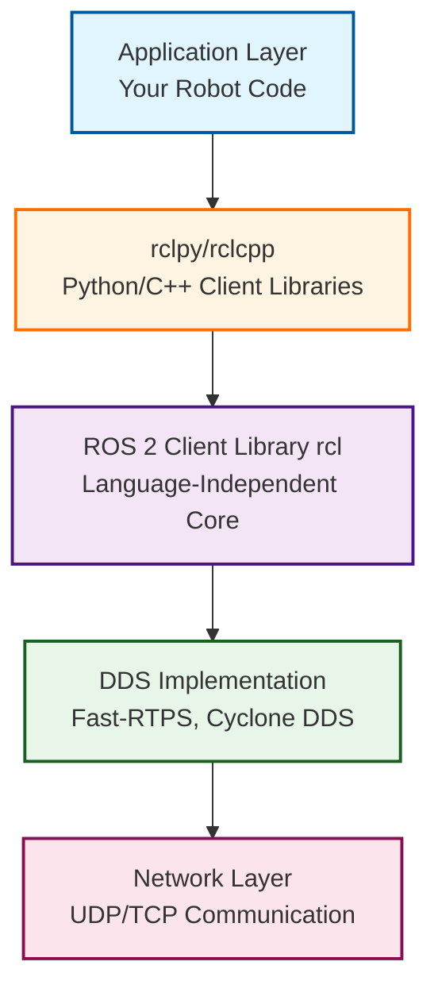
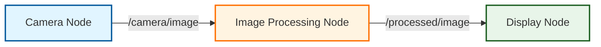

# ROS 2 Fundamentals


*Modern robotics systems rely on ROS 2 for distributed communication and modular architecture*

## Prerequisites

Before diving into ROS 2, you should have:
- Basic Linux command-line knowledge (navigating directories, running commands)
- Python programming fundamentals (variables, functions, classes)
- Understanding of basic robotics concepts from the Introduction to Physical AI chapter
- A computer running Ubuntu 22.04 LTS (recommended) or access to a virtual machine

## Introduction

Imagine building a humanoid robot where the vision system, motion planning, motor control, and voice recognition all need to communicate in real-time. How do these components talk to each other? How do you ensure that sensor data reaches the right processing nodes at the right time? How do you organize thousands of lines of code across multiple programs?

This is where ROS 2 (Robot Operating System 2) becomes indispensable. ROS 2 is not an operating system in the traditional sense—it's a middleware framework that provides the communication infrastructure, tools, and libraries needed to build complex robotic systems. Think of it as the nervous system of your robot: individual components (like neurons) send and receive messages through a structured network, enabling coordinated behavior.

In this chapter, you will learn what ROS 2 is, why it has become the industry standard for robotics development, how it differs from its predecessor ROS 1, and how to install and use it. By the end, you will have ROS 2 running on your system and understand its core architectural concepts.

## What is ROS 2?

ROS 2 is an open-source middleware framework designed to help developers build robot applications. It provides:

**Communication Infrastructure**: ROS 2 enables different parts of your robot software to communicate using a publish-subscribe messaging pattern. A camera node can publish image data, a processing node can subscribe to that data, and a control node can use the processed results—all without tight coupling between components.

**Standard Libraries**: Instead of writing motor control, sensor drivers, or path planning from scratch, ROS 2 provides battle-tested libraries that have been refined by thousands of robotics engineers worldwide. This dramatically accelerates development.

**Tools and Ecosystem**: ROS 2 includes command-line tools for introspection (viewing active nodes, topics, and data streams), visualization (RViz for 3D robot models), simulation (Gazebo integration), and debugging. The ecosystem also includes thousands of community-contributed packages for everything from SLAM (Simultaneous Localization and Mapping) to object recognition.

**Language Agnostic Design**: While we will focus on Python (rclpy) in this book, ROS 2 supports C++, and community efforts have added support for Rust, Java, and other languages. This means you can write performance-critical components in C++ while using Python for rapid prototyping.

**Industry Adoption**: ROS 2 is used by companies building autonomous vehicles (Apex.AI), warehouse robots (Amazon Robotics), drones (PX4), and humanoid robots (Boston Dynamics, Agility Robotics). NASA uses ROS 2 for space robotics. This widespread adoption means a large community, extensive documentation, and job market relevance.

The key philosophical shift from traditional robotics frameworks is **modularity**. Instead of one monolithic program, ROS 2 encourages breaking your robot's software into independent nodes that communicate through well-defined interfaces. This makes testing easier (test one node at a time), enables code reuse (share nodes across projects), and supports distributed computing (run nodes on different computers).

## ROS 2 vs ROS 1

If you have heard of ROS (sometimes called ROS 1), you might wonder why ROS 2 exists. ROS 1, created in 2007, revolutionized academic robotics but had limitations that became apparent as robots moved from labs to production:

**Real-Time Performance**: ROS 1 used TCP-based communication, which introduced unpredictable latency. ROS 2 uses DDS (Data Distribution Service), an industry-standard protocol designed for real-time systems, enabling deterministic communication necessary for safety-critical applications like autonomous cars.

**Security**: ROS 1 had no built-in security, making it unsuitable for networked robots vulnerable to attacks. ROS 2 supports DDS Security (SROS2), providing authentication, encryption, and access control.

**Multi-Robot Systems**: ROS 1 required a central master node, creating a single point of failure. ROS 2 is fully distributed—nodes discover each other automatically through DDS, enabling robust multi-robot coordination.

**Windows and macOS Support**: ROS 1 officially supported only Linux. ROS 2 runs natively on Ubuntu, Windows, macOS, and even real-time operating systems (RTOS) for embedded platforms.

**Lifecycle Management**: ROS 2 introduces managed nodes with explicit states (unconfigured, inactive, active, finalized), allowing graceful startup, reconfiguration, and shutdown—critical for production systems.

**When to use ROS 1 vs ROS 2**: ROS 1 (specifically ROS Noetic, the final release) is in maintenance mode and will reach end-of-life in 2025. New projects should use ROS 2. However, if you are working with legacy code or packages not yet ported to ROS 2, you might temporarily use ROS 1 with a migration plan. For this book, we exclusively use ROS 2 Humble, the latest long-term support (LTS) release.

## Architecture Overview

Understanding ROS 2's layered architecture is essential for effective development. The stack can be visualized as follows:



*ROS 2 Architecture Stack: Each layer abstracts complexity, allowing developers to focus on application logic*

Let's break down each layer:

**Application Layer (Your Robot Code)**: This is where you write nodes—individual programs that perform specific tasks like reading sensor data, processing images, or controlling motors. You import ROS 2 libraries and use their APIs to publish/subscribe to topics, call services, and manage parameters.

**Client Libraries (rclpy/rclcpp)**: These are language-specific libraries that provide a convenient API for your chosen language. `rclpy` is the Python client library, `rclcpp` is C++. They handle tasks like creating nodes, publishers, subscribers, and timers. You rarely interact with lower layers directly.

**ROS Client Library (rcl)**: This is the language-independent core written in C. It provides the fundamental abstractions (nodes, topics, services) that client libraries build upon. This layer ensures consistency across languages.

**DDS Layer (Data Distribution Service)**: DDS is the middleware that handles all network communication. ROS 2 supports multiple DDS implementations (Fast-RTPS, Cyclone DDS, Connext DDS). DDS provides quality-of-service (QoS) settings, automatic node discovery, and efficient data serialization. You typically do not interact with DDS directly, but understanding it exists helps when troubleshooting network issues.

**Network Layer**: The physical network (Ethernet, WiFi) that transports DDS messages using UDP (for speed) or TCP (for reliability). DDS automatically handles IP multicast for node discovery.

### The Computation Graph

In ROS 2, your running system forms a **computation graph**—a network of nodes connected by topics and services. Here is a simple example:



*A simple computation graph: Camera publishes images, Image Processing subscribes and processes them, Display subscribes to results*

**Nodes**: Independent processes (Camera Node, Image Processing Node, Display Node). Each runs as a separate program, potentially on different computers.

**Topics**: Named channels for data flow (`/camera/image`, `/processed/image`). Topics use a publish-subscribe pattern—publishers send data, subscribers receive it. Multiple nodes can publish to or subscribe to the same topic.

**Messages**: The data structures sent over topics. For example, `sensor_msgs/Image` for camera data or `geometry_msgs/Twist` for velocity commands.

This decoupled architecture means you can:
- Test the Image Processing Node in isolation by feeding it recorded camera data
- Replace the Display Node with a different visualization tool without modifying other nodes
- Run the Camera Node on a robot and the Image Processing Node on a powerful server

## Installation Guide

We will install ROS 2 Humble on Ubuntu 22.04 LTS. ROS 2 Humble is the latest long-term support release (supported until 2027), making it ideal for learning and production use.

### System Requirements

- **Operating System**: Ubuntu 22.04 LTS (Jammy Jellyfish)
- **Disk Space**: At least 2 GB for ROS 2 installation
- **Memory**: Minimum 2 GB RAM (4 GB recommended)
- **Network**: Internet connection for downloading packages

If you are using Windows or macOS, you can install Ubuntu 22.04 in a virtual machine using VirtualBox or VMware, or use Windows Subsystem for Linux 2 (WSL2).

### Step 1: Set Up Sources

First, ensure your Ubuntu system can download software from the ROS 2 repository:

```bash
# Ensure your system is up to date
sudo apt update && sudo apt upgrade -y

# Install curl if not already installed
sudo apt install -y curl

# Add the ROS 2 GPG key
sudo curl -sSL https://raw.githubusercontent.com/ros/rosdistro/master/ros.key \
  -o /usr/share/keyrings/ros-archive-keyring.gpg

# Add the ROS 2 repository to your sources list
echo "deb [arch=$(dpkg --print-architecture) signed-by=/usr/share/keyrings/ros-archive-keyring.gpg] \
  http://packages.ros.org/ros2/ubuntu $(. /etc/os-release && echo $UBUNTU_CODENAME) main" \
  | sudo tee /etc/apt/sources.list.d/ros2.list > /dev/null
```

### Step 2: Install ROS 2 Packages

Now install ROS 2 Humble:

```bash
# Update package index after adding ROS 2 repository
sudo apt update

# Install ROS 2 Humble Desktop (includes RViz, demos, tutorials)
sudo apt install -y ros-humble-desktop

# Install development tools (compilers, build system)
sudo apt install -y ros-dev-tools
```

The `ros-humble-desktop` package includes:
- Core ROS 2 libraries (rclcpp, rclpy)
- Common robot packages (sensor drivers, coordinate transforms)
- Visualization tools (RViz)
- Simulation demos (turtlesim)

This installation will take 5-10 minutes depending on your internet speed.

### Step 3: Environment Setup

ROS 2 commands and libraries are not immediately available after installation. You must "source" the ROS 2 setup script to configure your environment:

```bash
# Source the ROS 2 setup script
source /opt/ros/humble/setup.bash
```

This command sets environment variables like `ROS_DISTRO` (set to `humble`) and adds ROS 2 executables to your `PATH`. You need to run this command **in every new terminal** where you want to use ROS 2.

To avoid typing this repeatedly, add it to your `.bashrc` file (runs automatically when you open a terminal):

```bash
echo "source /opt/ros/humble/setup.bash" >> ~/.bashrc
source ~/.bashrc
```

### Step 4: Verify Installation

Confirm ROS 2 is installed correctly:

```bash
ros2 --version
```

**Expected output:**
```
ros2 doctor 0.10.4
```

Run the ROS 2 diagnostics tool:

```bash
ros2 doctor
```

**Expected output:**
```
All checks passed!
```

If you see warnings about missing packages, install them using `apt`. The most common issue is missing `python3-colcon-common-extensions`, which you can install with:

```bash
sudo apt install -y python3-colcon-common-extensions
```

Congratulations! ROS 2 is now installed and ready to use.

## First ROS 2 Commands

Let's explore ROS 2 by running a simple demo: **turtlesim**, a 2D robot simulator that teaches ROS 2 concepts without requiring physical hardware.

### Running Turtlesim

Open a terminal and start the turtlesim node:

```bash
ros2 run turtlesim turtlesim_node
```

**What this command does:**
- `ros2 run`: Runs a ROS 2 executable
- `turtlesim`: The package name
- `turtlesim_node`: The executable within that package

A window should appear showing a blue background with a turtle in the center. The turtle is a simple robot that can move forward/backward and rotate.

**Expected output in terminal:**
```
[INFO] [turtlesim]: Starting turtlesim with node name /turtlesim
[INFO] [turtlesim]: Spawning turtle [turtle1] at x=[5.544445], y=[5.544445], theta=[0.000000]
```

Keep this terminal open. Open a **second terminal** to interact with the turtle.

### Controlling the Turtle

In the second terminal, run the keyboard teleop (teleoperation) node:

```bash
ros2 run turtlesim turtle_teleop_key
```

**Expected output:**
```
Reading from keyboard
---------------------------
Use arrow keys to move the turtle.
Use G|B|V|C|D|E|R|T keys to rotate to absolute orientations. 'F' to cancel a rotation.
'Q' to quit.
```

Press the arrow keys to move the turtle. Notice:
- The turtle moves in the turtlesim window
- Lines trace the turtle's path
- The teleop node sends velocity commands, and the turtlesim node receives them and updates the simulation

This demonstrates ROS 2's publish-subscribe communication: `turtle_teleop_key` publishes velocity commands to a topic, and `turtlesim_node` subscribes to that topic.

### Inspecting the System

Open a **third terminal** to inspect the running ROS 2 system without disrupting it.

**List all active nodes:**

```bash
ros2 node list
```

**Expected output:**
```
/turtlesim
/teleop_turtle
```

These are the two nodes you started. Each node has a unique name.

**List all active topics:**

```bash
ros2 topic list
```

**Expected output:**
```
/parameter_events
/rosout
/turtle1/cmd_vel
/turtle1/color_sensor
/turtle1/pose
```

Topics prefixed with `/turtle1/` are specific to the turtle. `/turtle1/cmd_vel` is where velocity commands are published.

**View data on a topic in real-time:**

```bash
ros2 topic echo /turtle1/pose
```

**Expected output (updates as turtle moves):**
```
x: 5.544445037841797
y: 5.544445037841797
theta: 0.0
linear_velocity: 0.0
angular_velocity: 0.0
---
```

This shows the turtle's position (`x`, `y`), orientation (`theta`), and velocities. Press `Ctrl+C` to stop echoing.

**Get information about a topic:**

```bash
ros2 topic info /turtle1/cmd_vel
```

**Expected output:**
```
Type: geometry_msgs/msg/Twist
Publisher count: 1
Subscription count: 1
```

This tells you:
- The message type is `geometry_msgs/msg/Twist` (a standard message for velocity commands)
- One publisher (teleop node) and one subscriber (turtlesim node) are connected

### Publishing Commands Manually

You can publish messages from the command line. Try moving the turtle without the teleop node:

```bash
ros2 topic pub --once /turtle1/cmd_vel geometry_msgs/msg/Twist \
  "{linear: {x: 2.0, y: 0.0, z: 0.0}, angular: {x: 0.0, y: 0.0, z: 1.8}}"
```

The turtle should move forward and rotate. This demonstrates that topics are decoupled from specific nodes—anything can publish or subscribe.

## Understanding the Ecosystem

ROS 2 is more than code—it is an ecosystem of packages, tools, and community resources.

### Packages

A **package** is the fundamental unit of ROS 2 software organization. A package contains:
- Executable nodes (Python scripts or C++ binaries)
- Libraries (reusable code)
- Configuration files (parameters, launch files)
- Dependencies (listed in `package.xml`)

For example, `turtlesim` is a package containing `turtlesim_node` and `turtle_teleop_key` executables.

You can list installed packages:

```bash
ros2 pkg list
```

This will show hundreds of packages installed with `ros-humble-desktop`.

To find where a package is installed:

```bash
ros2 pkg prefix turtlesim
```

**Expected output:**
```
/opt/ros/humble
```

### Workspaces

A **workspace** is a directory where you build and develop ROS 2 packages. The typical structure is:

```
~/ros2_ws/           # Workspace root
├── src/             # Source code (your packages go here)
├── build/           # Build artifacts (generated by colcon)
├── install/         # Installed packages (executables, libraries)
└── log/             # Build logs
```

You will learn to create and manage workspaces in Chapter 3: Building ROS 2 Packages.

### Community Resources

ROS 2 has extensive documentation and an active community:

- **Official Documentation**: [https://docs.ros.org](https://docs.ros.org) - Comprehensive guides, tutorials, and API references
- **ROS Answers**: [https://answers.ros.org](https://answers.ros.org) - Q&A forum for troubleshooting
- **ROS Discourse**: [https://discourse.ros.org](https://discourse.ros.org) - Discussions, announcements, and community governance
- **GitHub**: [https://github.com/ros2](https://github.com/ros2) - Source code for core ROS 2 packages

When you encounter issues, search ROS Answers first—most common problems have documented solutions.

## Hands-On Exercises

Solidify your understanding with these exercises:

### Exercise 1: Verify Your Installation

Run `ros2 doctor` and ensure all checks pass. If you see warnings, research the issue using ROS Answers and fix it. Document what you changed.

### Exercise 2: Explore Turtlesim Topics

Start turtlesim (`ros2 run turtlesim turtlesim_node`). Without starting the teleop node, use `ros2 topic list` and `ros2 topic echo` to find and display the turtle's current pose. What are the initial x, y, and theta values?

### Exercise 3: Control the Turtle via Command Line

Using `ros2 topic pub`, publish a `geometry_msgs/msg/Twist` message to `/turtle1/cmd_vel` that makes the turtle move in a circle. Hint: Set constant linear.x and angular.z velocities. Use the `--rate` option to publish continuously (e.g., `--rate 1` for 1 Hz).

### Exercise 4: Monitor Sensor Data

While moving the turtle with teleop, use `ros2 topic echo /turtle1/color_sensor` to see the color values the turtle detects. Move the turtle to different parts of the screen (which have different background colors) and observe how the RGB values change.

## Key Takeaways

- **ROS 2 is middleware**, not an operating system—it provides communication infrastructure, libraries, and tools for building robot applications.

- **Industry standard**: Used by companies building autonomous vehicles, warehouse robots, drones, and humanoid robots due to its real-time performance, security, and modularity.

- **ROS 2 improvements over ROS 1**: Real-time DDS communication, built-in security, multi-platform support (Linux, Windows, macOS), distributed architecture (no central master), and lifecycle management.

- **Layered architecture**: Applications use client libraries (rclpy/rclcpp) that interface with the ROS Client Library (rcl), which uses DDS for network communication.

- **Computation graph**: ROS 2 systems are networks of **nodes** (independent processes) that communicate via **topics** (publish-subscribe channels) and **services** (request-response calls).

- **Installation**: ROS 2 Humble on Ubuntu 22.04 is the recommended setup for learning and production use (LTS support until 2027).

- **Essential commands**: `ros2 run` to execute nodes, `ros2 topic list/echo/info/pub` to inspect and interact with topics, `ros2 node list/info` to inspect nodes.

---

**Previous Chapter**: [Introduction to Physical AI](../intro-physical-ai.md)

**Next Chapter**: [Nodes, Topics, and Services](./nodes-topics-services.md)
