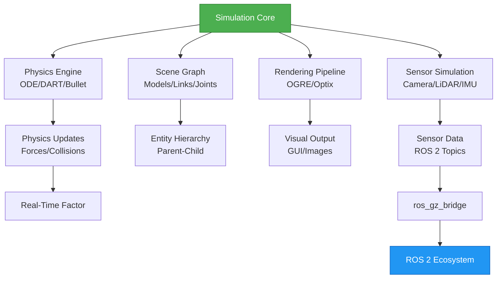
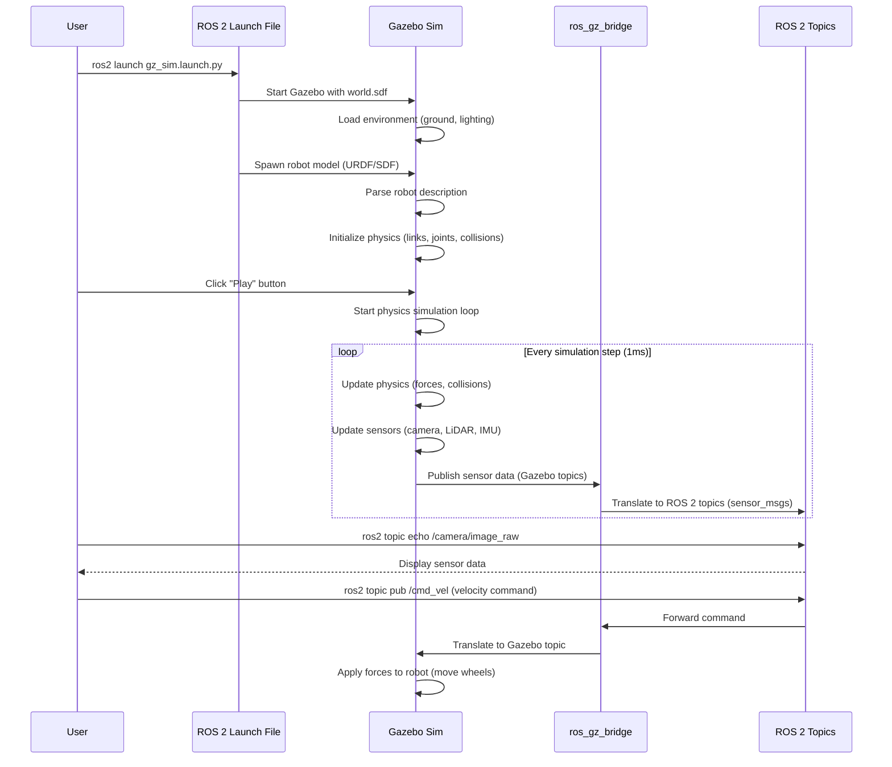

# Introduction to Gazebo

## Prerequisites

Before starting this chapter, you should have:

- ✅ Completed Module 1 (ROS 2 Fundamentals, Nodes/Topics/Services, Building Packages)
- ✅ ROS 2 Humble installed on Ubuntu 22.04 LTS
- ✅ Understanding of ROS 2 nodes, topics, and publishers/subscribers
- ✅ Basic knowledge of Linux terminal commands
- ✅ Familiarity with Python programming

**Estimated Reading Time**: 20-25 minutes

---

## Introduction

Robot simulation is a cornerstone of modern robotics development. Testing algorithms on real hardware is time-consuming, expensive, and potentially dangerous—especially during the early stages of development. Simulation environments allow roboticists to rapidly iterate on designs, test edge cases, and validate behaviors in a controlled, reproducible setting before deploying to physical robots.

**Why Gazebo Matters**: Gazebo is one of the most widely-used robot simulators in the ROS ecosystem. It provides high-fidelity physics simulation, realistic sensor models, and seamless integration with ROS 2. Whether you're developing autonomous navigation algorithms, testing manipulation strategies, or training reinforcement learning policies, Gazebo provides a safe, cost-effective environment to validate your work.

**Chapter Goals**: By the end of this chapter, you will understand Gazebo's architecture, install Gazebo Garden for ROS 2 Humble, launch your first simulation, and integrate Gazebo with ROS 2 using the `ros_gz_bridge`. You'll gain hands-on experience loading robot models, visualizing sensor data, and controlling simulated robots through ROS 2 topics.

**Learning Objectives**:
1. Understand Gazebo's role in the robotics development workflow
2. Explain the architecture of Gazebo Garden (physics engine, scene graph, rendering pipeline)
3. Install Gazebo Garden and integrate it with ROS 2 Humble
4. Launch simulations, load robot models, and navigate the Gazebo GUI
5. Use `ros_gz_bridge` to communicate between ROS 2 and Gazebo
6. Control simulated robots using ROS 2 topics and commands

---

## What is Gazebo?

Gazebo is an open-source 3D robotics simulator that enables you to test robots in complex indoor and outdoor environments without needing physical hardware. Originally developed in 2004, Gazebo has evolved into a mature simulation platform trusted by universities, research labs, and companies worldwide.

**Core Capabilities**:
- **Realistic Physics**: Gazebo uses physics engines like ODE (Open Dynamics Engine) and DART (Dynamic Animation and Robotics Toolkit) to simulate rigid body dynamics, collisions, and friction. This allows robots to interact with their environment in ways that closely mimic real-world behavior.
- **Sensor Simulation**: Gazebo can simulate a wide range of sensors including cameras, LiDAR, IMUs, force/torque sensors, and GPS. Sensor data is published to ROS 2 topics, allowing you to test perception algorithms without real hardware.
- **Integration with ROS 2**: Gazebo works seamlessly with ROS 2 via the `ros_gz` packages, which provide bidirectional communication between Gazebo topics and ROS 2 topics. This integration allows you to reuse the same code in simulation and on real robots.

**Use Cases for Gazebo**:
- **Algorithm Development**: Test navigation, localization, mapping (SLAM), and manipulation algorithms in diverse environments
- **Hardware-in-the-Loop Testing**: Validate sensor fusion, control systems, and safety mechanisms before physical deployment
- **Multi-Robot Systems**: Simulate swarms of robots or human-robot collaboration scenarios
- **Education and Training**: Provide students with hands-on robotics experience without expensive hardware

**Advantages for ROS 2 Testing**:
- **Rapid Iteration**: No need to charge batteries, reset hardware, or repair damaged components—just restart the simulation
- **Reproducibility**: Run the same scenario hundreds of times with identical initial conditions to test edge cases
- **Safety**: Test risky behaviors (like high-speed navigation or collision scenarios) without danger to people or equipment
- **Cost-Effectiveness**: Reduce hardware costs during development; a single laptop can simulate dozens of robots

Gazebo has become the de facto simulator for ROS-based projects, with extensive community support, pre-built robot models (URDF/SDF), and integration with popular robotics frameworks.

---

## Gazebo Architecture

Understanding Gazebo's internal architecture helps you troubleshoot issues, optimize performance, and extend the simulator with custom plugins.

**High-Level Architecture**: Gazebo Garden (the version compatible with ROS 2 Humble) follows a modular architecture consisting of four main components:

1. **Physics Engine**: Computes rigid body dynamics, collisions, constraints, and forces. Gazebo supports multiple physics engines (ODE, DART, Bullet) which you can select based on performance and accuracy requirements.

2. **Scene Graph**: Manages the hierarchical structure of simulation entities (models, links, joints, sensors). The scene graph defines parent-child relationships, allowing complex assemblies like robot arms with multiple degrees of freedom.

3. **Rendering Pipeline**: Handles 3D visualization using OGRE (Object-Oriented Graphics Rendering Engine) or Optix for ray-tracing. The rendering pipeline generates camera images, depth maps, and visualizations displayed in the Gazebo GUI.

4. **Sensor Simulation**: Generates synthetic sensor data (RGB images, depth images, LiDAR point clouds, IMU readings) by interfacing with the physics engine and rendering pipeline. Sensors are attached to robot links and publish data at configurable rates.

**Architecture Diagram**:


*Figure 1: Gazebo Garden architecture showing the flow from simulation core components to ROS 2 integration via ros_gz_bridge.*

**Key Architectural Features**:

**Plugin System**: Gazebo's functionality can be extended through plugins—custom C++ libraries that hook into the simulation loop. Plugins are used for sensors, actuators, custom physics behaviors, and ROS 2 communication. For example, the `ros_gz_bridge` is implemented as a plugin that translates Gazebo messages to ROS 2 messages.

**Real-Time Factor (RTF)**: Gazebo aims to run in real-time (RTF = 1.0), meaning one second of simulation time equals one second of wall-clock time. If your physics calculations are too complex or your hardware is underpowered, RTF may drop below 1.0 (simulation runs slower than real-time). You can monitor RTF in the GUI to diagnose performance issues.

**Transport Layer**: Gazebo uses its own internal message-passing system (Ignition Transport) for communication between components. The `ros_gz_bridge` translates between Ignition Transport topics and ROS 2 topics, enabling bidirectional data flow.

**World Files (SDF Format)**: Simulations are defined using SDF (Simulation Description Format), an XML-based language that specifies models, environments, sensors, and plugins. SDF is more flexible than URDF (Unified Robot Description Format) and supports advanced features like nested models and articulated systems.

Understanding this architecture is crucial when you need to debug simulation issues, optimize physics timesteps, or develop custom sensor plugins for specialized applications.

---

## Installing Gazebo Garden

Gazebo Garden is the recommended version for ROS 2 Humble due to its long-term support (LTS) and compatibility with Ubuntu 22.04.

**System Requirements**:
- **Operating System**: Ubuntu 22.04 LTS (Jammy Jellyfish)
- **Graphics**: Dedicated GPU recommended (NVIDIA, AMD, or Intel integrated graphics supported)
- **RAM**: Minimum 4GB, 8GB+ recommended for complex simulations
- **Disk Space**: ~2GB for Gazebo Garden and dependencies

**Installation Steps**:

### Step 1: Add Gazebo Package Repository

First, add the official Gazebo Garden repository to your system:

```bash
sudo wget https://packages.osrfoundation.org/gazebo.gpg -O /usr/share/keyrings/pkgs-osrf-archive-keyring.gpg

echo "deb [arch=$(dpkg --print-architecture) signed-by=/usr/share/keyrings/pkgs-osrf-archive-keyring.gpg] http://packages.osrfoundation.org/gazebo/ubuntu-stable $(lsb_release -cs) main" | sudo tee /etc/apt/sources.list.d/gazebo-stable.list > /dev/null

sudo apt update
```

### Step 2: Install Gazebo Garden

Install the Gazebo Garden package:

```bash
sudo apt install gz-garden
```

This command installs the core Gazebo Garden simulator, including the GUI, physics engines, and command-line tools.

### Step 3: Verify Gazebo Installation

Check that Gazebo is installed correctly:

```bash
gz sim --version
```

**Expected Output**:
```
Gazebo Sim, version 7.x.x
Copyright (C) 2018 Open Robotics
```

### Step 4: Install ROS 2 Humble Integration Packages

To enable communication between ROS 2 and Gazebo, install the `ros_gz` packages:

```bash
sudo apt install ros-humble-ros-gz
```

This package includes:
- **ros_gz_bridge**: Translates Gazebo topics to ROS 2 topics
- **ros_gz_sim**: Launch files and utilities for starting Gazebo with ROS 2
- **ros_gz_image**: Converts Gazebo image messages to ROS 2 sensor_msgs/Image

### Step 5: Source ROS 2 Environment

Ensure your ROS 2 environment is sourced (add this to your `~/.bashrc` for persistence):

```bash
source /opt/ros/humble/setup.bash
```

### Step 6: Test ROS 2 Integration

Verify that ROS 2 can launch Gazebo:

```bash
ros2 launch ros_gz_sim gz_sim.launch.py gz_args:="empty.sdf"
```

**Expected Behavior**: The Gazebo GUI should open, displaying an empty world. You can close it with `Ctrl+C` in the terminal.

**Installation Verification Checklist**:
- ✅ `gz sim --version` shows Gazebo Garden version 7.x.x
- ✅ `ros2 pkg list | grep ros_gz` shows ros_gz packages installed
- ✅ `ros2 launch ros_gz_sim gz_sim.launch.py` opens Gazebo GUI
- ✅ No errors in terminal output during launch

**Troubleshooting Common Issues**:
- **Graphics Driver Errors**: If you see "Failed to initialize OpenGL context" errors, update your GPU drivers: `sudo ubuntu-drivers autoinstall`
- **Permission Denied**: Ensure you're not running Gazebo as root: `whoami` should show your username
- **ROS 2 Not Found**: If `ros2` command is not found, double-check you sourced `/opt/ros/humble/setup.bash`

---

## First Gazebo Simulation

Now that Gazebo is installed, let's launch a simulation and explore the interface.

**Launching Gazebo with an Empty World**:

```bash
gz sim empty.sdf
```

This command launches Gazebo with a minimal world containing only a ground plane and lighting.

**Gazebo GUI Overview**:

When Gazebo opens, you'll see several key interface elements:

1. **3D Viewport**: The main area displaying the simulated environment. Use mouse controls to navigate:
   - **Left-click + drag**: Rotate camera
   - **Middle-click + drag** (or Shift + left-click): Pan camera
   - **Scroll wheel**: Zoom in/out

2. **Entity Tree (Left Panel)**: Hierarchical view of all models, links, joints, and sensors in the scene. You can select entities to inspect their properties.

3. **Component Inspector (Right Panel)**: Shows detailed properties of the selected entity (position, orientation, physics parameters, visual properties).

4. **Simulation Controls (Top Bar)**:
   - **Play/Pause**: Start or pause the physics simulation
   - **Step**: Advance simulation by one timestep (useful for debugging)
   - **Real-Time Factor**: Displays current RTF (should be ~1.0 for real-time)

5. **Plugins Menu**: Access additional functionality like plotting, visualization tools, and custom panels.

**Loading a Robot Model**:

Let's load a simple robot model to see it in action. Create a test launch file:

```bash
mkdir -p ~/gazebo_test_ws/src
cd ~/gazebo_test_ws/src
```

Create a file called `spawn_robot.launch.py`:

```python
from launch import LaunchDescription
from launch.actions import IncludeLaunchDescription
from launch.launch_description_sources import PythonLaunchDescriptionSource
from launch_ros.actions import Node
import os

def generate_launch_description():
    # Path to Gazebo launch file
    gz_sim_launch = IncludeLaunchDescription(
        PythonLaunchDescriptionSource([
            os.path.join(
                get_package_share_directory('ros_gz_sim'),
                'launch', 'gz_sim.launch.py'
            )
        ]),
        launch_arguments={'gz_args': 'empty.sdf'}.items()
    )

    # Spawn a simple sphere robot
    spawn_entity = Node(
        package='ros_gz_sim',
        executable='create',
        arguments=[
            '-name', 'sphere_robot',
            '-x', '0', '-y', '0', '-z', '0.5',
            '-file', '/path/to/sphere_robot.sdf'  # Replace with actual model path
        ],
        output='screen'
    )

    return LaunchDescription([
        gz_sim_launch,
        spawn_entity
    ])
```

**Controlling the Robot via ROS 2 Topics**:

Once a robot is loaded, you can publish velocity commands to move it:

```bash
# List available ROS 2 topics bridged from Gazebo
ros2 topic list

# Publish a velocity command (example for a differential drive robot)
ros2 topic pub /cmd_vel geometry_msgs/msg/Twist "{linear: {x: 0.5}, angular: {z: 0.0}}" --once
```

**Inspecting Simulation State**:

Monitor the simulation state using ROS 2 commands:

```bash
# Echo pose data from the robot
ros2 topic echo /model/sphere_robot/pose

# Check simulation time
ros2 topic echo /clock
```

**Key Concepts from Your First Simulation**:
- Gazebo runs as a standalone process; ROS 2 communicates with it via `ros_gz_bridge`
- Models are defined in SDF format (more on this in later chapters)
- Robot sensors (cameras, LiDAR) automatically publish data to ROS 2 topics
- Physics runs at a default timestep of 1ms (configurable in world files)

---

## Understanding URDF and SDF

Robot models in ROS 2 and Gazebo use two main description formats: **URDF** (Unified Robot Description Format) and **SDF** (Simulation Description Format). Understanding when to use each is important for effective simulation workflows.

**URDF (Unified Robot Description Format)**:
- **Purpose**: XML format for describing robot kinematics and dynamics in ROS
- **Strengths**:
  - Native ROS 2 format, used by robot_state_publisher and MoveIt
  - Simple syntax for basic robot structures
  - Widely supported by ROS tools and libraries
- **Limitations**:
  - Lacks support for complex scenes (lighting, multiple robots, world elements)
  - No support for sensor plugins or advanced physics parameters
  - Requires xacro macros for modularity (adds complexity)

**SDF (Simulation Description Format)**:
- **Purpose**: XML format designed specifically for simulation environments
- **Strengths**:
  - Supports complete world descriptions (environments, multiple robots, lighting)
  - Includes sensor plugins, physics parameters, and visual materials
  - Allows nested models and dynamic model composition
  - More expressive than URDF for complex scenarios
- **Limitations**:
  - Not natively supported by all ROS 2 tools (e.g., MoveIt uses URDF)
  - Learning curve if you're already familiar with URDF

**When to Use Each**:
- **URDF**: When defining robot kinematics for ROS 2 tools like MoveIt, robot_state_publisher, or control systems. URDF can be automatically converted to SDF for Gazebo use.
- **SDF**: When creating complete simulation worlds with multiple robots, complex environments, or custom sensors. SDF provides full control over Gazebo simulation parameters.

**Conversion Between URDF and SDF**:

Gazebo can automatically convert URDF to SDF at runtime:

```bash
# Spawn a robot from URDF (Gazebo converts to SDF internally)
ros2 run ros_gz_sim create -name my_robot -file my_robot.urdf
```

Alternatively, use the `gz sdf` command to manually convert URDF to SDF:

```bash
gz sdf -p my_robot.urdf > my_robot.sdf
```

**Best Practice**: Use URDF for robot models (to maintain compatibility with ROS 2 tools), and use SDF for world files and complex simulation environments. The `ros_gz_bridge` handles communication between ROS 2 (expecting URDF-based topics) and Gazebo (using SDF models).

---

## Gazebo Workflow Diagram

The following diagram illustrates the typical workflow for launching Gazebo, loading a robot model, starting physics simulation, and publishing sensor data to ROS 2 topics:


*Figure 2: Sequence diagram showing the workflow from launching Gazebo to controlling a robot via ROS 2 topics. The ros_gz_bridge acts as a translator between Gazebo's internal topics and ROS 2's messaging system.*

**Workflow Explanation**:
1. **Launch**: User runs ROS 2 launch file, which starts Gazebo with a world file
2. **Model Loading**: Robot model (URDF or SDF) is spawned into the simulation
3. **Physics Initialization**: Gazebo parses robot links, joints, and sensors
4. **Simulation Loop**: User clicks "Play"; Gazebo begins physics updates at ~1000 Hz
5. **Sensor Publishing**: Sensor data flows from Gazebo → ros_gz_bridge → ROS 2 topics
6. **Command Subscription**: ROS 2 commands flow from topics → ros_gz_bridge → Gazebo actuators

This bidirectional communication allows you to develop ROS 2 nodes (for perception, planning, control) that work identically in simulation and on real robots.

---

## Hands-On Exercises

Complete these exercises to reinforce your understanding of Gazebo basics.

### Exercise 1: Install and Verify Gazebo
**Goal**: Confirm Gazebo Garden is correctly installed and integrated with ROS 2.

**Instructions**:
1. Run `gz sim --version` and record the version number
2. Run `ros2 pkg list | grep ros_gz` and verify you see `ros_gz_bridge`, `ros_gz_sim`, and `ros_gz_image`
3. Launch Gazebo with `ros2 launch ros_gz_sim gz_sim.launch.py gz_args:="empty.sdf"`
4. Take a screenshot of the Gazebo GUI showing the empty world

**Expected Outcome**: Gazebo opens without errors, displays a ground plane, and you can navigate the 3D viewport.

---

### Exercise 2: Launch and Explore Worlds
**Goal**: Navigate Gazebo's pre-built worlds and explore the GUI.

**Instructions**:
1. Launch Gazebo with different world files:
   ```bash
   gz sim shapes.sdf  # World with primitive shapes
   ```
2. Use mouse controls to rotate, pan, and zoom the camera
3. Click on different entities in the scene (ground plane, shapes) and inspect their properties in the Component Inspector
4. Open the Entity Tree panel and expand the world hierarchy

**Expected Outcome**: You can navigate the 3D world, select entities, and view their properties (position, mass, inertia, visual materials).

---

### Exercise 3: Spawn a Robot Model
**Goal**: Load a robot model into Gazebo and observe its behavior.

**Instructions**:
1. Launch an empty Gazebo world:
   ```bash
   ros2 launch ros_gz_sim gz_sim.launch.py gz_args:="empty.sdf"
   ```
2. In a new terminal, spawn a simple robot (e.g., a box with wheels):
   ```bash
   gz model --spawn-file=/usr/share/gz/gz-sim7/models/vehicle_blue/model.sdf --model-name=my_vehicle -x 0 -y 0 -z 0.5
   ```
3. Click "Play" in the Gazebo GUI to start physics simulation
4. Observe the robot falling due to gravity

**Expected Outcome**: The robot model loads at the specified position and falls to the ground when physics starts.

---

### Exercise 4: Control via ROS 2 Topics
**Goal**: Publish ROS 2 messages to control a simulated robot.

**Instructions**:
1. Launch Gazebo with a differential drive robot (if available) or use the vehicle from Exercise 3
2. List available ROS 2 topics:
   ```bash
   ros2 topic list
   ```
3. Identify the `/cmd_vel` topic (or equivalent for your robot)
4. Publish a velocity command to move the robot forward:
   ```bash
   ros2 topic pub /cmd_vel geometry_msgs/msg/Twist "{linear: {x: 1.0}, angular: {z: 0.0}}" --rate 10
   ```
5. Observe the robot moving in the Gazebo GUI

**Expected Outcome**: The robot moves forward in response to the ROS 2 velocity command. You can change linear and angular velocities to see different motion behaviors.

---

## Key Takeaways

After completing this chapter, you should understand:

1. **Simulation Value**: Gazebo enables rapid prototyping, safe testing, and cost-effective development by providing a realistic virtual environment for robots.

2. **Gazebo Architecture**: Gazebo Garden consists of a physics engine, scene graph, rendering pipeline, and sensor simulation components, all integrated via plugins.

3. **Installation and Setup**: Gazebo Garden integrates with ROS 2 Humble via the `ros_gz` packages, enabling bidirectional communication between simulation and ROS 2 topics.

4. **Gazebo GUI**: The Gazebo interface includes a 3D viewport, entity tree, component inspector, and simulation controls for managing and debugging simulations.

5. **URDF vs SDF**: URDF is used for robot descriptions in ROS 2 tools, while SDF is the native Gazebo format for complete simulation worlds. Gazebo can convert between them.

6. **ROS 2 Integration**: The `ros_gz_bridge` translates Gazebo topics to ROS 2 topics, allowing you to control robots and receive sensor data using standard ROS 2 messages.

7. **Workflow**: A typical workflow involves launching Gazebo with a world file, spawning robot models, starting physics simulation, and interacting via ROS 2 topics.

---

## Navigation

**Previous Chapter**: [Building ROS 2 Packages](/docs/module-1-ros2/building-packages-python)
**Next Chapter**: [Unity for Robotics](/docs/module-2-gazebo/unity-robotics)
