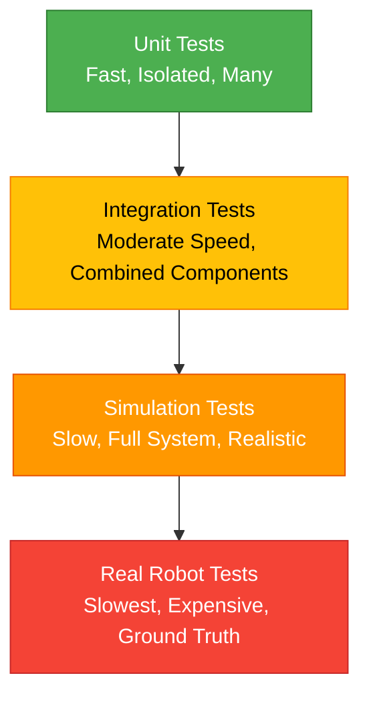
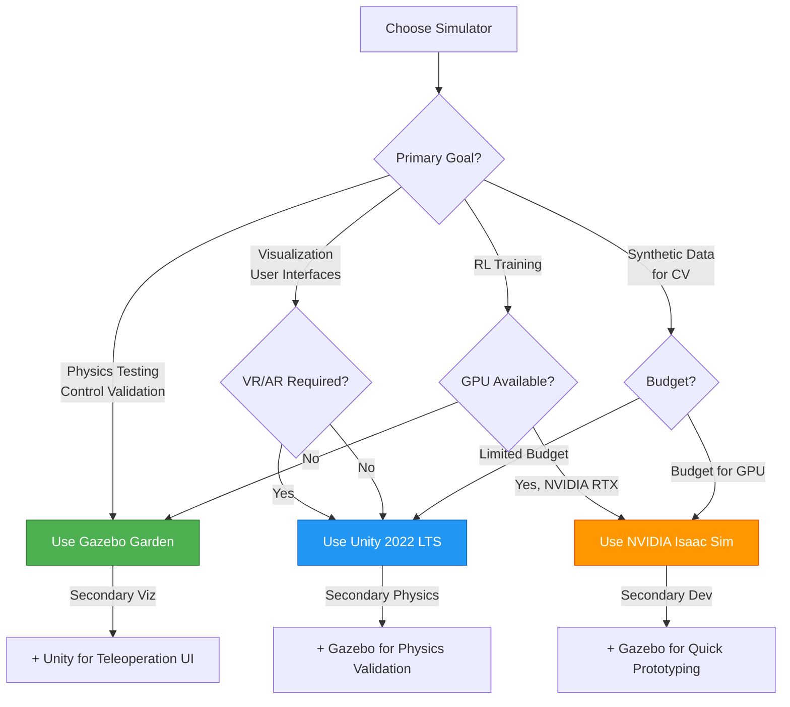

# Simulation Best Practices

## Prerequisites

Before starting this chapter, you should have:

- ✅ Completed Chapter 1: Introduction to Gazebo
- ✅ Completed Chapter 2: Unity for Robotics
- ✅ Understanding of Gazebo Garden and Unity 2022 LTS fundamentals
- ✅ Experience launching simulations and loading robot models
- ✅ Basic understanding of ROS 2 topics, launch files, and Python programming
- ✅ Familiarity with robot testing concepts (unit tests, integration tests)

**Estimated Reading Time**: 20-25 minutes

---

## Introduction

Simulation is a powerful tool for robotics development, but it's not a perfect replacement for real-world testing. **The simulation-to-reality gap** (often called the **sim-to-real gap**) refers to the differences between simulated behavior and real-world performance. Factors like sensor noise, physics approximations, timing variations, and environmental complexity can cause algorithms that work perfectly in simulation to fail on real robots.

**Importance of Simulation Testing**: Despite the sim-to-real gap, simulation remains essential for:
- **Rapid Prototyping**: Test hundreds of scenarios in the time it takes to run one real-world experiment
- **Safety**: Validate risky behaviors (collision recovery, emergency stops) without endangering people or equipment
- **Reproducibility**: Run identical test conditions multiple times to isolate bugs and measure performance
- **Cost-Effectiveness**: Reduce hardware wear-and-tear and development costs during early-stage testing

**Chapter Goals**: By the end of this chapter, you will understand how to design effective simulation testing workflows, choose between Gazebo and Unity based on your needs, optimize simulation performance, and troubleshoot common simulation issues. You'll learn strategies to minimize the sim-to-real gap and validate that your algorithms are robust enough for physical deployment.

**Learning Objectives**:
1. Design a simulation testing workflow that progresses from unit tests to integration tests to real-world deployment
2. Understand the sim-to-real gap and strategies to mitigate it (domain randomization, realistic sensor models, system identification)
3. Choose the appropriate simulator (Gazebo vs Unity vs Isaac) based on project requirements
4. Optimize simulation performance (physics timestep tuning, rendering settings, parallel simulations)
5. Troubleshoot common simulation issues (physics instability, sensor noise, model collisions, slow real-time factor)
6. Validate simulation results against real-world data to build confidence in your algorithms

---

## Simulation Testing Workflow

A robust simulation testing workflow follows a **progressive validation strategy**: start with simple, fast tests and gradually increase complexity until you're confident enough to deploy to real hardware.

### Testing Pyramid for Robotics

The testing pyramid is a software engineering concept adapted for robotics:


*Figure 1: Testing pyramid showing the progression from fast unit tests (many) to slow real robot tests (few). Each layer builds confidence before moving to the next.*

### 1. Unit Tests (Fastest, Most Numerous)

**Purpose**: Test individual components in isolation (perception algorithms, planners, controllers) without full simulation.

**Tools**: Python `unittest`, `pytest`, ROS 2 `launch_testing`

**Example**: Test a path planning algorithm with synthetic obstacle data:

```python
import unittest
import numpy as np
from my_robot_pkg.path_planner import AStarPlanner

class TestAStarPlanner(unittest.TestCase):
    def setUp(self):
        self.planner = AStarPlanner(grid_size=(100, 100))

    def test_finds_path_in_empty_space(self):
        start = (10, 10)
        goal = (90, 90)
        path = self.planner.plan(start, goal, obstacles=[])

        self.assertIsNotNone(path)
        self.assertEqual(path[0], start)
        self.assertEqual(path[-1], goal)

    def test_avoids_obstacles(self):
        start = (10, 10)
        goal = (90, 90)
        obstacles = [(50, 50), (51, 50), (52, 50)]  # Wall blocking direct path

        path = self.planner.plan(start, goal, obstacles)

        self.assertIsNotNone(path)
        for obstacle in obstacles:
            self.assertNotIn(obstacle, path)  # Path should not pass through obstacles

if __name__ == '__main__':
    unittest.main()
```

**Benefits**: Unit tests run in milliseconds, enable rapid iteration, and catch logic errors before expensive simulation tests.

---

### 2. Integration Tests (Moderate Complexity)

**Purpose**: Test multiple components working together (e.g., perception + planning, localization + navigation) with realistic ROS 2 message flows.

**Tools**: ROS 2 `launch_testing`, simulated sensor data playback (rosbag), mock ROS 2 nodes

**Example**: Test that your navigation stack responds correctly to obstacle detection:

```python
import launch_testing
import rclpy
from geometry_msgs.msg import Twist
from sensor_msgs.msg import LaserScan

def test_navigation_stops_on_obstacle():
    # Launch navigation stack
    # ...

    # Publish fake laser scan showing obstacle ahead
    fake_scan = LaserScan()
    fake_scan.ranges = [1.0] * 360  # All ranges at 1 meter (obstacle ahead)
    laser_pub.publish(fake_scan)

    # Check that /cmd_vel is zero (robot should stop)
    cmd_vel_msg = wait_for_message('/cmd_vel', Twist, timeout=5.0)
    assert cmd_vel_msg.linear.x == 0.0, "Robot should stop when obstacle detected"
```

**Benefits**: Integration tests validate component interactions without the overhead of full physics simulation.

---

### 3. Simulation Tests (Full System, Realistic Environment)

**Purpose**: Test the complete robotic system (perception, planning, control) in a simulated environment with physics and sensors.

**Tools**: Gazebo, Unity, Isaac Sim

**Example Workflow**:
1. Launch Gazebo with a test world (e.g., office environment with obstacles)
2. Spawn robot with sensors (camera, LiDAR, IMU)
3. Start navigation stack, give goal pose
4. Monitor for successful navigation to goal within timeout
5. Log metrics (time to goal, path smoothness, collision count)

**Example Launch Test for Simulation**:

```python
from launch import LaunchDescription
from launch.actions import IncludeLaunchDescription, TimerAction
from launch_ros.actions import Node
import launch_testing.actions

def generate_test_description():
    # Launch Gazebo with test world
    gazebo = IncludeLaunchDescription(
        PythonLaunchDescriptionSource([
            os.path.join(get_package_share_directory('ros_gz_sim'), 'launch', 'gz_sim.launch.py')
        ]),
        launch_arguments={'gz_args': 'office_world.sdf'}.items()
    )

    # Spawn robot
    spawn_robot = Node(
        package='ros_gz_sim',
        executable='create',
        arguments=['-name', 'test_robot', '-file', 'test_robot.urdf']
    )

    # Wait 5 seconds for simulation to stabilize, then run test
    test_node = TimerAction(
        period=5.0,
        actions=[Node(package='my_robot_test', executable='navigation_test')]
    )

    return LaunchDescription([
        gazebo,
        spawn_robot,
        test_node,
        launch_testing.actions.ReadyToTest()
    ])
```

**Benefits**: Simulation tests validate full-system behavior with realistic sensor noise, physics interactions, and timing constraints.

---

### 4. Real Robot Tests (Ground Truth)

**Purpose**: Final validation on physical hardware to measure the sim-to-real gap and ensure deployment readiness.

**Best Practices**:
- Start with controlled environments (lab, marked testing area)
- Gradually increase complexity (dynamic obstacles, outdoor environments, human interactions)
- Log all data (sensor readings, commands, trajectories) for post-test analysis
- Compare real-world performance metrics to simulation baselines

**Sim-to-Real Gap Analysis**:
- **Measure discrepancies**: If simulation predicts 90% navigation success but real robot achieves 70%, investigate causes (sensor noise, calibration, unexpected dynamics)
- **Iterate on simulation**: Add noise models, update physics parameters, improve world models to make simulation more realistic
- **Set conservative thresholds**: If your simulation success rate is 95%, aim for 98%+ before deploying to real hardware (to account for the gap)

---

## Choosing the Right Simulator

Different simulators have different strengths. Here's a decision matrix to guide your choice:

### Simulator Comparison Matrix

| **Criterion** | **Gazebo Garden** | **Unity 2022 LTS** | **NVIDIA Isaac Sim** |
|---------------|-------------------|--------------------|----------------------|
| **Physics Fidelity** | High (ODE, DART, Bullet) | Medium (PhysX, Unity Physics) | Very High (PhysX 5 GPU) |
| **Rendering Quality** | Functional | Photorealistic (URP/HDRP) | Photorealistic (RTX ray-tracing) |
| **ROS 2 Integration** | Native (DDS-based) | TCP Bridge (adds latency) | OmniGraph + ROS 2 bridge |
| **RL Training Support** | Limited | Limited | Excellent (Isaac Gym parallel envs) |
| **VR/AR Support** | No | Native (Quest, HoloLens) | Experimental |
| **GPU Acceleration** | Rendering only | Rendering + limited physics | Full physics + rendering |
| **Sensor Simulation** | Excellent (cameras, LiDAR, IMU, GPS) | Good (cameras, basic sensors) | Excellent (RGB, depth, semantic, LiDAR) |
| **Multi-Robot Scaling** | Good (dozens of robots) | Good (depends on hardware) | Excellent (thousands of parallel envs) |
| **Open Source** | Yes (Apache 2.0) | Engine is proprietary | Proprietary (free for research) |
| **Learning Curve** | Steep (XML-based config) | Moderate (visual editor) | Steep (USD format, Python API) |
| **Best For** | Control validation, sensor testing, traditional robotics | HRI, teleoperation UIs, demos, CV datasets | RL training, large-scale sim, synthetic data |

### Decision Flowchart


*Figure 2: Decision flowchart for selecting the appropriate simulator based on project requirements. Many teams use multiple simulators for different purposes.*

**Hybrid Approach**: Many advanced robotics teams use **multiple simulators**:
- **Gazebo** for physics validation and sensor testing
- **Unity** for teleoperation interfaces and public demonstrations
- **Isaac Sim** for reinforcement learning training and large-scale data generation

---

## Performance Optimization

Slow simulation can bottleneck development. Here are strategies to optimize simulation performance:

### 1. Physics Timestep Tuning

**Problem**: Default physics timesteps may be too small (accurate but slow) or too large (fast but unstable).

**Solution**: Adjust the physics update rate in your world file:

```xml
<!-- In your Gazebo SDF world file -->
<world name="default">
  <physics name="default_physics" type="ode">
    <max_step_size>0.001</max_step_size>  <!-- 1ms timestep (1000 Hz) -->
    <real_time_factor>1.0</real_time_factor>
    <real_time_update_rate>1000</real_time_update_rate>
  </physics>
</world>
```

**Optimization**:
- **Increase timestep** for faster simulation: `0.005` (5ms, 200 Hz) - acceptable for wheeled robots
- **Decrease timestep** for stability: `0.0005` (0.5ms, 2000 Hz) - needed for fast manipulators or legged robots
- Monitor **Real-Time Factor (RTF)** in Gazebo GUI: RTF < 1.0 means simulation is slower than real-time

### 2. Rendering Optimization

**Problem**: Rendering high-fidelity graphics can slow simulation even if physics is fast.

**Solution**: Run Gazebo in headless mode (no GUI) for automated tests:

```bash
gz sim -s world.sdf  # -s flag = server mode (no rendering)
```

**Unity Optimization**:
- Reduce camera resolution: 640x480 instead of 1920x1080
- Disable post-processing effects (bloom, depth of field, anti-aliasing)
- Use Unity's **Low Quality** preset for physics testing

### 3. Parallel Simulations

**Problem**: Running one simulation at a time is slow for hyperparameter tuning or Monte Carlo testing.

**Solution**: Launch multiple Gazebo instances with different parameters:

```python
# Example: Run 10 parallel simulations with different PID gains
import subprocess

for kp in [1.0, 2.0, 3.0, ..., 10.0]:
    cmd = f"gz sim -s world.sdf --ros-args -p kp:={kp}"
    subprocess.Popen(cmd.split(), env={...})
```

**NVIDIA Isaac Sim**: Natively supports thousands of parallel environments on a single GPU for reinforcement learning.

### 4. Sensor Update Rate Tuning

**Problem**: Sensors updating too fast (e.g., camera at 60 Hz) can overwhelm CPU.

**Solution**: Reduce sensor update rates to match real hardware:

```xml
<!-- In Gazebo SDF model file -->
<sensor name="camera" type="camera">
  <update_rate>30</update_rate>  <!-- 30 Hz instead of default 60 Hz -->
  <camera>
    <image>
      <width>640</width>  <!-- Reduce resolution if not needed -->
      <height>480</height>
    </image>
  </camera>
</sensor>
```

---

## Troubleshooting Common Issues

### Issue 1: Physics Instability (Robot Vibrates or Explodes)

**Symptoms**: Robot model shakes violently, falls through the ground, or parts separate unexpectedly.

**Causes**:
- Collision geometries overlap (e.g., wheel inside chassis)
- Inertia values too small or incorrect
- Joint limits not set properly
- Timestep too large for the system dynamics

**Solutions**:
1. **Check collision geometries**: Open model in Gazebo, enable "View → Collisions" to visualize collision shapes
2. **Increase inertia**: Add realistic inertia values to links (use MeshLab or SolidWorks to compute from CAD models)
3. **Reduce timestep**: Set `<max_step_size>0.0005</max_step_size>` for more stable physics
4. **Add damping**: Increase joint damping to reduce oscillations:
   ```xml
   <joint name="wheel_joint" type="continuous">
     <dynamics>
       <damping>0.1</damping>
     </dynamics>
   </joint>
   ```

### Issue 2: Sensor Noise Too Low (Unrealistic Performance)

**Symptoms**: Algorithms work perfectly in simulation but fail in real world due to sensor noise.

**Causes**: Default Gazebo sensors have no noise (perfect measurements).

**Solutions**: Add realistic noise models to sensors:

```xml
<sensor name="camera" type="camera">
  <camera>
    <noise>
      <type>gaussian</type>
      <mean>0.0</mean>
      <stddev>0.007</stddev>  <!-- Add Gaussian noise (based on real sensor specs) -->
    </noise>
  </camera>
</sensor>

<sensor name="imu" type="imu">
  <imu>
    <angular_velocity>
      <x><noise type="gaussian"><mean>0.0</mean><stddev>0.00018</stddev></noise></x>
      <y><noise type="gaussian"><mean>0.0</mean><stddev>0.00018</stddev></noise></y>
      <z><noise type="gaussian"><mean>0.0</mean><stddev>0.00018</stddev></noise></z>
    </angular_velocity>
  </imu>
</sensor>
```

**Reference**: Use real sensor datasheets to determine realistic noise parameters (e.g., IMU gyroscope noise density).

### Issue 3: ROS 2 Bridge Failures (Topics Not Publishing)

**Symptoms**: Gazebo is running but ROS 2 topics are not receiving data.

**Causes**:
- `ros_gz_bridge` not started
- Topic names mismatch between Gazebo and ROS 2
- Message type incompatibility

**Solutions**:
1. **Verify bridge is running**:
   ```bash
   ros2 node list | grep ros_gz_bridge
   ```
2. **Check topic mappings**: List Gazebo topics and ROS 2 topics side-by-side:
   ```bash
   gz topic -l           # Gazebo topics
   ros2 topic list       # ROS 2 topics
   ```
3. **Manually configure bridge**: Create a YAML config file for explicit topic mapping:
   ```yaml
   # bridge_config.yaml
   - topic_name: "/camera/image_raw"
     ros_type_name: "sensor_msgs/msg/Image"
     gz_type_name: "ignition.msgs.Image"
     direction: GZ_TO_ROS
   ```
   Launch with:
   ```bash
   ros2 run ros_gz_bridge parameter_bridge --ros-args -p config_file:=bridge_config.yaml
   ```

### Issue 4: Slow Real-Time Factor (RTF < 0.5)

**Symptoms**: Simulation runs much slower than real-time, making testing tedious.

**Causes**:
- Physics timestep too small
- Too many collision checks (complex geometries)
- GPU rendering overhead
- Insufficient CPU/GPU resources

**Solutions**:
1. **Profile simulation**: Use `gz sim --verbose` to identify bottlenecks
2. **Simplify collision geometries**: Replace complex meshes with primitive shapes (boxes, cylinders, spheres)
3. **Disable GUI**: Run headless (`gz sim -s`)
4. **Upgrade hardware**: Use a dedicated GPU and multi-core CPU

---

## Example: Simulation Testing Script

Here's a complete Python script for automated simulation testing:

```python
#!/usr/bin/env python3
"""
Automated navigation test in Gazebo simulation.
Tests robot's ability to navigate from start to goal without collisions.
"""

import rclpy
from rclpy.node import Node
from geometry_msgs.msg import PoseStamped, Twist
from nav_msgs.msg import Odometry
import math
import time

class NavigationTestNode(Node):
    def __init__(self):
        super().__init__('navigation_test_node')

        # Publishers and subscribers
        self.goal_pub = self.create_publisher(PoseStamped, '/goal_pose', 10)
        self.cmd_vel_sub = self.create_subscription(Twist, '/cmd_vel', self.cmd_vel_callback, 10)
        self.odom_sub = self.create_subscription(Odometry, '/odom', self.odom_callback, 10)

        # Test parameters
        self.goal = (5.0, 5.0)  # Target position (x, y)
        self.tolerance = 0.3    # Goal reached tolerance (meters)
        self.timeout = 60.0     # Test timeout (seconds)
        self.max_linear_vel = 0.5  # Safety limit

        # State
        self.current_pose = None
        self.test_start_time = None
        self.collision_count = 0

        self.get_logger().info("Navigation test node started")

    def cmd_vel_callback(self, msg):
        # Check velocity safety limits
        if abs(msg.linear.x) > self.max_linear_vel:
            self.get_logger().warn(f"Velocity exceeds safety limit: {msg.linear.x}")
            self.collision_count += 1

    def odom_callback(self, msg):
        self.current_pose = msg.pose.pose

    def run_test(self):
        self.get_logger().info("Starting navigation test...")
        self.test_start_time = time.time()

        # Publish goal
        goal_msg = PoseStamped()
        goal_msg.header.frame_id = "map"
        goal_msg.pose.position.x = self.goal[0]
        goal_msg.pose.position.y = self.goal[1]
        goal_msg.pose.orientation.w = 1.0
        self.goal_pub.publish(goal_msg)

        # Wait for goal to be reached or timeout
        while rclpy.ok():
            if self.current_pose is None:
                self.get_logger().warn("Waiting for odometry...")
                time.sleep(0.1)
                continue

            # Calculate distance to goal
            dx = self.goal[0] - self.current_pose.position.x
            dy = self.goal[1] - self.current_pose.position.y
            distance = math.sqrt(dx**2 + dy**2)

            # Check success condition
            if distance < self.tolerance:
                elapsed = time.time() - self.test_start_time
                self.get_logger().info(f"✅ SUCCESS: Goal reached in {elapsed:.1f}s")
                return True

            # Check timeout condition
            if time.time() - self.test_start_time > self.timeout:
                self.get_logger().error(f"❌ FAILURE: Timeout after {self.timeout}s (distance: {distance:.2f}m)")
                return False

            time.sleep(0.1)

        return False

def main():
    rclpy.init()
    test_node = NavigationTestNode()

    # Give simulation time to stabilize
    time.sleep(2.0)

    # Run test
    success = test_node.run_test()

    # Cleanup
    test_node.destroy_node()
    rclpy.shutdown()

    exit(0 if success else 1)

if __name__ == '__main__':
    main()
```

**Usage**:
```bash
# Terminal 1: Launch Gazebo with robot
ros2 launch my_robot_pkg simulation.launch.py

# Terminal 2: Run navigation stack
ros2 launch my_robot_pkg navigation.launch.py

# Terminal 3: Run automated test
python3 navigation_test.py
```

**Expected Output**:
```
[INFO] [navigation_test_node]: Navigation test node started
[INFO] [navigation_test_node]: Starting navigation test...
[INFO] [navigation_test_node]: ✅ SUCCESS: Goal reached in 23.4s
```

---

## Hands-On Exercises

### Exercise 1: Write a Simulation Unit Test
**Goal**: Create a unit test for a simple robot behavior.

**Instructions**:
1. Choose a simple algorithm from your ROS 2 package (e.g., PID controller, path smoother)
2. Write a Python `unittest` test case with at least 3 test methods
3. Run the test with `python3 -m unittest test_file.py`
4. Ensure all tests pass

**Expected Outcome**: You have a passing unit test that validates algorithm behavior in isolation.

---

### Exercise 2: Optimize Physics Performance
**Goal**: Improve simulation real-time factor by tuning physics parameters.

**Instructions**:
1. Launch Gazebo with a complex robot model (multiple joints, sensors)
2. Record the current Real-Time Factor (RTF) displayed in Gazebo GUI
3. Modify your world file to increase `max_step_size` from `0.001` to `0.005`
4. Relaunch Gazebo and compare RTF
5. Verify robot still behaves stably (no vibrations or instability)

**Expected Outcome**: RTF improves (e.g., from 0.6 to 0.9) without sacrificing physics stability.

---

### Exercise 3: Debug Collision Issues
**Goal**: Diagnose and fix physics instability in a robot model.

**Instructions**:
1. Create a simple URDF robot with a chassis and wheels
2. Intentionally create a collision overlap (wheel mesh intersects chassis)
3. Launch in Gazebo and observe the instability (shaking, incorrect behavior)
4. Enable collision visualization (View → Collisions in Gazebo)
5. Fix the URDF by adjusting collision geometry origins or sizes
6. Verify the robot is now stable

**Expected Outcome**: Robot model is stable with no overlapping collisions.

---

### Exercise 4: Measure Performance Metrics
**Goal**: Collect quantitative data from simulation tests.

**Instructions**:
1. Use the `navigation_test.py` script provided above
2. Run the test 10 times with different goal positions
3. Record metrics for each run:
   - Time to goal (seconds)
   - Maximum linear velocity (m/s)
   - Final distance error (meters)
4. Calculate statistics (mean, std deviation, success rate)

**Expected Outcome**: You have quantitative baseline metrics for your navigation system.

---

### Exercise 5: Validate Sensor Data
**Goal**: Compare simulated sensor data to real sensor specifications.

**Instructions**:
1. Add noise to a camera sensor in Gazebo (use Gaussian noise with `stddev=0.01`)
2. Publish camera images to a ROS 2 topic
3. Use `ros2 topic echo /camera/image_raw` to inspect image messages
4. Compare simulated noise to real camera datasheet specifications
5. Adjust noise parameters to match real sensor

**Expected Outcome**: Simulated camera has realistic noise characteristics matching real hardware.

---

## Key Takeaways

After completing this chapter, you should understand:

1. **Testing Pyramid**: Progress from fast unit tests → integration tests → simulation tests → real robot tests to build confidence incrementally.

2. **Sim-to-Real Gap**: Simulation is not perfect; always validate on real hardware and iterate on simulation parameters to improve realism.

3. **Simulator Selection**: Choose Gazebo for physics testing, Unity for visualization/VR, and Isaac Sim for RL training based on project needs.

4. **Performance Optimization**: Tune physics timesteps, reduce rendering overhead, run headless simulations, and use parallel instances to speed up testing.

5. **Troubleshooting Skills**: Diagnose physics instability (check collisions, inertia, damping), sensor issues (add noise), and ROS 2 bridge failures (verify topic mappings).

6. **Automated Testing**: Write Python scripts to automate simulation tests, measure performance metrics, and enable continuous integration for robotic systems.

7. **Hybrid Workflows**: Many teams use multiple simulators (Gazebo for physics, Unity for demos, Isaac for RL) to leverage each tool's strengths.

---

## Navigation

**Previous Chapter**: [Unity for Robotics](/docs/module-2-gazebo/unity-robotics)
**Next Chapter**: [Introduction to NVIDIA Isaac](/docs/module-3-isaac/intro-isaac)
