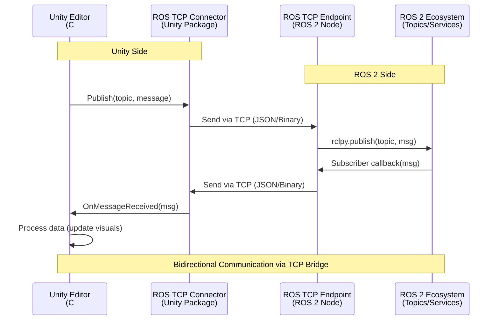

# Unity for Robotics

## Prerequisites

Before starting this chapter, you should have:

- ✅ Completed Chapter 1: Introduction to Gazebo
- ✅ Understanding of Gazebo simulation basics
- ✅ ROS 2 Humble installed on Ubuntu 22.04 LTS (or Windows/macOS for Unity development)
- ✅ Basic understanding of 3D graphics concepts (meshes, materials, transforms)
- ✅ Familiarity with C# programming (helpful but not required)
- ✅ ~20GB disk space for Unity Editor and packages

**Estimated Reading Time**: 20-25 minutes

---

## Introduction

While Gazebo excels at physics-accurate simulation for robotics research, Unity offers complementary strengths that make it valuable for specific robotics applications. Unity is a professional game engine with industry-leading rendering capabilities, extensive asset libraries, and robust support for VR/AR experiences.

**Why Unity for Robotics?** Unity's real-time 3D rendering engine produces photorealistic visuals, making it ideal for human-robot interaction research, teleoperation interfaces, synthetic data generation for computer vision, and public demonstrations. Unlike Gazebo, which prioritizes physics accuracy, Unity prioritizes visual fidelity and ease of use for non-roboticists.

**Unity Robotics Hub**: Recognizing Unity's potential for robotics, Unity Technologies developed the Unity Robotics Hub—a suite of tools that bridge Unity and ROS 2. The Hub includes packages for URDF import, bidirectional ROS 2 communication via TCP, and pre-built visualization tools. This integration allows roboticists to leverage Unity's strengths without abandoning the ROS 2 ecosystem.

**Chapter Goals**: By the end of this chapter, you will install Unity 2022 LTS, set up the Unity Robotics Hub packages, import a robot URDF into a Unity scene, establish ROS 2 communication via the ROS TCP Connector, and publish/subscribe to ROS 2 topics from Unity C# scripts.

**Learning Objectives**:
1. Understand when to choose Unity over Gazebo for robotics applications
2. Install Unity 2022 LTS and Unity Hub on your development machine
3. Import and configure the Unity Robotics Hub packages via Package Manager
4. Use the URDF Importer to bring robot models into Unity scenes
5. Establish bidirectional ROS 2 communication using ROS TCP Connector
6. Write C# scripts to publish and subscribe to ROS 2 topics
7. Integrate Unity visualization with existing ROS 2 systems

---

## Unity Robotics Hub Overview

The **Unity Robotics Hub** is an open-source project that provides ROS 2 integration tools for the Unity game engine. It consists of three primary packages:

### 1. URDF Importer
**Purpose**: Import robot models defined in URDF (Unified Robot Description Format) directly into Unity scenes.

**Key Features**:
- Automatic conversion of URDF links and joints to Unity GameObjects
- Physics configuration using Unity's Articulation Body system (analogous to ROS 2 joint controllers)
- Material and mesh import from ROS packages
- Preservation of kinematic chains and parent-child relationships

**Use Case**: Quickly visualize your existing ROS 2 robot models in Unity without manual recreation. The URDF Importer reads your robot's URDF file and generates the equivalent Unity scene hierarchy.

### 2. ROS TCP Connector
**Purpose**: Enable bidirectional communication between Unity and ROS 2 via a TCP/IP connection.

**Key Features**:
- Publish Unity data (camera images, transforms, sensor readings) to ROS 2 topics
- Subscribe to ROS 2 topics from Unity (robot commands, joint states, visualization markers)
- Service calls for request-response interactions
- Support for custom ROS 2 message types

**Use Case**: Create Unity-based robot control interfaces, teleoperation GUIs, or visualization dashboards that interact with real or simulated ROS 2 robots in real-time.

### 3. Visualizations Package
**Purpose**: Pre-built Unity components for common ROS 2 visualization tasks.

**Key Features**:
- TF (transform) visualizer for robot coordinate frames
- Marker visualizer for RViz-style 3D markers
- Laser scan visualizer for LiDAR data
- Point cloud visualizer for 3D sensor data

**Use Case**: Rapidly prototype visualization tools without writing custom rendering code. These components are similar to RViz plugins but leverage Unity's rendering engine.

### Unity vs. Gazebo: When to Use Each

| **Criterion** | **Unity** | **Gazebo** |
|---------------|-----------|------------|
| **Visual Fidelity** | Photorealistic rendering, real-time ray tracing, advanced shaders | Functional rendering, less realistic materials |
| **Physics Accuracy** | Good for general scenarios, limited for complex contacts | High-fidelity physics (ODE, DART, Bullet) for robotics |
| **VR/AR Support** | Native VR/AR support (Quest, HoloLens, Vive) | No native VR/AR support |
| **Asset Ecosystem** | Massive Unity Asset Store (3D models, environments, effects) | Limited to robotics-specific models |
| **Learning Curve** | Easier for non-roboticists, visual editor-first | Steeper learning curve, XML-based configuration |
| **ROS 2 Integration** | Via ROS TCP Connector (requires TCP bridge) | Native via ros_gz_bridge (DDS-based) |
| **Best For** | HRI research, teleoperation UIs, synthetic data for CV, demos | Physics-based testing, control validation, sensor simulation |

**Recommendation**: Use Unity for visualization, user interfaces, and data generation. Use Gazebo for physics-accurate simulation and control testing. Many teams use both: Gazebo for backend simulation, Unity for frontend visualization.

---

## Unity Robotics Hub Architecture

The following diagram illustrates how Unity communicates with ROS 2 via the ROS TCP Connector:


*Figure 1: Unity Robotics Hub architecture showing the TCP-based bridge between Unity and ROS 2. The ROS TCP Connector (Unity) communicates with the ROS TCP Endpoint (ROS 2 node) over a network socket.*

**Communication Flow**:
1. **Unity → ROS 2**: Unity C# script calls `ROSConnection.Publish()` → ROS TCP Connector serializes message → Sends over TCP to ROS TCP Endpoint → ROS 2 node publishes to topic
2. **ROS 2 → Unity**: ROS 2 node publishes to topic → ROS TCP Endpoint receives message → Sends over TCP to ROS TCP Connector → Unity C# subscriber callback invoked

**Key Insight**: Unlike Gazebo's native DDS integration, Unity uses a TCP bridge. This adds network latency (~5-20ms) but allows Unity to run on different machines or operating systems (Windows, macOS) while communicating with ROS 2 on Linux.

---

## Installing Unity 2022 LTS

Unity 2022 LTS (Long-Term Support) is the recommended version for robotics projects due to its stability, extended support lifecycle (2 years), and compatibility with Unity Robotics Hub.

### Step 1: Download and Install Unity Hub

Unity Hub is a desktop application that manages Unity Editor installations, projects, and licenses.

**For Linux (Ubuntu 22.04)**:
```bash
# Download Unity Hub AppImage
wget https://public-cdn.cloud.unity3d.com/hub/prod/UnityHubSetup.AppImage

# Make executable
chmod +x UnityHubSetup.AppImage

# Run Unity Hub
./UnityHubSetup.AppImage
```

**For Windows**:
- Download Unity Hub installer from https://unity.com/download
- Run the installer and follow the setup wizard

**For macOS**:
- Download Unity Hub DMG from https://unity.com/download
- Drag Unity Hub to Applications folder

### Step 2: Create Unity Account and Activate License

1. Open Unity Hub
2. Click "Sign In" and create a free Unity ID account (required for all Unity Editor downloads)
3. Go to Settings → Licenses → Add License → Get a free personal license (for non-commercial use)

**Note**: Unity offers free Personal licenses for individuals and small organizations (&lt;$100k revenue/year). Commercial licenses are required for larger organizations.

### Step 3: Install Unity 2022 LTS Editor

1. In Unity Hub, go to the **Installs** tab
2. Click **Install Editor** → Select **Unity 2022.3 LTS** (latest 2022 LTS version)
3. Choose modules to install:
   - ✅ **Linux Build Support** (if on Linux)
   - ✅ **Documentation** (optional but helpful)
   - ✅ **Language Packs** (optional)
4. Click **Install** and wait for download (~5-10 GB, 20-40 minutes depending on connection)

### Step 4: Create a New Unity Project

1. In Unity Hub, go to the **Projects** tab
2. Click **New Project**
3. Select **3D (URP)** template (Universal Render Pipeline, optimized for robotics)
4. Name your project (e.g., "ROS2_Unity_Demo")
5. Choose a project location (ensure adequate disk space)
6. Click **Create Project**

Unity Editor will open with a blank scene. You'll see the Scene view, Game view, Hierarchy panel, Inspector panel, and Project panel.

### Step 5: Install Unity Robotics Hub Packages

Unity Robotics Hub packages are distributed via Git URLs and installed through Unity's Package Manager.

**Installation Steps**:

1. In Unity Editor, go to **Window → Package Manager**
2. Click the **+** button (top-left) → **Add package from git URL**
3. Enter the following Git URLs **one at a time**:

```
https://github.com/Unity-Technologies/ROS-TCP-Connector.git?path=/com.unity.robotics.ros-tcp-connector
```

Wait for installation to complete (~1-2 minutes).

4. Repeat step 2-3 for the URDF Importer:

```
https://github.com/Unity-Technologies/URDF-Importer.git?path=/com.unity.robotics.urdf-importer#v0.5.2
```

5. Repeat step 2-3 for Visualizations (optional but recommended):

```
https://github.com/Unity-Technologies/ROS-TCP-Connector.git?path=/com.unity.robotics.visualizations
```

**Verification**: After installation, you should see "ROS TCP Connector", "URDF Importer", and "Visualizations" listed in Package Manager under "In Project" packages.

### Step 6: Configure ROS TCP Connector

1. In Unity Editor, go to **Robotics → ROS Settings**
2. Set the following parameters:
   - **ROS IP Address**: `127.0.0.1` (localhost, if ROS 2 is on the same machine) or the IP of your ROS 2 machine
   - **ROS Port**: `10000` (default ROS TCP Endpoint port)
   - **Protocol**: `ROS2` (not ROS1)

Unity is now ready to communicate with ROS 2 once the ROS TCP Endpoint is running (next section).

---

## ROS TCP Endpoint Setup

The **ROS TCP Endpoint** is a ROS 2 node that acts as the bridge server, listening for connections from Unity.

### Installation on ROS 2 Humble

```bash
# Navigate to your ROS 2 workspace (or create one)
cd ~/ros2_ws/src

# Clone the ROS TCP Endpoint repository
git clone https://github.com/Unity-Technologies/ROS-TCP-Endpoint.git

# Install dependencies
cd ~/ros2_ws
rosdep install --from-paths src --ignore-src -r -y

# Build the package
colcon build --packages-select ros_tcp_endpoint

# Source the workspace
source install/setup.bash
```

### Launching the ROS TCP Endpoint

Start the ROS TCP Endpoint node to accept Unity connections:

```bash
ros2 run ros_tcp_endpoint default_server_endpoint --ros-args -p ROS_IP:=0.0.0.0 -p ROS_TCP_PORT:=10000
```

**Expected Output**:
```
[INFO] [ros_tcp_endpoint]: Starting ROS TCP Server...
[INFO] [ros_tcp_endpoint]: Listening on 0.0.0.0:10000
[INFO] [ros_tcp_endpoint]: Waiting for Unity connection...
```

**Connection Test**: In Unity, click **Robotics → ROS Settings → Test Connection**. You should see "Connection successful!" if Unity can reach the ROS TCP Endpoint.

**Configuration Notes**:
- **ROS_IP**: Set to `0.0.0.0` to listen on all network interfaces (allows Unity on different machines to connect)
- **ROS_TCP_PORT**: Must match the port configured in Unity's ROS Settings (default 10000)
- **Firewall**: Ensure port 10000 is open in your firewall if Unity and ROS 2 are on different machines

---

## URDF Importer for Unity

The URDF Importer translates ROS 2 robot descriptions (URDF files) into Unity GameObjects with proper kinematics, physics, and visuals.

### Importing a URDF Model

**Example: Import a TurtleBot3 Burger**

1. In Unity Editor, go to **Assets → Import Robot from URDF**
2. Click **Browse** and navigate to your robot's URDF file:
   ```
   /opt/ros/humble/share/turtlebot3_description/urdf/turtlebot3_burger.urdf
   ```
3. Click **Import**

Unity will parse the URDF, download meshes (if referenced), and create a GameObject hierarchy in the Scene.

### Understanding the Imported Structure

The URDF Importer creates the following Unity structure:

```
TurtleBot3_Burger (Root GameObject)
├── base_link (Articulation Body - root)
│   ├── Visual (MeshFilter + MeshRenderer)
│   └── Collision (MeshCollider or primitive colliders)
├── wheel_left_link (Articulation Body - revolute joint)
│   ├── Visual
│   └── Collision
├── wheel_right_link (Articulation Body - revolute joint)
│   ├── Visual
│   └── Collision
└── caster_link (Articulation Body - fixed joint)
    ├── Visual
    └── Collision
```

**Articulation Body**: Unity's physics component for multi-body systems with joints. It's analogous to ROS 2's joint controllers and provides realistic physics simulation for robot arms, mobile robots, and humanoids.

### Configuring Materials and Visuals

By default, URDF Importer applies generic materials. To improve visuals:

1. Select a link's Visual child in the Hierarchy
2. In the Inspector, expand **Mesh Renderer → Materials**
3. Drag a custom Unity material (e.g., metallic shader for robot body, rubber shader for wheels)

**Tip**: Use Unity's **Universal Render Pipeline (URP)** materials for better performance and visual quality.

### Articulation Body Configuration

To control the robot's joints from ROS 2:

1. Select a joint link (e.g., `wheel_left_link`) in the Hierarchy
2. In the Inspector, expand **Articulation Body**
3. Note the **Target** properties:
   - **Target Velocity**: For velocity-controlled joints (wheels)
   - **Target Position**: For position-controlled joints (robot arms)

You'll set these values via C# scripts that subscribe to ROS 2 joint command topics.

---

## ROS 2 Communication from Unity

Now that Unity and ROS 2 are connected via the ROS TCP Endpoint, let's write C# scripts to publish and subscribe to ROS 2 topics.

### Example 1: Publishing Twist Messages (Robot Velocity Commands)

**Use Case**: Create a Unity UI that publishes `/cmd_vel` commands to control a robot.

**C# Script (`TwistPublisher.cs`)**:

```csharp
using UnityEngine;
using Unity.Robotics.ROSTCPConnector;
using RosMessageTypes.Geometry;

public class TwistPublisher : MonoBehaviour
{
    ROSConnection ros;
    public string topicName = "/cmd_vel";
    public float publishRate = 10f; // Hz

    // Velocity parameters (set in Inspector or via UI)
    public float linearX = 0.0f;
    public float angularZ = 0.0f;

    private float timer;

    void Start()
    {
        // Get or create the ROS connection
        ros = ROSConnection.GetOrCreateInstance();

        // Register publisher for Twist messages
        ros.RegisterPublisher<TwistMsg>(topicName);
    }

    void Update()
    {
        // Publish at specified rate
        timer += Time.deltaTime;
        if (timer >= 1.0f / publishRate)
        {
            timer = 0;

            // Create Twist message
            TwistMsg twist = new TwistMsg
            {
                linear = new Vector3Msg { x = linearX, y = 0, z = 0 },
                angular = new Vector3Msg { x = 0, y = 0, z = angularZ }
            };

            // Publish to ROS 2
            ros.Publish(topicName, twist);
        }
    }

    // Example: Call this from UI buttons to change velocity
    public void SetLinearX(float value)
    {
        linearX = value;
    }

    public void SetAngularZ(float value)
    {
        angularZ = value;
    }
}
```

**How to Use**:
1. Create an empty GameObject in Unity (right-click Hierarchy → Create Empty → name it "TwistPublisher")
2. Attach the `TwistPublisher.cs` script to the GameObject (drag script onto GameObject in Inspector)
3. In the Inspector, set `linearX = 0.5` and `angularZ = 0.0` for testing
4. Run the scene (Play button)
5. In a terminal, verify the topic is being published:
   ```bash
   ros2 topic echo /cmd_vel
   ```

**Expected Output**:
```yaml
linear:
  x: 0.5
  y: 0.0
  z: 0.0
angular:
  x: 0.0
  y: 0.0
  z: 0.0
---
```

### Example 2: Subscribing to Laser Scan Data

**Use Case**: Visualize LiDAR data from a ROS 2 robot in Unity.

**C# Script (`LaserScanSubscriber.cs`)**:

```csharp
using UnityEngine;
using Unity.Robotics.ROSTCPConnector;
using RosMessageTypes.Sensor;

public class LaserScanSubscriber : MonoBehaviour
{
    ROSConnection ros;
    public string topicName = "/scan";
    public GameObject laserPointPrefab; // Assign a small sphere prefab in Inspector

    private GameObject[] laserPoints;

    void Start()
    {
        ros = ROSConnection.GetOrCreateInstance();

        // Register subscriber for LaserScan messages
        ros.Subscribe<LaserScanMsg>(topicName, OnLaserScanReceived);
    }

    void OnLaserScanReceived(LaserScanMsg msg)
    {
        // Destroy old laser points
        if (laserPoints != null)
        {
            foreach (var point in laserPoints)
            {
                Destroy(point);
            }
        }

        // Create new laser points
        laserPoints = new GameObject[msg.ranges.Length];

        for (int i = 0; i < msg.ranges.Length; i++)
        {
            float range = msg.ranges[i];
            float angle = msg.angle_min + i * msg.angle_increment;

            // Convert polar to Cartesian coordinates
            Vector3 position = new Vector3(
                range * Mathf.Cos(angle),
                0,
                range * Mathf.Sin(angle)
            );

            // Instantiate laser point
            laserPoints[i] = Instantiate(laserPointPrefab, position, Quaternion.identity, transform);
        }
    }
}
```

**How to Use**:
1. Create a small sphere prefab (GameObject → 3D Object → Sphere, scale to 0.1, save as prefab)
2. Create an empty GameObject "LaserScanVisualizer" and attach `LaserScanSubscriber.cs`
3. Drag the sphere prefab to the `laserPointPrefab` field in Inspector
4. Run a ROS 2 node that publishes `/scan` (e.g., `ros2 launch turtlebot3_gazebo turtlebot3_world.launch.py`)
5. Play the Unity scene

**Expected Behavior**: Small spheres appear in Unity, representing LiDAR scan points in 3D space.

### Example 3: Controlling Robot Joints

**Use Case**: Subscribe to `/joint_states` and update Unity Articulation Bodies to match the robot's joint positions.

**C# Script (`JointStateSubscriber.cs`)**:

```csharp
using UnityEngine;
using Unity.Robotics.ROSTCPConnector;
using RosMessageTypes.Sensor;
using System.Collections.Generic;

public class JointStateSubscriber : MonoBehaviour
{
    ROSConnection ros;
    public string topicName = "/joint_states";

    // Map joint names to Articulation Bodies (set in Inspector)
    public List<string> jointNames;
    public List<ArticulationBody> articulationBodies;

    void Start()
    {
        ros = ROSConnection.GetOrCreateInstance();
        ros.Subscribe<JointStateMsg>(topicName, OnJointStateReceived);
    }

    void OnJointStateReceived(JointStateMsg msg)
    {
        for (int i = 0; i < msg.name.Length; i++)
        {
            string jointName = msg.name[i];
            int index = jointNames.IndexOf(jointName);

            if (index >= 0 && index < articulationBodies.Count)
            {
                ArticulationBody body = articulationBodies[index];
                ArticulationDrive drive = body.xDrive;

                // Update target position (convert radians to degrees if needed)
                drive.target = (float)msg.position[i] * Mathf.Rad2Deg;
                body.xDrive = drive;
            }
        }
    }
}
```

**Configuration**:
1. Attach this script to your robot's root GameObject
2. In Inspector, manually populate `jointNames` (e.g., "wheel_left_joint", "wheel_right_joint")
3. Drag the corresponding Articulation Body components to the `articulationBodies` list

**Result**: Unity robot joints move in sync with the real/simulated robot's joint states.

---

## Hands-On Exercises

### Exercise 1: Install Unity Hub and Unity 2022 LTS
**Goal**: Set up the Unity development environment.

**Instructions**:
1. Download and install Unity Hub for your operating system
2. Create a Unity ID account and activate a Personal license
3. Install Unity 2022.3 LTS (latest patch version)
4. Create a new 3D (URP) project named "ROS2_Robot_Visualization"
5. Verify the Unity Editor opens without errors

**Expected Outcome**: You have a working Unity 2022 LTS installation and an empty project.

---

### Exercise 2: Import Robot URDF
**Goal**: Bring a ROS 2 robot model into Unity.

**Instructions**:
1. Install the URDF Importer package via Package Manager (Git URL from earlier section)
2. Go to **Assets → Import Robot from URDF**
3. Browse to a URDF file on your system (e.g., TurtleBot3, your custom robot, or download a sample URDF)
4. Click **Import** and wait for the process to complete
5. Inspect the generated GameObject hierarchy in the Hierarchy panel
6. Add a Directional Light and Main Camera to the scene if not present
7. Click Play and observe the robot in the Game view

**Expected Outcome**: Your robot model appears in Unity with proper joint structure and physics.

---

### Exercise 3: Publish to /cmd_vel Topic
**Goal**: Send velocity commands from Unity to ROS 2.

**Instructions**:
1. Install ROS TCP Connector and ROS TCP Endpoint (follow installation sections)
2. Launch the ROS TCP Endpoint:
   ```bash
   ros2 run ros_tcp_endpoint default_server_endpoint
   ```
3. In Unity, create the `TwistPublisher.cs` script (from Example 1)
4. Attach the script to an empty GameObject
5. Set `linearX = 0.5` in Inspector
6. Play the Unity scene
7. In a terminal, run:
   ```bash
   ros2 topic echo /cmd_vel
   ```

**Expected Outcome**: You see Twist messages being published from Unity to ROS 2.

---

### Exercise 4: Subscribe from ROS 2 in Unity
**Goal**: Receive ROS 2 topic data in Unity.

**Instructions**:
1. In ROS 2, start a node that publishes a topic (e.g., a talker node publishing to `/chatter`):
   ```bash
   ros2 run demo_nodes_cpp talker
   ```
2. In Unity, create a subscriber script similar to Example 2
3. Subscribe to `/chatter` (String message type)
4. In the callback, use `Debug.Log(msg.data)` to print received messages
5. Play the Unity scene and check the Console panel

**Expected Outcome**: Unity Console shows messages received from the ROS 2 talker node.

---

## Key Takeaways

After completing this chapter, you should understand:

1. **Unity's Role in Robotics**: Unity excels at visualization, user interfaces, VR/AR, and synthetic data generation, complementing Gazebo's physics-focused simulation.

2. **Unity Robotics Hub Components**: The URDF Importer, ROS TCP Connector, and Visualizations packages enable seamless ROS 2 integration with Unity.

3. **Installation Workflow**: Install Unity Hub → Unity 2022 LTS → Unity Robotics Hub packages via Package Manager → ROS TCP Endpoint in ROS 2.

4. **URDF Import**: The URDF Importer converts ROS 2 robot descriptions into Unity GameObjects with Articulation Bodies for physics and kinematics.

5. **ROS 2 Communication**: Unity communicates with ROS 2 via a TCP bridge (ROS TCP Connector + ROS TCP Endpoint), supporting publish/subscribe and service calls.

6. **C# Scripting**: C# scripts use the `ROSConnection` API to publish (`Publish()`) and subscribe (`Subscribe()`) to ROS 2 topics from Unity.

7. **Use Cases**: Unity is ideal for teleoperation UIs, 3D visualizations for non-technical stakeholders, VR-based robot control, and generating labeled training data for machine learning.

---

## Navigation

**Previous Chapter**: [Introduction to Gazebo](/docs/module-2-gazebo/intro-gazebo)
**Next Chapter**: [Simulation Best Practices](/docs/module-2-gazebo/simulation-best-practices)
