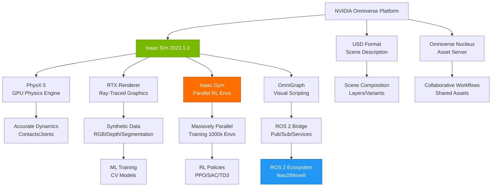

# Introduction to NVIDIA Isaac

## Prerequisites

Before starting this chapter, you should have:

- ✅ Completed Module 2 (Gazebo & Unity Simulation)
- ✅ **NVIDIA RTX GPU** (GTX 1060 6GB+ or RTX 2060+) - **REQUIRED**
- ✅ Ubuntu 22.04 LTS or Windows 10/11 (64-bit)
- ✅ CUDA 11.8 or newer installed
- ✅ 16GB+ RAM (32GB recommended for large scenes)
- ✅ 50GB+ free disk space for Omniverse and Isaac Sim
- ✅ Basic understanding of Python programming
- ✅ Familiarity with reinforcement learning concepts (helpful but not required)

**Estimated Reading Time**: 20-25 minutes

---

## Introduction

As robotics research pushes toward more intelligent, autonomous systems, traditional simulation environments face scalability challenges. Training reinforcement learning (RL) policies or generating massive synthetic datasets requires running thousands—or even millions—of simulations. On CPU-based simulators like Gazebo, this process can take days or weeks. NVIDIA Isaac changes the game by leveraging GPU acceleration to run thousands of parallel simulations simultaneously.

**Why Isaac for AI Robotics?** NVIDIA Isaac is not just a simulator—it's an ecosystem designed specifically for AI-driven robotics. Isaac Sim provides photorealistic, physics-accurate simulation powered by NVIDIA's PhysX 5 engine running entirely on the GPU. Isaac Gym, integrated within Isaac Sim, enables massively parallel reinforcement learning with thousands of environments training on a single GPU. This speed enables rapid iteration on robot learning algorithms that would be impractical with CPU-based tools.

**The Isaac Advantage**: While Gazebo excels at physics testing and Unity at visualization, Isaac Sim bridges both worlds: physically accurate simulations with stunning visual fidelity, all accelerated by RTX GPUs for ray-traced rendering and GPU-parallelized physics. Additionally, Isaac integrates seamlessly with NVIDIA's robotics stack (Isaac ROS, Isaac Manipulator, Isaac AMR) for end-to-end development from simulation to deployment.

**Chapter Goals**: By the end of this chapter, you will understand the NVIDIA Isaac ecosystem, identify when to use Isaac Sim vs. Gazebo/Unity, install Isaac Sim via Omniverse Launcher, explore the Isaac Sim interface, and verify your GPU setup for RL training. You'll gain foundational knowledge to leverage GPU-accelerated simulation for your robotics projects.

**Learning Objectives**:
1. Understand the NVIDIA Isaac ecosystem (Isaac Sim, Isaac Gym, Isaac ROS)
2. Identify use cases where Isaac provides advantages over Gazebo and Unity
3. Explain the role of Omniverse and USD format in Isaac workflows
4. Install Isaac Sim 2023.1.0 (or newer) via Omniverse Launcher
5. Verify GPU, CUDA, and system requirements for Isaac Sim
6. Navigate the Isaac Sim interface and load sample robotic scenes
7. Run a simple Python script to interact with Isaac Sim programmatically

---

## What is NVIDIA Isaac?

NVIDIA Isaac is a platform for developing, testing, and deploying AI-powered robots. It consists of three main components:

### 1. Isaac Sim
**Purpose**: GPU-accelerated robotics simulator with photorealistic rendering and physically accurate simulation.

**Key Features**:
- **PhysX 5 GPU Physics**: Simulates rigid bodies, joints, collisions, and contacts entirely on the GPU, enabling real-time simulation of complex robots
- **RTX Ray-Traced Rendering**: Photorealistic visuals using NVIDIA RTX GPUs, ideal for computer vision algorithm development
- **USD (Universal Scene Description)**: Uses Pixar's USD format for scene composition, enabling complex world building and asset reuse
- **Synthetic Data Generation**: Generate labeled training data (RGB images, depth maps, semantic segmentation, bounding boxes) for machine learning
- **ROS 2 Integration**: Bidirectional communication with ROS 2 via Isaac ROS packages

**Use Cases**:
- Testing perception algorithms (object detection, semantic segmentation) with diverse, labeled datasets
- Simulating complex manipulation tasks (pick-and-place, assembly) with accurate physics
- Validating navigation systems in photorealistic indoor/outdoor environments
- Generating synthetic data to augment real-world training datasets

### 2. Isaac Gym
**Purpose**: Massively parallel reinforcement learning environment integrated into Isaac Sim.

**Key Features**:
- **GPU-Parallelized Environments**: Run thousands of robot environments in parallel on a single GPU (e.g., 4096 simultaneous robot arms on an RTX 4090)
- **Tensor-Based API**: Observations, actions, and rewards are PyTorch tensors, enabling direct GPU-to-GPU data flow (no CPU bottleneck)
- **Built-In RL Algorithms**: Integration with RL libraries (RL Games, Stable Baselines3) for PPO, SAC, and other algorithms
- **Physics Accuracy**: Full PhysX 5 simulation fidelity even in massively parallel mode

**Use Cases**:
- Training robot manipulation policies (grasping, in-hand manipulation, tool use)
- Learning locomotion for legged robots (quadrupeds, bipeds, hexapods)
- Multi-agent coordination and swarm robotics research
- Hyperparameter tuning for RL algorithms with fast iteration

### 3. Isaac ROS
**Purpose**: Hardware-accelerated ROS 2 packages for perception, navigation, and manipulation.

**Key Features**:
- **GPU-Accelerated Perception**: AprilTag detection, DNN inference, stereo depth estimation running on NVIDIA GPUs
- **Pre-Built Pipelines**: Ready-to-use perception pipelines (object detection, 3D reconstruction, visual SLAM)
- **Deployment Optimization**: Optimized for NVIDIA Jetson embedded platforms (Jetson Orin, Jetson Xavier)

**Use Cases**:
- Real-time object detection and tracking on Jetson-powered robots
- Visual SLAM for autonomous mobile robots
- Integration between simulated (Isaac Sim) and real-world (Jetson) workflows

---

## Isaac Sim vs. Gazebo vs. Unity

Understanding when to use each simulator helps you choose the right tool for your project:

| **Criterion** | **Isaac Sim** | **Gazebo Garden** | **Unity 2022 LTS** |
|---------------|---------------|-------------------|--------------------|
| **Physics Engine** | PhysX 5 (GPU) | ODE/DART/Bullet (CPU) | PhysX/Unity Physics (CPU/partial GPU) |
| **Physics Accuracy** | Very High | High | Medium |
| **Rendering Quality** | Photorealistic (RTX ray-tracing) | Functional | Photorealistic (URP/HDRP) |
| **GPU Acceleration** | Full (physics + rendering) | Rendering only | Rendering + limited physics |
| **RL Training Support** | Excellent (Isaac Gym, thousands of parallel envs) | Limited (single env per instance) | Limited |
| **ROS 2 Integration** | OmniGraph + Isaac ROS | Native (ros_gz_bridge, DDS) | TCP bridge (ros_tcp_connector) |
| **Synthetic Data Generation** | Excellent (Replicator, domain randomization) | Basic | Good (Perception package) |
| **Asset Format** | USD (Universal Scene Description) | SDF/URDF | Unity Prefabs/URDF Importer |
| **Multi-Robot Scaling** | Excellent (GPU-parallelized) | Good (dozens per machine) | Good (depends on hardware) |
| **Hardware Requirements** | **NVIDIA RTX GPU required** | Any GPU (or CPU-only) | Any GPU |
| **Learning Curve** | Steep (USD, Python API, Omniverse) | Steep (XML config, plugins) | Moderate (visual editor) |
| **Cost** | Free for research/education | Open-source (Apache 2.0) | Free Personal license (Engine proprietary) |
| **Best For** | RL training, synthetic data, GPU-accelerated physics | Traditional robotics, control validation | HRI, teleoperation UIs, VR/AR |

**Decision Guidelines**:
- **Use Isaac Sim** when you need GPU-accelerated physics, RL training, or large-scale synthetic data generation
- **Use Gazebo** for CPU-based development, lightweight simulation, or maximum ROS 2 compatibility
- **Use Unity** for visualization-focused projects, user interfaces, or VR/AR applications

---

## Isaac Ecosystem Architecture

The following diagram illustrates how the Isaac ecosystem components interact:


*Figure 1: NVIDIA Isaac ecosystem architecture. Isaac Sim runs on Omniverse, leveraging USD for scene composition, PhysX 5 for GPU physics, RTX rendering for photorealism, and OmniGraph for ROS 2 integration.*

**Key Architectural Insights**:

1. **Omniverse Foundation**: Isaac Sim is built on NVIDIA Omniverse, a platform for 3D collaboration and simulation. Omniverse provides USD support, Nucleus asset servers, and real-time collaboration tools.

2. **USD Scene Format**: Universal Scene Description (developed by Pixar) is a file format for describing 3D scenes. USD enables non-destructive editing, layering (overrides), and variants (multiple configurations of the same scene).

3. **PhysX 5 GPU Acceleration**: Unlike CPU-based physics engines, PhysX 5 runs collision detection, rigid body dynamics, and joint constraints on the GPU. This enables real-time simulation of thousands of robots simultaneously.

4. **OmniGraph**: A visual node-based scripting system for defining simulation logic, sensor configurations, and ROS 2 communication. OmniGraph nodes handle data flow between Isaac Sim and external systems (ROS 2, Python scripts).

---

## System Requirements

Isaac Sim has strict hardware requirements due to GPU-accelerated physics and ray-traced rendering.

### Minimum Requirements
- **GPU**: NVIDIA RTX 2060 (6GB VRAM) or GTX 1060 (6GB VRAM) *with driver 525.60.13+*
- **CPU**: Intel Core i7 or AMD Ryzen 7 (8+ cores recommended)
- **RAM**: 16GB (32GB recommended for complex scenes)
- **Storage**: 50GB free disk space (SSD strongly recommended)
- **OS**: Ubuntu 22.04 LTS or Windows 10/11 (64-bit)
- **CUDA**: 11.8 or newer
- **GPU Driver**: 525.60.13 or newer (Linux), 528.33 or newer (Windows)

### Recommended Requirements (for RL Training)
- **GPU**: NVIDIA RTX 4080 (16GB VRAM) or RTX 4090 (24GB VRAM)
- **CPU**: Intel Core i9 or AMD Ryzen 9 (16+ cores)
- **RAM**: 64GB
- **Storage**: 500GB NVMe SSD

### Checking Your System

**Verify GPU**:
```bash
# Check NVIDIA GPU
nvidia-smi
```

**Expected Output**:
```
+-----------------------------------------------------------------------------+
| NVIDIA-SMI 535.54.03    Driver Version: 535.54.03    CUDA Version: 12.2     |
|-------------------------------+----------------------+----------------------+
| GPU  Name        Persistence-M| Bus-Id        Disp.A | Volatile Uncorr. ECC |
|   0  NVIDIA GeForce ...  Off  | 00000000:01:00.0  On |                  N/A |
+-----------------------------------------------------------------------------+
```

**Verify CUDA**:
```bash
nvcc --version
```

**Expected Output**:
```
nvcc: NVIDIA (R) Cuda compiler driver
Cuda compilation tools, release 11.8, V11.8.89
```

**Important Notes**:
- **No NVIDIA GPU? Isaac Sim will not run.** Consider using Gazebo or Unity for CPU-based simulation.
- **Integrated Graphics (Intel/AMD)**: Not supported. A dedicated NVIDIA GPU is required.
- **Older GPUs (GTX 10 series)**: Supported but limited performance. RL training may be slow.

---

## Installing Isaac Sim

Isaac Sim is distributed via **NVIDIA Omniverse**, a platform for 3D workflows and collaborative simulation.

### Step 1: Download Omniverse Launcher

**For Linux (Ubuntu 22.04)**:
```bash
# Download Omniverse Launcher AppImage
wget https://install.launcher.omniverse.nvidia.com/installers/omniverse-launcher-linux.AppImage

# Make executable
chmod +x omniverse-launcher-linux.AppImage

# Run Omniverse Launcher
./omniverse-launcher-linux.AppImage
```

**For Windows**:
- Download Omniverse Launcher installer: https://www.nvidia.com/en-us/omniverse/download/
- Run the installer and follow the setup wizard
- Launch Omniverse Launcher from the Start menu

### Step 2: Create NVIDIA Account

1. Open Omniverse Launcher
2. Click **Sign In** (top-right)
3. Create a free NVIDIA account (required for downloads)
4. Verify your email address

### Step 3: Install Isaac Sim

1. In Omniverse Launcher, go to the **Exchange** tab
2. Search for **"Isaac Sim"**
3. Select **Isaac Sim 2023.1.0** (or latest version)
4. Click **Install** (download size: ~15GB, installation: ~30GB)
5. Wait for installation to complete (~20-40 minutes depending on internet speed)

**Installation Path**:
- **Linux**: `~/.local/share/ov/pkg/isaac_sim-2023.1.0/`
- **Windows**: `C:\Users\<YourName>\AppData\Local\ov\pkg\isaac_sim-2023.1.0\`

### Step 4: Launch Isaac Sim

1. In Omniverse Launcher, go to the **Library** tab
2. Find **Isaac Sim 2023.1.0** in your installed apps
3. Click **Launch**
4. First launch will take 2-5 minutes (loading shaders, initializing PhysX)

**Expected Behavior**: Isaac Sim opens with a viewport showing an empty stage, a properties panel, and a content browser.

### Step 5: Load a Sample Scene

1. In Isaac Sim, go to **Isaac Examples → Manipulation → Pick and Place**
2. Click **Load** to open a sample robotic arm scene
3. Click **Play** button (bottom-left) to start physics simulation
4. Observe the robot arm picking and placing objects

**Troubleshooting**:
- **"CUDA initialization failed"**: Update your NVIDIA driver: `sudo ubuntu-drivers autoinstall` (Linux)
- **"Insufficient VRAM"**: Close other GPU-intensive applications (browsers with hardware acceleration, games)
- **Black viewport**: Update GPU driver, ensure Vulkan support is enabled

---

## Isaac Sim Python API

Isaac Sim provides a Python API for programmatic control, enabling headless simulation, automated testing, and custom environments.

### Example: Simple Scene Creation and Control

```python
#!/usr/bin/env python3
"""
Simple Isaac Sim example: Create a scene with a robot and control it.
"""

from isaacsim import SimulationApp

# Initialize Isaac Sim headless (no GUI)
simulation_app = SimulationApp({"headless": False})  # Set to True for servers

# Import Isaac Sim modules (must be after SimulationApp initialization)
from omni.isaac.core import World
from omni.isaac.core.objects import DynamicCuboid
from omni.isaac.core.utils.stage import add_reference_to_stage
import numpy as np

# Create a simulation world
world = World(stage_units_in_meters=1.0)

# Add a ground plane
world.scene.add_default_ground_plane()

# Add a cube (simulated object)
cube = world.scene.add(
    DynamicCuboid(
        prim_path="/World/Cube",
        name="cube",
        position=np.array([0, 0, 0.5]),  # x, y, z in meters
        size=np.array([0.2, 0.2, 0.2]),  # 20cm cube
        color=np.array([0.8, 0.2, 0.2]),  # Red color
    )
)

# Reset the world (initialize physics)
world.reset()

print("Starting simulation...")

# Run simulation for 1000 steps
for i in range(1000):
    # Apply a small force to the cube (push it)
    if i == 100:
        cube.apply_force(force=np.array([10.0, 0, 0]), is_impulse=False)
        print("Applied force to cube!")

    # Step the simulation (advance physics by one timestep)
    world.step(render=True)

    # Print cube position every 100 steps
    if i % 100 == 0:
        position, orientation = cube.get_world_pose()
        print(f"Step {i}: Cube position = {position}")

# Cleanup
simulation_app.close()
print("Simulation complete.")
```

**How to Run**:
```bash
# Navigate to Isaac Sim installation directory
cd ~/.local/share/ov/pkg/isaac_sim-2023.1.0/

# Run the script with Isaac Sim's Python interpreter
./python.sh /path/to/your_script.py
```

**Expected Output**:
```
Starting simulation...
Step 0: Cube position = [0. 0. 0.5]
Applied force to cube!
Step 100: Cube position = [0.05 0.   0.48]
Step 200: Cube position = [0.12 0.   0.46]
...
Simulation complete.
```

**Key Concepts**:
- **SimulationApp**: Initializes the Isaac Sim runtime (can run headless or with GUI)
- **World**: Manages the simulation state, time stepping, and scene hierarchy
- **DynamicCuboid**: A physics-enabled object that responds to forces and gravity
- **world.step()**: Advances the simulation by one physics timestep (~1/60th second by default)

---

## Hands-On Exercises

### Exercise 1: Verify GPU and CUDA
**Goal**: Confirm your system meets Isaac Sim requirements.

**Instructions**:
1. Run `nvidia-smi` and verify you have an NVIDIA RTX or GTX GPU (6GB+ VRAM)
2. Run `nvcc --version` and confirm CUDA 11.8 or newer
3. Check driver version in `nvidia-smi` output (525.60.13+ for Linux, 528.33+ for Windows)
4. If any requirement fails, update drivers or consider alternative simulators

**Expected Outcome**: Your system meets all minimum requirements for Isaac Sim.

---

### Exercise 2: Install Isaac Sim via Omniverse
**Goal**: Set up the complete Isaac Sim development environment.

**Instructions**:
1. Download and install Omniverse Launcher
2. Create an NVIDIA account and sign in
3. Install Isaac Sim 2023.1.0 (or latest version) from the Exchange tab
4. Launch Isaac Sim from the Library tab
5. Wait for the initial shader compilation to complete

**Expected Outcome**: Isaac Sim opens successfully, displaying the viewport and UI panels.

---

### Exercise 3: Load and Explore a Sample Scene
**Goal**: Familiarize yourself with the Isaac Sim interface.

**Instructions**:
1. In Isaac Sim, go to **Isaac Examples → Manipulation → Pick and Place**
2. Click **Load** to open the scene
3. Click **Play** to start the simulation
4. Use mouse controls to navigate the 3D viewport:
   - **Left-click + drag**: Rotate camera
   - **Middle-click + drag**: Pan camera
   - **Scroll wheel**: Zoom in/out
5. Explore the **Stage** panel (left) to see the scene hierarchy (robot, objects, sensors)

**Expected Outcome**: You can navigate the scene and observe the robot performing pick-and-place operations.

---

### Exercise 4: Run the Python API Example
**Goal**: Control Isaac Sim programmatically with Python.

**Instructions**:
1. Save the "Simple Scene Creation and Control" Python script from the section above to a file (e.g., `test_isaac.py`)
2. Open a terminal and navigate to Isaac Sim installation directory:
   ```bash
   cd ~/.local/share/ov/pkg/isaac_sim-2023.1.0/
   ```
3. Run the script:
   ```bash
   ./python.sh /path/to/test_isaac.py
   ```
4. Observe the cube falling, force application, and position updates in the console

**Expected Outcome**: The script runs successfully, prints cube positions, and the simulation completes without errors.

---

## Key Takeaways

After completing this chapter, you should understand:

1. **Isaac Ecosystem**: NVIDIA Isaac consists of Isaac Sim (GPU-accelerated simulator), Isaac Gym (parallel RL environments), and Isaac ROS (hardware-accelerated ROS 2 packages).

2. **GPU Requirement**: Isaac Sim **requires an NVIDIA RTX or GTX GPU** (6GB+ VRAM). CPU-only systems cannot run Isaac Sim—use Gazebo or Unity instead.

3. **Isaac vs. Gazebo vs. Unity**: Isaac excels at RL training (massively parallel envs), synthetic data generation, and GPU-accelerated physics. Gazebo is better for CPU-based development, Unity for visualization/VR.

4. **Omniverse Platform**: Isaac Sim runs on NVIDIA Omniverse, which provides USD scene format support, asset collaboration, and integration with other NVIDIA tools.

5. **USD Format**: Universal Scene Description (USD) is the native scene format for Isaac Sim, enabling complex scene composition, layering, and non-destructive editing.

6. **Installation**: Install Isaac Sim via Omniverse Launcher (~30GB installation, requires NVIDIA account).

7. **Python API**: Isaac Sim provides a Python API for headless simulation, automated testing, and custom environment creation (essential for RL training).

---

## Navigation

**Previous Chapter**: [Simulation Best Practices](/docs/module-2-gazebo/simulation-best-practices)
**Next Chapter**: [Isaac Sim for Robotics](/docs/module-3-isaac/isaac-sim)
