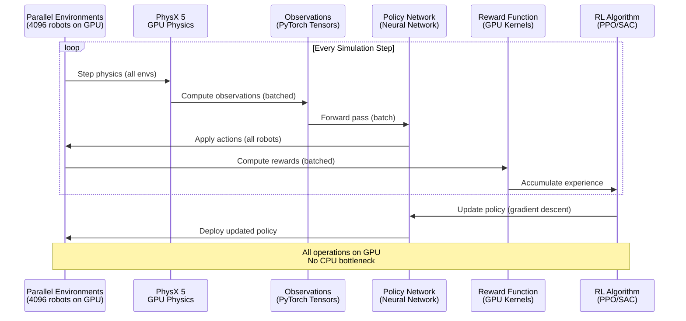
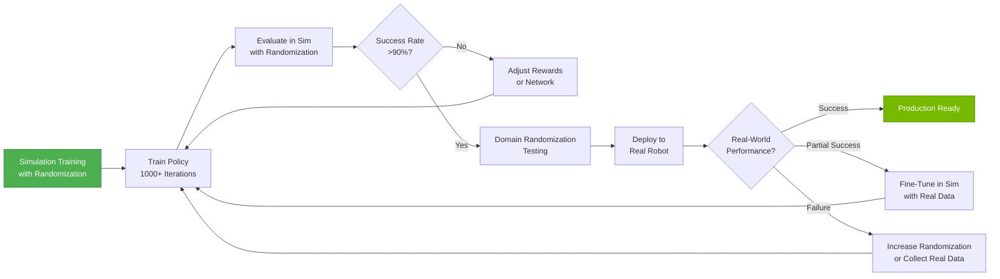

# Reinforcement Learning with Isaac Gym

## Prerequisites

Before starting this chapter, you should have:

- ✅ Completed Chapter 1: Introduction to NVIDIA Isaac
- ✅ Completed Chapter 2: Isaac Sim for Robotics
- ✅ NVIDIA RTX GPU (8GB+ VRAM recommended for RL training)
- ✅ Isaac Sim 2023.1.0 (or newer) installed and verified
- ✅ **PyTorch installed** (1.13.0+ with CUDA support)
- ✅ Basic understanding of reinforcement learning (policies, rewards, value functions)
- ✅ Familiarity with Python and NumPy for tensor operations
- ✅ Understanding of robot control concepts (joint positions, velocities, torques)

**Estimated Reading Time**: 20-25 minutes

---

## Introduction

Traditional reinforcement learning (RL) for robotics faces a critical bottleneck: simulation speed. Training a robotic manipulation policy from scratch can require millions of environment interactions. On CPU-based simulators, collecting this data might take weeks or months—making research impractical and hyperparameter tuning infeasible. Isaac Gym solves this problem with **massively parallel GPU simulation**, running thousands of robot environments simultaneously on a single GPU.

**Why RL for Robotics?** Reinforcement learning enables robots to learn complex behaviors through trial and error, discovering strategies that are difficult or impossible to hand-program. From dexterous manipulation (in-hand object rotation, tool use) to dynamic locomotion (quadruped gaits, bipedal walking), RL has achieved state-of-the-art results. However, the key challenge is sample efficiency—RL algorithms require vast amounts of experience to learn.

**Isaac Gym's Breakthrough**: By parallelizing physics simulation on the GPU, Isaac Gym accelerates RL training by **10-100x** compared to CPU-based approaches. What previously took weeks can now complete in hours. This speed enables:
- **Rapid prototyping**: Test reward functions and hyperparameters in minutes instead of days
- **Complex tasks**: Train policies for high-DoF robots (humanoids, multi-fingered hands)
- **Curriculum learning**: Progressively increase task difficulty as the policy improves
- **Robust policies**: Train with domain randomization (varying masses, friction, sensor noise) for sim-to-real transfer

**Chapter Goals**: By the end of this chapter, you will understand Isaac Gym's architecture for GPU-parallelized RL, define custom RL tasks with observations/actions/rewards, train a robot manipulation policy using PPO (Proximal Policy Optimization), evaluate policy performance, and apply domain randomization for sim-to-real transfer. You'll gain hands-on experience with the tools that power cutting-edge robot learning research.

**Learning Objectives**:
1. Understand GPU-parallel RL and Isaac Gym's tensor-based API
2. Define RL tasks: observation space, action space, reward functions
3. Train policies using RL Games (PPO algorithm)
4. Implement reward shaping for effective learning
5. Apply domain randomization to improve sim-to-real transfer
6. Evaluate and visualize trained policies
7. Deploy policies from simulation to real robots

---

## Isaac Gym Overview

**Isaac Gym** is not a separate simulator—it's a mode of Isaac Sim optimized for massively parallel reinforcement learning.

### GPU-Parallel RL Architecture

Traditional RL training loop (CPU-based):
1. Collect experience from **1 environment** (slow)
2. Update policy using collected data
3. Repeat millions of times

Isaac Gym RL training loop (GPU-based):
1. Collect experience from **thousands of environments in parallel** (fast)
2. Update policy using batched GPU data (no CPU-GPU data transfer)
3. Converge 10-100x faster


*Figure 1: Isaac Gym RL training loop. All operations (physics, observations, policy inference, rewards) execute on the GPU, eliminating CPU-GPU data transfer overhead.*

### Key Features

**1. Tensor-Based API**
- All data (observations, actions, rewards) are PyTorch tensors on GPU
- Direct integration with PyTorch-based RL libraries (RL Games, Stable Baselines3)
- No CPU-GPU memory copies (10-100x speedup)

**2. Vectorized Environments**
- Thousands of identical robots training simultaneously
- Each environment has independent state (joint positions, object poses)
- Shared policy learns from diverse experiences in parallel

**3. Built-In Domain Randomization**
- Randomize physics parameters (mass, friction, damping) per environment
- Randomize visual properties (lighting, textures, camera position)
- Improves generalization to real-world deployment

**4. Efficient Memory Layout**
- Environments stored in contiguous GPU memory (cache-efficient)
- Batch operations leverage GPU tensor cores (fast matrix multiplication)

---

## RL Training Workflow

### Defining an RL Task

An RL task in Isaac Gym requires defining:
1. **Observation Space**: What the policy "sees" (joint positions, object poses, goal, etc.)
2. **Action Space**: What the policy controls (joint velocities, torques, end-effector poses)
3. **Reward Function**: What the policy optimizes for (reach target, minimize energy, avoid collisions)
4. **Reset Conditions**: When to reset an environment (task success, timeout, failure)

### Example Task: Franka Arm Reaching

**Goal**: Control a 7-DoF Franka Panda arm to reach a target position in 3D space.

**Observation** (17-dimensional vector):
- Franka joint positions (7 values)
- Franka joint velocities (7 values)
- Target position relative to end-effector (3 values: x, y, z)

**Action** (7-dimensional vector):
- Joint velocity commands for 7 Franka joints (continuous values in [-1, 1])

**Reward**:
- `-distance_to_target` (negative distance encourages reaching)
- `-0.01 * action_penalty` (small penalty for large actions, encourages smooth motion)
- `+10` bonus if end-effector within 5cm of target (task success)

**Reset**:
- Reset if end-effector reaches target (success)
- Reset if 500 steps elapsed (timeout)

---

## Isaac Gym RL Code Example

### Step 1: Define the Task Class

```python
from omni.isaac.gym.vec_env import VecEnvBase
import torch
import numpy as np

class FrankaReachTask(VecEnvBase):
    def __init__(self, cfg, sim_device, graphics_device_id, headless):
        # Configuration
        self.num_envs = cfg["num_envs"]  # e.g., 4096 parallel environments
        self.num_obs = 17  # Observation dimension
        self.num_actions = 7  # Action dimension (7 Franka joints)

        # Initialize base class
        super().__init__(cfg, sim_device, graphics_device_id, headless)

        # Define observation and action spaces
        self.obs_buf = torch.zeros((self.num_envs, self.num_obs), device=self.device)
        self.rew_buf = torch.zeros(self.num_envs, device=self.device)
        self.reset_buf = torch.zeros(self.num_envs, dtype=torch.long, device=self.device)

        # Target positions for each environment (randomized)
        self.targets = torch.zeros((self.num_envs, 3), device=self.device)

    def create_sim(self):
        """Create the simulation with Franka robots and targets."""
        # Add Franka robot for each environment
        for i in range(self.num_envs):
            # Create environment at offset position
            env_pos = torch.tensor([i % 64, i // 64, 0.0]) * 2.0  # Grid layout

            # Add Franka arm
            self.add_franka(env_pos)

            # Add target sphere (visual marker)
            self.add_target_sphere(env_pos + torch.tensor([0.5, 0.0, 0.3]))

    def compute_observations(self):
        """Compute observations for all environments."""
        # Get Franka joint positions and velocities (batched)
        joint_pos = self.get_joint_positions()  # Shape: (num_envs, 7)
        joint_vel = self.get_joint_velocities()  # Shape: (num_envs, 7)

        # Get end-effector position
        ee_pos = self.get_end_effector_position()  # Shape: (num_envs, 3)

        # Compute relative target position
        target_rel = self.targets - ee_pos  # Shape: (num_envs, 3)

        # Concatenate into observation vector
        self.obs_buf = torch.cat([joint_pos, joint_vel, target_rel], dim=-1)

        return self.obs_buf

    def compute_reward(self):
        """Compute rewards for all environments."""
        # Get end-effector position
        ee_pos = self.get_end_effector_position()

        # Distance to target
        distance = torch.norm(self.targets - ee_pos, dim=-1)

        # Reward: negative distance
        self.rew_buf = -distance

        # Action penalty (encourage smooth motion)
        action_penalty = torch.norm(self.actions, dim=-1)
        self.rew_buf -= 0.01 * action_penalty

        # Success bonus (if within 5cm of target)
        success_mask = distance < 0.05
        self.rew_buf[success_mask] += 10.0

        # Mark successful environments for reset
        self.reset_buf[success_mask] = 1

        return self.rew_buf

    def reset_idx(self, env_ids):
        """Reset specified environments."""
        # Randomize Franka joint positions
        self.set_joint_positions(env_ids, torch.rand((len(env_ids), 7)) * 0.5)

        # Randomize target positions
        self.targets[env_ids] = torch.rand((len(env_ids), 3)) * 0.6 + torch.tensor([0.3, -0.3, 0.2])

        # Reset buffers
        self.reset_buf[env_ids] = 0

    def step(self, actions):
        """Apply actions and step simulation."""
        self.actions = actions.clone()

        # Apply joint velocity commands
        self.set_joint_velocities(actions)

        # Step physics simulation
        self.simulate()
        self.render()

        # Compute observations and rewards
        obs = self.compute_observations()
        rewards = self.compute_reward()

        # Check for timeouts
        self.progress_buf += 1
        timeout_mask = self.progress_buf >= 500  # 500 steps = timeout
        self.reset_buf[timeout_mask] = 1

        # Reset environments that need it
        reset_env_ids = self.reset_buf.nonzero(as_tuple=False).squeeze(-1)
        if len(reset_env_ids) > 0:
            self.reset_idx(reset_env_ids)

        return obs, rewards, self.reset_buf, {}
```

### Step 2: Configure RL Training

**Configuration File (`franka_reach.yaml`)**:
```yaml
# Environment settings
num_envs: 4096  # Number of parallel environments
env_spacing: 2.0  # Spacing between environments (meters)

# RL algorithm (PPO)
ppo:
  num_iterations: 1000  # Training iterations
  horizon_length: 16  # Steps per environment before policy update
  minibatch_size: 32768  # Samples per gradient update
  learning_rate: 0.001
  gamma: 0.99  # Discount factor
  lam: 0.95  # GAE lambda
  clip_param: 0.2  # PPO clipping
  entropy_coef: 0.0
  value_loss_coef: 2.0
  max_grad_norm: 1.0

# Network architecture
network:
  name: "ActorCritic"
  separate: False  # Shared trunk for actor and critic
  mlp:
    units: [256, 128, 64]  # Hidden layer sizes
    activation: "elu"
    initializer: "default"
```

### Step 3: Train the Policy

```python
from rl_games.torch_runner import Runner
from rl_games.algos_torch import torch_ext

# Load task configuration
task_cfg = load_yaml("franka_reach.yaml")

# Create vectorized environment
env = FrankaReachTask(task_cfg, sim_device="cuda:0", graphics_device_id=0, headless=False)

# Configure RL Games runner
runner = Runner()
runner.load(task_cfg)
runner.reset()

# Train policy
runner.run({
    "train": True,
    "play": False,
    "num_actors": task_cfg["num_envs"],
    "max_iterations": task_cfg["ppo"]["num_iterations"]
})

# Save trained policy
runner.save("franka_reach_policy.pth")
print("Training complete! Policy saved.")
```

**Expected Training Time**:
- **RTX 4090**: ~15-30 minutes for 1000 iterations (4096 envs)
- **RTX 3080**: ~30-60 minutes
- **RTX 2080 Ti**: ~60-90 minutes

**Training Metrics** (printed during training):
```
Iteration: 100/1000
Mean Reward: -0.45 (improving from -1.2)
Success Rate: 12% (improving from 0%)
FPS: 85000 (steps per second across all envs)
```

---

## Reward Shaping Best Practices

Designing effective reward functions is critical for RL success. Poor rewards lead to slow learning or undesirable behaviors.

### Principles of Good Reward Design

**1. Dense Rewards > Sparse Rewards**
- **Sparse**: `+1` if task succeeds, `0` otherwise (slow learning)
- **Dense**: `-distance_to_goal` (provides gradient, faster learning)

**2. Scale Rewards Appropriately**
- Keep rewards in range `[-10, +10]` for numerical stability
- Success bonuses should be significant but not dominating

**3. Avoid Unintended Behaviors**
- **Bad**: Reward only "reach target" → policy might reach in dangerous way
- **Good**: Reward "reach target" + penalize collisions + penalize large actions

**4. Use Curriculum Learning**
- Start with easier tasks (target close to robot)
- Gradually increase difficulty as success rate improves

### Example: Improved Franka Reach Reward

```python
def compute_reward_improved(self):
    """Improved reward with shaping and safety constraints."""
    ee_pos = self.get_end_effector_position()
    distance = torch.norm(self.targets - ee_pos, dim=-1)

    # Dense reward: negative distance (range: [-1, 0])
    reward = -distance

    # Success bonus (scaled)
    success_mask = distance < 0.05
    reward[success_mask] += 5.0

    # Action penalty (encourage smooth motion)
    action_magnitude = torch.norm(self.actions, dim=-1)
    reward -= 0.01 * action_magnitude

    # Collision penalty (if robot hits itself or environment)
    collision_mask = self.check_collisions()
    reward[collision_mask] -= 2.0
    self.reset_buf[collision_mask] = 1  # Reset on collision

    # Joint limit penalty (discourage near-limit configurations)
    joint_pos = self.get_joint_positions()
    near_limit_penalty = torch.sum(torch.abs(joint_pos) > 0.9, dim=-1) * 0.1
    reward -= near_limit_penalty

    self.rew_buf = reward
    return self.rew_buf
```

---

## Sim-to-Real Transfer with Domain Randomization

Policies trained purely in simulation often fail when deployed to real robots due to the **sim-to-real gap**: differences in physics, sensor noise, and environmental conditions.

**Domain Randomization** mitigates this gap by training on diverse simulation parameters, forcing the policy to be robust to variations.


*Figure 2: Sim-to-real transfer workflow with domain randomization. Policies are trained on randomized simulation parameters, then deployed to real robots after achieving high success rates.*

### Randomization Strategies

**1. Physics Randomization**
```python
def randomize_physics(self, env_ids):
    """Randomize physics parameters for specified environments."""
    # Randomize robot link masses (±20%)
    base_mass = 2.0
    mass_scale = torch.rand(len(env_ids)) * 0.4 + 0.8  # [0.8, 1.2]
    self.set_link_mass(env_ids, base_mass * mass_scale)

    # Randomize joint friction (0.01 to 0.1)
    friction = torch.rand(len(env_ids)) * 0.09 + 0.01
    self.set_joint_friction(env_ids, friction)

    # Randomize surface friction (table, floor)
    surface_friction = torch.rand(len(env_ids)) * 0.5 + 0.5  # [0.5, 1.0]
    self.set_surface_friction(env_ids, surface_friction)

    # Randomize joint damping
    damping = torch.rand(len(env_ids)) * 0.5 + 0.1  # [0.1, 0.6]
    self.set_joint_damping(env_ids, damping)
```

**2. Observation Noise**
```python
def add_observation_noise(self, obs):
    """Add realistic sensor noise to observations."""
    # Joint position noise (encoders have ~0.001 rad error)
    joint_pos_noise = torch.randn_like(obs[:, :7]) * 0.001
    obs[:, :7] += joint_pos_noise

    # Joint velocity noise (higher than position)
    joint_vel_noise = torch.randn_like(obs[:, 7:14]) * 0.01
    obs[:, 7:14] += joint_vel_noise

    # Vision-based target position noise (camera has ~1cm error)
    target_noise = torch.randn_like(obs[:, 14:17]) * 0.01
    obs[:, 14:17] += target_noise

    return obs
```

**3. Visual Randomization** (for vision-based policies)
```python
def randomize_visuals(self, env_ids):
    """Randomize visual properties (lighting, textures, colors)."""
    # Randomize lighting intensity
    light_intensity = torch.rand(len(env_ids)) * 2000 + 1000  # [1000, 3000]
    self.set_light_intensity(env_ids, light_intensity)

    # Randomize object colors
    colors = torch.rand(len(env_ids), 3)  # RGB [0, 1]
    self.set_object_color(env_ids, colors)

    # Randomize camera position (small perturbations)
    cam_offset = (torch.rand(len(env_ids), 3) - 0.5) * 0.1  # ±5cm
    self.set_camera_offset(env_ids, cam_offset)
```

---

## Hands-On Exercises

### Exercise 1: Set Up Isaac Gym Environment
**Goal**: Verify Isaac Gym is ready for RL training.

**Instructions**:
1. Install PyTorch with CUDA support:
   ```bash
   pip3 install torch torchvision --index-url https://download.pytorch.org/whl/cu118
   ```
2. Install RL Games:
   ```bash
   pip3 install rl-games
   ```
3. Run a sample Isaac Gym example (if available in your installation):
   ```bash
   cd ~/.local/share/ov/pkg/isaac_sim-2023.1.0/
   ./python.sh standalone_examples/api/omni.isaac.gym/cartpole.py
   ```

**Expected Outcome**: Cartpole example runs with thousands of parallel environments training in real-time.

---

### Exercise 2: Define a Custom RL Task
**Goal**: Create a simple RL task from scratch.

**Instructions**:
1. Define a task: "Balance a pole on a cart" (classic Cartpole problem)
2. Observation: cart position, cart velocity, pole angle, pole angular velocity (4D)
3. Action: force applied to cart (1D, continuous)
4. Reward: `+1` per timestep if pole angle < 12°, `-10` if pole falls
5. Implement the task class following the Franka Reach example structure

**Expected Outcome**: A functional RL task that can be trained with PPO.

---

### Exercise 3: Train a Reaching Policy
**Goal**: Train a robot arm to reach a target using PPO.

**Instructions**:
1. Use the Franka Reach code example from this chapter
2. Configure training for 500 iterations with 2048 environments (adjust based on GPU VRAM)
3. Monitor training metrics (mean reward, success rate, FPS)
4. Save the trained policy checkpoint
5. Visualize the trained policy by setting `headless=False` and running inference

**Expected Outcome**: After 500 iterations, success rate &gt;80%, mean reward &gt; -0.2.

---

### Exercise 4: Implement Reward Shaping
**Goal**: Improve learning speed with dense rewards.

**Instructions**:
1. Start with a sparse reward: `+10` if within 5cm of target, `0` otherwise
2. Train for 200 iterations and record success rate
3. Replace with dense reward: `-distance + success_bonus`
4. Train for 200 iterations and compare success rate
5. Analyze which reward converges faster

**Expected Outcome**: Dense reward achieves &gt;50% success rate in 200 iterations, sparse reward &lt;10%.

---

### Exercise 5: Apply Domain Randomization
**Goal**: Make policies robust to real-world variations.

**Instructions**:
1. Train a policy without randomization (fixed physics parameters)
2. Test on randomized physics (vary mass ±30%, friction ±50%)
3. Record success rate drop (e.g., 90% → 40%)
4. Retrain with domain randomization enabled
5. Test on randomized physics again and compare

**Expected Outcome**: Policy trained with randomization maintains &gt;70% success rate under variations.

---

## Key Takeaways

After completing this chapter, you should understand:

1. **GPU-Parallel RL**: Isaac Gym runs thousands of robot environments in parallel on a single GPU, accelerating RL training by 10-100x compared to CPU-based simulators.

2. **Tensor-Based API**: All data (observations, actions, rewards) are PyTorch tensors on GPU, eliminating CPU-GPU data transfer overhead.

3. **RL Task Definition**: Tasks require defining observation space, action space, reward function, and reset conditions. Design choices significantly impact learning speed and final policy quality.

4. **Reward Shaping**: Dense rewards (e.g., `-distance`) converge faster than sparse rewards (`+1` on success). Penalties for collisions and large actions improve safety and smoothness.

5. **Domain Randomization**: Varying physics parameters (mass, friction, damping) and sensor noise during training improves sim-to-real transfer by making policies robust to real-world variations.

6. **PPO Algorithm**: Proximal Policy Optimization (PPO) is a stable, sample-efficient RL algorithm well-suited for continuous control tasks in robotics.

7. **Deployment**: Trained policies can be exported as neural network checkpoints and deployed to real robots, though fine-tuning with real-world data often improves performance.

---

## Navigation

**Previous Chapter**: [Isaac Sim for Robotics](/docs/module-3-isaac/isaac-sim)
**Next Chapter**: [Isaac Platform Architecture](/docs/module-3-isaac/isaac-sdk-overview)
