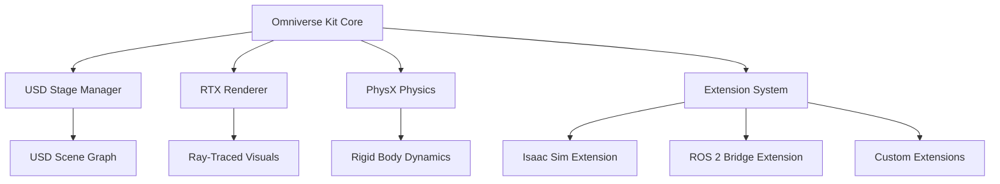

# Isaac Platform Architecture

## Prerequisites

Before starting this chapter, you should have:

- ✅ Completed previous Isaac chapters (Intro, Isaac Sim, Isaac Gym)
- ✅ NVIDIA RTX GPU with CUDA support
- ✅ Understanding of robotics middleware (ROS 2)
- ✅ Familiarity with 3D graphics concepts (meshes, materials, transforms)
- ✅ Python and C++ programming experience

**Estimated Reading Time**: 25-30 minutes

---

## Introduction

While you've learned to use Isaac Sim and Isaac Gym for simulation and training, understanding the **underlying architecture** of the Isaac platform is critical for production deployments. This chapter explores:

- **Omniverse Kit**: The extensible application framework powering Isaac Sim
- **Universal Scene Description (USD)**: The file format for robotic scenes
- **Isaac Core API**: Python API for programmatic scene manipulation
- **ROS 2 Integration**: Bridging Isaac with real robot systems
- **Performance Optimization**: GPU acceleration, batching, and distributed simulation

**Why Architecture Matters:**
- **Scalability**: Design systems that scale from prototype to production
- **Customization**: Extend Isaac Sim with custom sensors, robots, and behaviors
- **Integration**: Connect Isaac with existing robotics infrastructure (ROS, MQTT, cloud)
- **Debugging**: Understand performance bottlenecks and troubleshoot issues

**Learning Objectives**:
1. Understand the Omniverse Kit architecture and extension system
2. Master USD file formats and scene composition
3. Use Isaac Core API for programmatic simulation control
4. Integrate Isaac Sim with ROS 2 for hybrid simulation/real-robot workflows
5. Optimize simulation performance for large-scale training

---

## Omniverse Kit Architecture

### What is Omniverse Kit?

**NVIDIA Omniverse Kit** is the application framework that powers Isaac Sim, Create, View, and other Omniverse apps. It's built on:



**Key Components**:

| Component | Purpose | Programming Interface |
|-----------|---------|----------------------|
| **Kit Core** | Application framework, event loop, UI | Python + C++ |
| **USD Stage** | Scene graph representation | USD Python API |
| **RTX Renderer** | Real-time ray tracing | MaterialX, MDL |
| **PhysX** | Physics simulation (rigid, articulated, soft bodies) | PhysX API |
| **Extensions** | Modular plugins for features | Python extensions |

### Creating a Custom Isaac Extension

Extensions allow you to add custom functionality to Isaac Sim. Here's a minimal extension:

```python
# exts/my_robot_extension/my_robot_extension/extension.py
import omni.ext
import omni.ui as ui
from omni.isaac.core import World
from omni.isaac.core.robots import Robot

class MyRobotExtension(omni.ext.IExt):
    def on_startup(self, ext_id):
        """Called when extension is loaded"""
        print("[MyRobotExtension] Starting up")

        # Create UI window
        self._window = ui.Window("My Robot Controller", width=300, height=200)
        with self._window.frame:
            with ui.VStack():
                ui.Label("Robot Control Panel")
                ui.Button("Reset Robot", clicked_fn=self._reset_robot)
                ui.Button("Run Task", clicked_fn=self._run_task)

        # Initialize Isaac World
        self._world = World.instance()

    def _reset_robot(self):
        """Reset robot to initial pose"""
        if self._world.scene.object_exists("my_robot"):
            robot = self._world.scene.get_object("my_robot")
            robot.set_world_pose(position=[0, 0, 1.0])
            robot.set_joint_positions([0.0] * robot.num_dof)
            print("Robot reset complete")

    def _run_task(self):
        """Execute a predefined task"""
        print("Running task...")
        # Task logic here

    def on_shutdown(self):
        """Called when extension is unloaded"""
        print("[MyRobotExtension] Shutting down")
        if self._window:
            self._window.destroy()
            self._window = None
```

**Extension Configuration** (`extension.toml`):

```toml
[package]
version = "0.1.0"
title = "My Robot Extension"
description = "Custom robot controller for Isaac Sim"
keywords = ["robot", "control"]

[dependencies]
"omni.isaac.core" = {}
"omni.ui" = {}

[[python.module]]
name = "my_robot_extension"
```

---

## Universal Scene Description (USD)

### USD Basics

**USD** is the file format used by Isaac Sim (and all Omniverse apps) to represent 3D scenes. Think of it as "HTML for 3D graphics."

**Key USD Concepts**:

1. **Stage**: The root container for all scene data
2. **Prims** (Primitives): Objects in the scene (meshes, lights, cameras)
3. **Attributes**: Properties of prims (position, color, physics parameters)
4. **Relationships**: Connections between prims (parent-child, material bindings)
5. **Layers**: Composable "diffs" that can override properties

### Creating USD Scenes Programmatically

```python
# create_robot_scene.py
from pxr import Usd, UsdGeom, UsdPhysics, Gf

# Create new USD stage
stage = Usd.Stage.CreateNew("robot_scene.usd")

# Add world transform
UsdGeom.Xform.Define(stage, "/World")

# Add ground plane
ground_prim = stage.DefinePrim("/World/GroundPlane", "Cube")
UsdGeom.Xform(ground_prim).AddTranslateOp().Set(Gf.Vec3d(0, 0, -0.5))
UsdGeom.Xform(ground_prim).AddScaleOp().Set(Gf.Vec3d(10, 10, 0.1))

# Add physics properties
UsdPhysics.CollisionAPI.Apply(ground_prim)
UsdPhysics.RigidBodyAPI.Apply(ground_prim)

# Add robot (reference external USD)
robot_prim = stage.DefinePrim("/World/Robot")
robot_prim.GetReferences().AddReference("franka_robot.usd")

# Set robot initial pose
xform = UsdGeom.Xform(robot_prim)
xform.AddTranslateOp().Set(Gf.Vec3d(0, 0, 1.0))

# Add camera
camera_prim = UsdGeom.Camera.Define(stage, "/World/Camera")
camera_prim.GetClippingRangeAttr().Set(Gf.Vec2f(0.01, 10000))
camera_prim.GetFocalLengthAttr().Set(24.0)

# Save stage
stage.GetRootLayer().Save()
print("USD scene saved to robot_scene.usd")
```

### USD Composition: Layers and References

USD's power comes from **composition**: combining multiple files non-destructively.

```python
# Layer stack example
from pxr import Usd, Sdf

# Base layer: robot definition
base_stage = Usd.Stage.CreateNew("robot_base.usd")
# ... define robot structure

# Task layer: task-specific overrides
task_layer = Sdf.Layer.CreateNew("pick_and_place_task.usd")
task_stage = Usd.Stage.Open(task_layer)
task_stage.GetRootLayer().subLayerPaths.append("robot_base.usd")

# Override robot position for this task
robot_prim = task_stage.GetPrimAtPath("/World/Robot")
UsdGeom.Xform(robot_prim).AddTranslateOp().Set(Gf.Vec3d(0.5, 0.3, 1.0))

task_layer.Save()
```

**Composition Arc Hierarchy** (strongest to weakest):
1. **Local opinions**: Edits in the current layer
2. **References**: Include external USD files
3. **Payload**: Lazy-loaded references (for performance)
4. **Inherits**: Share properties from class prims
5. **Variants**: Switchable alternatives (e.g., different robot arms)

---

## Isaac Core API

### Programmatic Simulation Control

The **Isaac Core API** provides high-level Python abstractions for simulation:

```python
# isaac_core_example.py
from omni.isaac.core import World
from omni.isaac.core.robots import Robot
from omni.isaac.core.objects import DynamicCuboid
from omni.isaac.core.utils.types import ArticulationAction
import numpy as np

# Initialize simulation world
world = World(stage_units_in_meters=1.0)
world.scene.add_default_ground_plane()

# Add robot (Franka Panda)
robot = world.scene.add(Robot(
    prim_path="/World/Franka",
    name="franka_robot",
    usd_path="omniverse://localhost/NVIDIA/Assets/Isaac/2023.1.0/Isaac/Robots/Franka/franka_instanceable.usd"
))

# Add object to manipulate
cube = world.scene.add(DynamicCuboid(
    prim_path="/World/Cube",
    name="target_cube",
    position=np.array([0.5, 0.0, 0.3]),
    scale=np.array([0.05, 0.05, 0.05]),
    color=np.array([1.0, 0.0, 0.0])  # Red
))

# Reset simulation
world.reset()

# Simulation loop
for i in range(1000):
    # Get robot state
    joint_positions = robot.get_joint_positions()
    end_effector_pos = robot.end_effector.get_world_pose()[0]

    # Simple control: reach toward cube
    cube_pos = cube.get_world_pose()[0]
    direction = cube_pos - end_effector_pos

    # Apply joint actions (inverse kinematics would be used in practice)
    action = ArticulationAction(
        joint_positions=joint_positions + 0.01 * np.random.randn(7),
        joint_efforts=np.zeros(7)
    )
    robot.apply_action(action)

    # Step simulation
    world.step(render=True)

    if i % 100 == 0:
        print(f"Step {i}: EE at {end_effector_pos}, Cube at {cube_pos}")

# Cleanup
world.stop()
```

### Advanced: Custom Task Environment

```python
# custom_reach_task.py
from omni.isaac.core.tasks import BaseTask
from omni.isaac.core.utils.stage import add_reference_to_stage
import numpy as np

class ReachTask(BaseTask):
    def __init__(self, name="reach_task", offset=None):
        super().__init__(name=name, offset=offset)

        self._robot_prim_path = "/World/Robot"
        self._target_prim_path = "/World/Target"

    def set_up_scene(self, scene):
        """Add robot and target to scene"""
        super().set_up_scene(scene)

        # Add robot
        add_reference_to_stage(
            usd_path="omniverse://localhost/NVIDIA/Assets/Isaac/2023.1.0/Isaac/Robots/Franka/franka.usd",
            prim_path=self._robot_prim_path
        )

        # Add target sphere
        from omni.isaac.core.objects import DynamicSphere
        self._target = scene.add(DynamicSphere(
            prim_path=self._target_prim_path,
            name="target",
            radius=0.05,
            color=np.array([0, 1, 0])  # Green
        ))

    def get_observations(self):
        """Return current task observations"""
        robot_pos = self._robot.end_effector.get_world_pose()[0]
        target_pos = self._target.get_world_pose()[0]

        return {
            "robot_position": robot_pos,
            "target_position": target_pos,
            "distance": np.linalg.norm(target_pos - robot_pos)
        }

    def calculate_metrics(self):
        """Calculate task success metrics"""
        obs = self.get_observations()
        success = obs["distance"] < 0.05  # Within 5cm

        return {"success": success, "distance": obs["distance"]}
```

---

## ROS 2 Integration

### Isaac ROS Bridge

Isaac Sim provides native **ROS 2 integration** via the `omni.isaac.ros2_bridge` extension.

**Supported Message Types**:
- `sensor_msgs`: Image, LaserScan, PointCloud2, JointState
- `geometry_msgs`: Pose, Twist, Transform
- `std_msgs`: String, Float64, Int32
- `tf2_msgs`: TFMessage

### Publishing Robot State to ROS 2

```python
# ros2_publisher_example.py
import omni
from omni.isaac.core import SimulationContext
from omni.isaac.core.utils.extensions import enable_extension

# Enable ROS 2 bridge extension
enable_extension("omni.isaac.ros2_bridge")

import rclpy
from sensor_msgs.msg import JointState
from std_msgs.msg import Header

# Initialize ROS 2 node
rclpy.init()
node = rclpy.create_node("isaac_robot_publisher")

# Create publisher
joint_pub = node.create_publisher(JointState, "/robot/joint_states", 10)

# Simulation loop
simulation_context = SimulationContext()
simulation_context.initialize_physics()

while simulation_context.is_playing():
    # Get joint states from Isaac
    robot = simulation_context.stage.GetPrimAtPath("/World/Robot")
    joint_positions = get_joint_positions(robot)  # Custom helper function

    # Publish to ROS 2
    msg = JointState()
    msg.header = Header()
    msg.header.stamp = node.get_clock().now().to_msg()
    msg.name = ["joint_1", "joint_2", "joint_3", "joint_4", "joint_5", "joint_6", "joint_7"]
    msg.position = joint_positions.tolist()

    joint_pub.publish(msg)

    simulation_context.step()
    rclpy.spin_once(node, timeout_sec=0.01)

rclpy.shutdown()
```

### Subscribing to ROS 2 Commands

```python
# ros2_subscriber_example.py
from omni.isaac.ros2_bridge import create_subscriber_node
from geometry_msgs.msg import Twist

class RobotController:
    def __init__(self, robot):
        self.robot = robot
        self.current_twist = Twist()

        # Create ROS 2 subscriber
        self.sub = create_subscriber_node(
            Twist,
            "/cmd_vel",
            self.cmd_vel_callback
        )

    def cmd_vel_callback(self, msg):
        """Receive velocity commands from ROS 2"""
        self.current_twist = msg

        # Apply to robot in Isaac Sim
        linear_vel = [msg.linear.x, msg.linear.y, msg.linear.z]
        angular_vel = [msg.angular.x, msg.angular.y, msg.angular.z]

        self.robot.set_linear_velocity(linear_vel)
        self.robot.set_angular_velocity(angular_vel)
```

---

## Performance Optimization

### GPU Acceleration

**Isaac Sim leverages GPUs for**:
1. **Rendering**: RTX ray tracing
2. **Physics**: PhysX GPU rigid body dynamics
3. **Tensor operations**: PyTorch/TensorFlow integration for RL

**Enabling GPU Physics**:

```python
from omni.isaac.core import PhysicsContext

# Enable GPU physics acceleration
physics_ctx = PhysicsContext()
physics_ctx.enable_gpu_dynamics(flag=True)
physics_ctx.set_broadphase_type("GPU")  # GPU-accelerated collision detection
physics_ctx.set_solver_type("TGS")  # Temporal Gauss-Seidel (faster)
```

### Batched Simulation

For RL training, simulate **thousands of environments in parallel**:

```python
# batched_envs.py
from omni.isaac.gym.vec_env import VecEnvBase

class BatchedReachEnv(VecEnvBase):
    def __init__(self, num_envs=4096):
        super().__init__(num_envs=num_envs)

        # Create grid of environments
        self._env_spacing = 2.0
        for i in range(num_envs):
            row = i // 64
            col = i % 64
            position = [col * self._env_spacing, row * self._env_spacing, 0]

            # Clone robot and target at offset
            self.create_env_instance(i, position)

    def step(self, actions):
        """Step all environments simultaneously"""
        # Apply actions to all robots (GPU tensor operation)
        self.robots.set_joint_position_targets(actions)

        # Physics step (GPU accelerated)
        self.world.step()

        # Compute observations and rewards (GPU tensors)
        obs = self.get_observations()
        rewards = self.compute_rewards()
        dones = self.check_termination()

        return obs, rewards, dones, {}
```

**Performance Tips**:
- Use `instanceable` USD references to reduce memory
- Disable rendering for training (`render=False`)
- Use GPU tensors (avoid CPU-GPU transfers)
- Batch observations/actions as tensors

---

## Common Integration Patterns

### Pattern 1: Hybrid Sim-Real Testing

```python
# hybrid_testing.py
class HybridRobotInterface:
    def __init__(self, use_sim=True):
        if use_sim:
            from omni.isaac.core import World
            self.world = World()
            self.robot = self.world.scene.get_object("robot")
        else:
            import rclpy
            from real_robot_driver import RealRobotDriver
            rclpy.init()
            self.robot = RealRobotDriver()

    def move_to_position(self, target):
        """Same interface for sim and real robot"""
        if isinstance(self.robot, RealRobotDriver):
            self.robot.execute_trajectory(target)
        else:
            self.robot.set_joint_position_target(target)
            self.world.step()

# Use same code for sim and real
robot = HybridRobotInterface(use_sim=False)  # Toggle sim/real
robot.move_to_position([0.0, -0.5, 0.5, -1.5, 0.0, 1.0, 0.0])
```

---

## Key Takeaways

- **Omniverse Kit** is the extensible framework powering Isaac Sim with modular extensions
- **USD** provides composable, scalable scene representation with layers and references
- **Isaac Core API** offers high-level Python abstractions for programmatic simulation
- **ROS 2 integration** enables hybrid workflows combining simulation and real robots
- **GPU acceleration** allows massively parallel simulation for RL training (4096+ envs)
- **Production robotics** requires understanding of performance optimization and integration patterns

The Isaac platform's architecture enables researchers to prototype rapidly in simulation, train policies at scale, and deploy seamlessly to physical robots.

---

**Previous Chapter**: [Reinforcement Learning with Isaac Gym](./isaac-gym-rl.md)
**Next Chapter**: [AI-Powered Perception](./ai-powered-perception.md)

In the next chapter, we'll explore computer vision and perception systems for robotic tasks using Isaac Sim's sensors and AI models.
