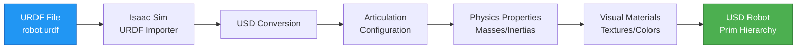

# Isaac Sim for Robotics

## Prerequisites

Before starting this chapter, you should have:

- ✅ Completed Chapter 1: Introduction to NVIDIA Isaac
- ✅ Isaac Sim 2023.1.0 (or newer) installed and verified
- ✅ NVIDIA RTX/GTX GPU (6GB+ VRAM) with updated drivers
- ✅ ROS 2 Humble installed on Ubuntu 22.04 (for ROS 2 integration sections)
- ✅ Basic understanding of USD (Universal Scene Description) concepts
- ✅ Python programming experience
- ✅ Familiarity with robotics concepts (URDF, sensors, coordinate frames)

**Estimated Reading Time**: 20-25 minutes

---

## Introduction

Creating realistic robotic simulations requires more than just loading a robot model and pressing "Play." Professional robotics development demands precise control over scene composition, physics parameters, sensor configurations, and integration with external frameworks like ROS 2. Isaac Sim provides powerful tools for all of these tasks, leveraging the USD (Universal Scene Description) format and NVIDIA's OmniGraph visual scripting system.

**Isaac Sim Capabilities**: Isaac Sim goes beyond traditional simulators by offering:
- **Photorealistic Rendering**: RTX ray-traced graphics for testing computer vision algorithms under realistic lighting conditions
- **Synthetic Data Generation**: Automated creation of labeled datasets (RGB, depth, semantic segmentation, bounding boxes) for training ML models
- **Domain Randomization**: Randomize lighting, textures, object positions, and physics parameters to improve sim-to-real transfer
- **Scalable Workflows**: From single robot prototyping to thousand-robot parallel simulations for RL training

**Chapter Goals**: By the end of this chapter, you will create custom simulation scenes using USD, import robot URDF models into Isaac Sim, configure realistic sensors (cameras, LiDAR, IMU), integrate Isaac Sim with ROS 2 via OmniGraph, and generate synthetic training data. You'll develop the skills to build complete robotic simulation environments tailored to your research or product development needs.

**Learning Objectives**:
1. Understand USD scene composition (stages, prims, layers, variants)
2. Create simulation scenes with environments, lighting, and physics
3. Import robot URDF models and configure articulation properties
4. Add and configure sensors (RGB cameras, depth cameras, LiDAR, IMU)
5. Set up ROS 2 communication using OmniGraph visual scripting
6. Generate synthetic sensor data for machine learning workflows
7. Control robots in Isaac Sim via ROS 2 topics and Python scripts

---

## Creating Simulation Scenes

Isaac Sim uses **USD (Universal Scene Description)** as its native scene format. Understanding USD fundamentals is essential for building complex simulations.

### USD Scene Structure

A **USD Stage** is the top-level container for a simulation scene. It consists of **Prims** (primitives), which represent objects, lights, cameras, and other scene elements.

**USD Hierarchy Example**:
```
/World (Xform - root prim)
├── /World/GroundPlane (Mesh - floor)
├── /World/Sun (DistantLight - directional light)
├── /World/Camera (Camera - viewport)
├── /World/Robot (Xform - robot root)
│   ├── /World/Robot/base_link (RigidBody)
│   ├── /World/Robot/wheel_left (RigidBody + Joint)
│   └── /World/Robot/wheel_right (RigidBody + Joint)
└── /World/Obstacles (Xform - obstacle container)
    ├── /World/Obstacles/Box1 (Cube)
    └── /World/Obstacles/Sphere1 (Sphere)
```

**Key Concepts**:
- **Prim**: A scene element (object, light, camera, etc.)
- **Xform**: Transform prim that groups child prims and defines their coordinate frame
- **Mesh**: Visual geometry (rendered but no physics)
- **RigidBody**: Physics-enabled object that responds to forces and collisions
- **Joint**: Connects two rigid bodies with constraints (revolute, prismatic, fixed, etc.)

### Creating a Scene in the GUI

**Step 1: Create a New Stage**
1. Open Isaac Sim
2. Go to **File → New**
3. A blank USD stage is created (empty viewport)

**Step 2: Add a Ground Plane**
1. In the **Create** menu, select **Physics → Ground Plane**
2. A large plane appears at the origin (represents the floor)

**Step 3: Add Lighting**
1. Go to **Create → Light → Distant Light** (represents the sun)
2. In the **Property** panel, set:
   - **Intensity**: `3000` (brightness)
   - **Angle**: `0.53` (sun angular diameter)
   - **Color**: White `(1.0, 1.0, 1.0)`

**Step 4: Add a Physics-Enabled Object**
1. Go to **Create → Mesh → Cube**
2. In the **Property** panel, set **Position**: `(0, 0, 1.0)` (1 meter above ground)
3. Right-click the cube in the **Stage** panel → **Add → Physics → Rigid Body with Colliders Preset**
4. Click **Play**: The cube falls due to gravity

**Step 5: Save the Scene**
1. Go to **File → Save As**
2. Save as `my_first_scene.usd` in your workspace directory

### Creating Scenes Programmatically with Python

```python
from isaacsim import SimulationApp
simulation_app = SimulationApp({"headless": False})

from omni.isaac.core import World
from omni.isaac.core.objects import DynamicCuboid, DynamicSphere
from omni.isaac.core.utils.prims import create_prim
import numpy as np

# Create world
world = World(stage_units_in_meters=1.0)
world.scene.add_default_ground_plane()

# Add a cube
cube = world.scene.add(
    DynamicCuboid(
        prim_path="/World/Cube",
        position=np.array([0, 0, 0.5]),
        size=np.array([0.3, 0.3, 0.3]),
        color=np.array([1.0, 0.0, 0.0])  # Red
    )
)

# Add a sphere
sphere = world.scene.add(
    DynamicSphere(
        prim_path="/World/Sphere",
        position=np.array([1.0, 0, 0.5]),
        radius=0.2,
        color=np.array([0.0, 0.0, 1.0])  # Blue
    )
)

# Add directional light (sun)
create_prim(
    prim_path="/World/Sun",
    prim_type="DistantLight",
    attributes={"intensity": 3000, "angle": 0.53}
)

# Reset and run simulation
world.reset()

for i in range(500):
    world.step(render=True)

simulation_app.close()
```

**Benefits of Programmatic Scene Creation**:
- **Reproducibility**: Scenes are defined in code, making experiments reproducible
- **Automation**: Generate thousands of randomized scenes for data augmentation
- **Version Control**: Track scene changes with Git instead of binary USD files

---

## Importing Robot Models

Isaac Sim can import robot models defined in URDF (standard ROS format) and convert them to USD with physics and rendering.

### URDF Import Workflow


*Figure 1: URDF import workflow in Isaac Sim. The URDF Importer converts ROS robot descriptions to USD format with physics-enabled articulations.*

### Importing a Robot via GUI

**Step 1: Open URDF Importer**
1. In Isaac Sim, go to **Isaac Utils → Workflows → URDF Importer**
2. A dialog window appears

**Step 2: Select URDF File**
1. Click **Browse** next to "Input File"
2. Navigate to your robot's URDF file (e.g., `/opt/ros/humble/share/turtlebot3_description/urdf/turtlebot3_burger.urdf`)
3. Click **Open**

**Step 3: Configure Import Settings**
- **Import Options**:
  - ✅ **Fix Base Link**: Check if the robot should be fixed to the ground (for manipulators)
  - ✅ **Merge Fixed Joints**: Simplifies the model by combining fixed links
  - ✅ **Self Collision**: Enable collision detection between robot parts
  - **Joint Drive Type**: Choose `Position` (default) for position-controlled joints
- **Output Directory**: Select where to save the generated USD file

**Step 4: Import**
1. Click **Import**
2. Isaac Sim converts URDF → USD (may take 10-60 seconds)
3. The robot appears in the viewport

**Step 5: Inspect the Robot**
1. In the **Stage** panel, expand the robot prim hierarchy
2. Select a joint (e.g., `/World/TurtleBot3/wheel_left_joint`)
3. In the **Property** panel, view:
   - **Joint Type**: Continuous (for wheels), Revolute (for arms), etc.
   - **Joint Limits**: Min/max angles
   - **Joint Drive**: Target position, velocity, stiffness, damping

### Importing a Robot via Python API

```python
from isaacsim import SimulationApp
simulation_app = SimulationApp({"headless": False})

from omni.isaac.core import World
from omni.isaac.core.utils.stage import add_reference_to_stage
from omni.isaac.core.articulations import Articulation
import numpy as np

# Create world
world = World()
world.scene.add_default_ground_plane()

# Import URDF (automatically converts to USD)
from omni.importer.urdf import _urdf
urdf_interface = _urdf.acquire_urdf_interface()

# Import robot from URDF path
robot_prim_path = urdf_interface.parse_urdf(
    urdf_path="/opt/ros/humble/share/turtlebot3_description/urdf/turtlebot3_burger.urdf",
    robot_name="TurtleBot3",
    dest_path="/World"
)

# Create an Articulation object to control the robot
robot = world.scene.add(
    Articulation(
        prim_path="/World/TurtleBot3",
        name="turtlebot3"
    )
)

# Reset world to initialize physics
world.reset()

# Get joint information
num_joints = robot.num_dof
print(f"Robot has {num_joints} degrees of freedom")
print(f"Joint names: {robot.dof_names}")

# Set joint positions (example: rotate wheels)
robot.set_joint_positions(np.array([0.0, 0.0]))  # Wheel positions in radians

# Run simulation
for i in range(1000):
    # Apply joint velocities (move forward)
    robot.set_joint_velocities(np.array([2.0, 2.0]))  # rad/s
    world.step(render=True)

simulation_app.close()
```

**Key Articulation API Methods**:
- `robot.num_dof`: Number of controllable joints
- `robot.dof_names`: List of joint names
- `robot.get_joint_positions()`: Current joint angles/positions
- `robot.set_joint_positions(positions)`: Command joint positions
- `robot.set_joint_velocities(velocities)`: Command joint velocities
- `robot.set_joint_efforts(efforts)`: Apply torques/forces to joints

---

## Sensor Simulation

Isaac Sim provides realistic sensor simulations for cameras, LiDAR, IMU, force/torque sensors, and contact sensors.

### RGB Camera

**Adding a Camera via GUI**:
1. In the **Stage** panel, right-click your robot → **Create → Camera**
2. Position the camera (e.g., attach to robot's head link)
3. In **Property** panel, configure:
   - **Focal Length**: 24mm (wide-angle) or 50mm (standard)
   - **Horizontal Aperture**: 20.955mm (full-frame sensor)
   - **Focus Distance**: Auto
4. Go to **Window → Render Settings** → Enable **RTX Real-Time** for ray-traced rendering

**Python API for RGB Camera**:
```python
from omni.isaac.sensor import Camera

# Create a camera
camera = Camera(
    prim_path="/World/Camera",
    position=np.array([2.0, 0, 1.5]),  # 2m in front, 1.5m high
    frequency=30,  # 30 Hz capture rate
    resolution=(640, 480),
    orientation=np.array([1, 0, 0, 0])  # Quaternion (w, x, y, z)
)

camera.initialize()

# Capture an image
camera.add_motion_vectors_to_frame()  # Optional: add motion vectors
rgb_data = camera.get_rgba()  # RGBA image as numpy array (480, 640, 4)

# Save image
import cv2
cv2.imwrite("camera_capture.png", rgb_data[:, :, :3])  # Drop alpha channel
```

### Depth Camera

**Depth Camera Configuration**:
```python
from omni.isaac.sensor import Camera

depth_camera = Camera(
    prim_path="/World/DepthCamera",
    position=np.array([2.0, 0, 1.5]),
    frequency=10,  # 10 Hz (depth is computationally expensive)
    resolution=(640, 480)
)

depth_camera.initialize()
depth_camera.add_depth_to_frame()  # Enable depth output

# Get depth image
depth_data = depth_camera.get_depth()  # Depth in meters (480, 640)

# Visualize depth (convert to grayscale image)
depth_normalized = (depth_data / depth_data.max() * 255).astype(np.uint8)
cv2.imwrite("depth_map.png", depth_normalized)
```

### LiDAR (LIDAR) Sensor

**LiDAR Configuration**:
```python
from omni.isaac.range_sensor import _range_sensor

# Add LiDAR sensor
lidar_prim = create_prim(
    prim_path="/World/Robot/LiDAR",
    prim_type="Lidar",
    translation=np.array([0, 0, 0.2]),  # 20cm above robot base
    attributes={
        "minRange": 0.4,  # 40cm minimum range
        "maxRange": 100.0,  # 100m maximum range
        "horizontalFov": 360.0,  # 360-degree scan
        "horizontalResolution": 1.0,  # 1-degree angular resolution
        "rotationRate": 10.0,  # 10 Hz scan rate
    }
)

# Read LiDAR data
lidar_interface = _range_sensor.acquire_lidar_sensor_interface()
depth_data = lidar_interface.get_linear_depth_data("/World/Robot/LiDAR")
print(f"LiDAR scan: {len(depth_data)} points")
```

### IMU (Inertial Measurement Unit)

**IMU Configuration**:
```python
from omni.isaac.sensor import IMUSensor

# Create IMU attached to robot base
imu = IMUSensor(
    prim_path="/World/Robot/IMU",
    name="imu_sensor",
    frequency=100,  # 100 Hz update rate
    translation=np.array([0, 0, 0]),  # At robot's center of mass
)

imu.initialize()

# Read IMU data
imu_data = imu.get_current_frame()
linear_acceleration = imu_data["lin_acc"]  # 3D acceleration (m/s²)
angular_velocity = imu_data["ang_vel"]  # 3D angular velocity (rad/s)
orientation = imu_data["orientation"]  # Quaternion (w, x, y, z)

print(f"Acceleration: {linear_acceleration}")
print(f"Angular Velocity: {angular_velocity}")
```

---

## ROS 2 Integration

Isaac Sim integrates with ROS 2 via **OmniGraph**, a visual node-based scripting system.

### Setting Up ROS 2 Bridge

**Step 1: Enable ROS 2 Extension**
1. In Isaac Sim, go to **Window → Extensions**
2. Search for **"ROS 2 Bridge"**
3. Enable the extension (may require restart)

**Step 2: Create an OmniGraph**
1. Go to **Window → Visual Scripting → Action Graph**
2. Click **New Action Graph**
3. Name it `ROS2_Bridge`

**Step 3: Add ROS 2 Publisher Nodes**
1. In the Action Graph editor, right-click → **Add Node**
2. Search for **"ROS2 Publish Clock"** and add it (publishes `/clock` topic)
3. Add **"On Playback Tick"** node (triggers every simulation step)
4. Connect **On Playback Tick** → **ROS2 Publish Clock** (triggers clock publishing)

**Step 4: Add Camera Publisher**
1. Add **"ROS2 Camera Helper"** node
2. Configure:
   - **Camera Prim Path**: `/World/Camera`
   - **Topic Name**: `/camera/image_raw`
   - **Frame ID**: `camera_frame`
3. Connect **On Playback Tick** → **ROS2 Camera Helper**

**Step 5: Verify ROS 2 Topics**
1. Click **Play** in Isaac Sim
2. In a terminal, run:
   ```bash
   ros2 topic list
   ```
   **Expected Output**:
   ```
   /clock
   /camera/image_raw
   /camera/camera_info
   ```

3. Echo camera topic:
   ```bash
   ros2 topic echo /camera/image_raw --no-arr
   ```

### ROS 2 Control Example (Python)

**Publish Joint Commands from ROS 2**:

```python
#!/usr/bin/env python3
import rclpy
from rclpy.node import Node
from sensor_msgs.msg import JointState

class RobotController(Node):
    def __init__(self):
        super().__init__('robot_controller')
        self.publisher = self.create_publisher(JointState, '/joint_command', 10)
        self.timer = self.create_timer(0.1, self.publish_commands)  # 10 Hz

    def publish_commands(self):
        msg = JointState()
        msg.header.stamp = self.get_clock().now().to_msg()
        msg.name = ['wheel_left_joint', 'wheel_right_joint']
        msg.position = [0.0, 0.0]
        msg.velocity = [2.0, 2.0]  # Move forward at 2 rad/s
        msg.effort = []

        self.publisher.publish(msg)
        self.get_logger().info('Publishing joint commands')

def main():
    rclpy.init()
    controller = RobotController()
    rclpy.spin(controller)
    controller.destroy_node()
    rclpy.shutdown()

if __name__ == '__main__':
    main()
```

**Subscribe to Joint Commands in Isaac Sim (OmniGraph)**:
1. Add **"ROS2 Subscribe Joint State"** node in Action Graph
2. Set **Topic Name**: `/joint_command`
3. Add **"Articulation Controller"** node
4. Connect **ROS2 Subscribe Joint State** output → **Articulation Controller** input
5. Set **Target Prim**: `/World/Robot`

---

## Synthetic Data Generation

Isaac Sim's **Replicator** API enables automated generation of labeled datasets for machine learning.

### Example: Generate RGB + Semantic Segmentation Data

```python
from isaacsim import SimulationApp
simulation_app = SimulationApp({"headless": False})

import omni.replicator.core as rep
from omni.isaac.core import World
import numpy as np

# Create world with objects
world = World()
world.scene.add_default_ground_plane()

# Add multiple objects for dataset
for i in range(10):
    rep.create.sphere(
        position=(np.random.uniform(-2, 2), np.random.uniform(-2, 2), 0.5),
        radius=0.2,
        semantics=[("class", "ball")]  # Semantic label
    )

# Create camera
camera = rep.create.camera(position=(0, 0, 3), look_at=(0, 0, 0))

# Attach writer to save data
writer = rep.WriterRegistry.get("BasicWriter")
writer.initialize(output_dir="synthetic_data", rgb=True, semantic_segmentation=True)

# Render and save frames
rep.orchestrator.run()

with rep.trigger.on_frame(num_frames=100):  # Generate 100 frames
    with camera:
        rep.randomizer.scatter_2d(
            surface_prims=["/World/GroundPlane"],
            check_for_collisions=True
        )
    rep.randomizer.light(
        min_intensity=1000,
        max_intensity=5000,
        temperature=(4000, 7000)  # Color temperature variation
    )

rep.orchestrator.step()
simulation_app.close()
```

**Output**: `synthetic_data/` directory contains:
- `rgb_0000.png`, `rgb_0001.png`, ... (RGB images)
- `semantic_segmentation_0000.png`, ... (Segmentation masks with color-coded classes)

---

## Hands-On Exercises

### Exercise 1: Create a Custom Scene
**Goal**: Build a simulation environment with multiple objects and lighting.

**Instructions**:
1. Create a new USD stage in Isaac Sim
2. Add a ground plane
3. Add 5 physics-enabled cubes at different positions
4. Add a distant light (sun) and a point light (lamp)
5. Click **Play** and observe object dynamics
6. Save the scene as `custom_scene.usd`

**Expected Outcome**: A functional scene with multiple objects falling and colliding.

---

### Exercise 2: Import a Robot URDF
**Goal**: Import a ROS 2 robot model into Isaac Sim.

**Instructions**:
1. Use the URDF Importer (**Isaac Utils → Workflows → URDF Importer**)
2. Import a robot URDF (e.g., TurtleBot3, UR5, Franka Panda)
3. Configure import settings (merge fixed joints, self-collision)
4. Inspect the generated USD hierarchy in the **Stage** panel
5. Select a joint and examine its properties (type, limits, drive parameters)

**Expected Outcome**: Robot appears in the scene with fully articulated joints.

---

### Exercise 3: Add a Camera Sensor
**Goal**: Configure an RGB camera and capture images.

**Instructions**:
1. In your scene, add a camera (**Create → Camera**)
2. Position the camera to view your robot
3. In **Window → Render Settings**, enable **RTX Real-Time**
4. Click **Play** and observe the viewport
5. Use the Python API to capture and save a camera frame (see "RGB Camera" code example)

**Expected Outcome**: Camera captures a photorealistic image of the robot.

---

### Exercise 4: Publish Camera Data to ROS 2
**Goal**: Stream camera images to ROS 2 topics.

**Instructions**:
1. Enable the ROS 2 Bridge extension
2. Create an Action Graph (**Window → Visual Scripting → Action Graph**)
3. Add nodes: **On Playback Tick** → **ROS2 Camera Helper**
4. Configure **ROS2 Camera Helper**: set camera path and topic name
5. Click **Play** in Isaac Sim
6. In a terminal, run:
   ```bash
   ros2 topic list
   ros2 topic echo /camera/image_raw --no-arr
   ```

**Expected Outcome**: Camera images are published to the `/camera/image_raw` topic.

---

### Exercise 5: Collect Synthetic Training Data
**Goal**: Generate a dataset of labeled images for object detection.

**Instructions**:
1. Use the Replicator API to create a scene with 20 spheres (labeled "ball")
2. Add a camera looking at the scene
3. Configure a **BasicWriter** to save RGB + semantic segmentation
4. Generate 50 frames with randomized lighting and object positions
5. Inspect the output directory for saved images

**Expected Outcome**: `synthetic_data/` contains 50 RGB images and 50 segmentation masks.

---

## Key Takeaways

After completing this chapter, you should understand:

1. **USD Scene Composition**: Isaac Sim uses USD for scene description, with prims representing objects, lights, cameras, and physics components.

2. **URDF Import**: Import ROS 2 robot models (URDF) into Isaac Sim via the URDF Importer, which converts them to USD with physics-enabled articulations.

3. **Sensor Simulation**: Isaac Sim supports RGB cameras, depth cameras, LiDAR, IMU, and force sensors with realistic noise models and configurable parameters.

4. **ROS 2 Integration**: Use OmniGraph to create visual node graphs that bridge Isaac Sim and ROS 2, enabling pub/sub communication and robot control.

5. **Synthetic Data Generation**: The Replicator API automates creation of labeled datasets (RGB, depth, segmentation) with domain randomization for robust ML training.

6. **Python API**: Programmatic scene creation, robot control, and data collection enable reproducible experiments and large-scale automation.

7. **Photorealistic Rendering**: RTX ray-tracing provides visually accurate simulations for testing computer vision algorithms under diverse lighting conditions.

---

## Navigation

**Previous Chapter**: [Introduction to NVIDIA Isaac](/docs/module-3-isaac/intro-isaac)
**Next Chapter**: [Reinforcement Learning with Isaac Gym](/docs/module-3-isaac/isaac-gym-rl)
