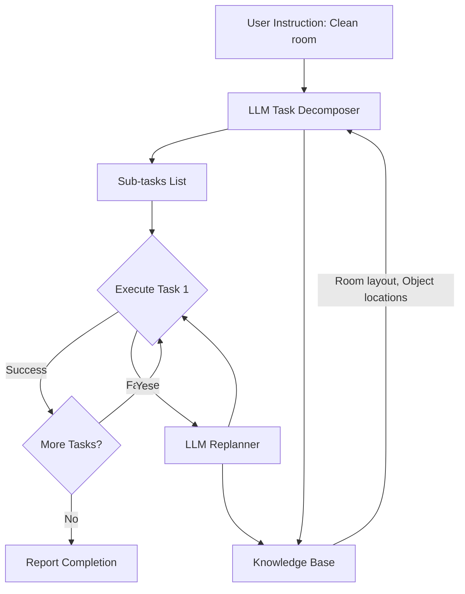

# Cognitive Planning with LLMs

## Prerequisites

Before starting this chapter, you should have:

- ✅ Completed Voice-to-Action chapter
- ✅ Understanding of LLM capabilities (GPT-4, Claude, Llama)
- ✅ Experience with prompt engineering
- ✅ Knowledge of task planning concepts (helpful but not required)
- ✅ Python async programming basics

**Estimated Reading Time**: 20-25 minutes

---

## Introduction

Traditional robot programming requires developers to manually script every step: "if sensor reads X, do Y; else do Z." This approach breaks down when robots encounter novel situations. **Cognitive planning** with large language models (LLMs) changes this paradigm: instead of rigid rules, robots use LLMs to *reason* about tasks, adapt to unexpected conditions, and generate action sequences on the fly.

Consider this instruction: *"Clean the living room."* A traditional robot needs explicit steps: navigate to living room, identify objects, categorize trash vs. belongings, pick up items, etc. An LLM-powered robot can **decompose** this high-level goal into sub-tasks, **reason** about object relationships ("don't vacuum before picking up toys"), and **adapt** when plans fail ("cup is too heavy, request human help").

This chapter demonstrates how to integrate GPT-4 as a cognitive planning layer for humanoid robots. You'll learn to prompt LLMs for task decomposition, implement chain-of-thought reasoning, handle failures, and create self-improving planning loops.

**Why LLMs for Planning?**
- **Zero-shot generalization**: Handle tasks never seen during training
- **Common-sense reasoning**: Understand implicit constraints ("don't place hot pan on wooden table")
- **Natural language interface**: Accept vague instructions and ask clarifying questions
- **Multi-step decomposition**: Break complex goals into achievable primitives

**Learning Objectives**:
1. Integrate LLMs (GPT-4, Claude) for robot task planning
2. Implement chain-of-thought (CoT) reasoning
3. Design prompt engineering strategies for robotics
4. Handle planning failures and replanning
5. Build self-critique and verification loops

---

## Cognitive Planning Architecture



**Key Components**:
1. **Task Decomposer**: LLM breaks high-level goals into atomic actions
2. **Executor**: ROS 2 action servers execute primitives
3. **Monitor**: Tracks success/failure of each step
4. **Replanner**: Generates alternative plans when steps fail
5. **Knowledge Base**: World state, object locations, constraints

---

## Prompt Engineering for Robot Planning

### Baseline Prompt (Naive Approach)

```python
user_instruction = "Clean the kitchen table"

prompt = f"Break down this task into steps: {user_instruction}"
```

**Problem**: Vague, no robot context, no constraints.

**Output**:
```
1. Remove items from table
2. Wipe surface
3. Put items back
```

**Issue**: Robot doesn't have "wipe" primitive. Steps assume human capabilities.

---

### Improved Prompt with Robot Constraints

```python
SYSTEM_PROMPT = """You are a task planner for a humanoid robot with these capabilities:

Available Actions:
- navigate_to(location: str) - Move to a named location
- grasp(object: str, hand: str) - Pick up object with left/right hand
- place(object: str, location: str) - Put held object at location
- open(object: str) - Open door/drawer
- close(object: str) - Close door/drawer
- detect_objects(area: str) - Scan area and list objects
- request_help(reason: str) - Ask human for assistance

Physical Constraints:
- Can carry max 2 objects (one per hand)
- Cannot lift objects >5kg
- Must navigate before grasping objects
- Cannot grasp if hands full

World Knowledge:
- Kitchen has: table, sink, trash_bin, counter
- Living room has: sofa, tv, bookshelf

Task: {user_task}

Output:
1. List of sequential actions in JSON format
2. Preconditions for each action
3. Expected outcome after completion

Example output:
{
  "plan": [
    {"action": "navigate_to", "params": {"location": "kitchen"}, "precondition": "none"},
    {"action": "detect_objects", "params": {"area": "table"}, "precondition": "at_kitchen"}
  ],
  "expected_outcome": "Kitchen table is clear"
}
"""
```

---

## Implementing the Planning System

### 1. LLM Planner Class

```python
# llm_planner.py
from openai import OpenAI
import json
from typing import List, Dict

class CognitivePlanner:
    def __init__(self, api_key: str, model: str = "gpt-4"):
        self.client = OpenAI(api_key=api_key)
        self.model = model
        self.action_primitives = [
            "navigate_to", "grasp", "place", "open", "close",
            "detect_objects", "request_help"
        ]

    def create_plan(self, user_task: str, world_state: Dict) -> List[Dict]:
        """
        Generate action plan from high-level task.

        Args:
            user_task: Natural language instruction
            world_state: Current robot knowledge (locations, objects)

        Returns:
            List of action dictionaries
        """
        system_prompt = self._build_system_prompt(world_state)

        response = self.client.chat.completions.create(
            model=self.model,
            messages=[
                {"role": "system", "content": system_prompt},
                {"role": "user", "content": f"Task: {user_task}"}
            ],
            temperature=0.0,
            response_format={"type": "json_object"}
        )

        result = json.loads(response.choices[0].message.content)
        return result.get("plan", [])

    def _build_system_prompt(self, world_state: Dict) -> str:
        """Construct prompt with current world knowledge"""
        return f"""You are a robot task planner.

Available actions: {', '.join(self.action_primitives)}

Current world state:
- Robot location: {world_state.get('robot_location', 'unknown')}
- Known objects: {world_state.get('objects', [])}
- Hand status: {world_state.get('hands', 'both empty')}

Plan the task step-by-step using ONLY available actions.
Output valid JSON with this format:
{{
  "plan": [
    {{"action": "action_name", "params": {{}}, "rationale": "why this step"}},
    ...
  ]
}}
"""
```

---

### 2. Chain-of-Thought (CoT) Reasoning

Chain-of-Thought prompting makes LLMs "think out loud," improving plan quality.

```python
COT_PROMPT = """Let's think step by step:

Task: {task}

Step 1: Analyze the goal
- What is the end state we want?
- What are the preconditions?

Step 2: Identify sub-goals
- What intermediate states are needed?
- Are there dependencies between steps?

Step 3: Check constraints
- Physical limitations (weight, reach, hands)?
- Environmental obstacles?

Step 4: Generate action sequence
Based on the above reasoning, create the plan.

Output your reasoning, then the final JSON plan.
"""

def plan_with_cot(self, task: str, world_state: Dict):
    """Generate plan with explicit reasoning"""
    prompt = COT_PROMPT.format(task=task)

    response = self.client.chat.completions.create(
        model=self.model,
        messages=[
            {"role": "system", "content": self._build_system_prompt(world_state)},
            {"role": "user", "content": prompt}
        ],
        temperature=0.2
    )

    # Extract JSON from response (may include reasoning text)
    content = response.choices[0].message.content
    # Parse JSON from content...
    return parsed_plan
```

**Example Output**:
```
Reasoning:
- Goal: Clean table means remove clutter
- Preconditions: Robot must be at table, hands empty
- Sub-goals: Navigate, detect objects, move each to trash/storage
- Constraint: Can only carry 2 items at once

Final Plan:
{
  "plan": [
    {"action": "navigate_to", "params": {"location": "kitchen_table"}},
    {"action": "detect_objects", "params": {"area": "table"}},
    {"action": "grasp", "params": {"object": "plate", "hand": "left"}},
    ...
  ]
}
```

---

## Execution and Monitoring

### Plan Executor with Failure Handling

```python
# plan_executor.py
import rclpy
from rclpy.node import Node
from enum import Enum

class ExecutionStatus(Enum):
    SUCCESS = "success"
    FAILURE = "failure"
    BLOCKED = "blocked"

class PlanExecutor(Node):
    def __init__(self, planner: CognitivePlanner):
        super().__init__('plan_executor')
        self.planner = planner
        self.action_handlers = {
            "navigate_to": self.execute_navigate,
            "grasp": self.execute_grasp,
            "place": self.execute_place,
            # ... register all action handlers
        }

    def execute_plan(self, plan: List[Dict], max_retries: int = 3):
        """
        Execute action plan with monitoring and replanning.
        """
        for step_idx, action in enumerate(plan):
            self.get_logger().info(f"Step {step_idx + 1}/{len(plan)}: {action}")

            # Execute action
            status = self._execute_action(action)

            if status == ExecutionStatus.SUCCESS:
                continue

            elif status == ExecutionStatus.FAILURE:
                # Attempt replanning
                self.get_logger().warn(f"Action failed: {action['action']}")

                if max_retries > 0:
                    # Ask LLM for alternative
                    new_plan = self.planner.replan(
                        failed_action=action,
                        remaining_plan=plan[step_idx + 1:],
                        failure_reason="action_failed"
                    )

                    return self.execute_plan(new_plan, max_retries - 1)
                else:
                    self.get_logger().error("Max retries exceeded")
                    return False

            elif status == ExecutionStatus.BLOCKED:
                # Environment changed, full replan needed
                self.get_logger().warn("Environment blocked, replanning...")
                # Get updated world state and replan entire task
                pass

        self.get_logger().info("✅ Plan completed successfully")
        return True

    def _execute_action(self, action: Dict) -> ExecutionStatus:
        """Execute single action via registered handler"""
        action_name = action["action"]
        params = action.get("params", {})

        if action_name not in self.action_handlers:
            self.get_logger().error(f"Unknown action: {action_name}")
            return ExecutionStatus.FAILURE

        handler = self.action_handlers[action_name]

        try:
            result = handler(**params)
            return ExecutionStatus.SUCCESS if result else ExecutionStatus.FAILURE
        except Exception as e:
            self.get_logger().error(f"Execution error: {e}")
            return ExecutionStatus.FAILURE

    def execute_grasp(self, object: str, hand: str) -> bool:
        """Example action handler for grasping"""
        # TODO: Call MoveIt or Isaac manipulation
        self.get_logger().info(f"Grasping {object} with {hand} hand")
        # Simulate action
        import time
        time.sleep(1)
        return True  # or False if grasp failed
```

---

## Replanning Strategy

When actions fail, the LLM generates alternative approaches:

```python
def replan(self, failed_action: Dict, remaining_plan: List[Dict],
           failure_reason: str) -> List[Dict]:
    """
    Generate alternative plan after failure.

    Args:
        failed_action: The action that failed
        remaining_plan: Actions that weren't executed yet
        failure_reason: Why the action failed

    Returns:
        New action plan
    """
    replan_prompt = f"""The robot attempted this action but it failed:
Failed action: {json.dumps(failed_action)}
Failure reason: {failure_reason}

Original remaining plan:
{json.dumps(remaining_plan, indent=2)}

Generate an ALTERNATIVE approach to complete the task.
Consider:
- Why did the action fail?
- What's a different way to achieve the same goal?
- Should we request human help?

Output new plan in JSON format.
"""

    response = self.client.chat.completions.create(
        model=self.model,
        messages=[
            {"role": "system", "content": self._build_system_prompt({})},
            {"role": "user", "content": replan_prompt}
        ],
        temperature=0.3  # Slightly higher for creative alternatives
    )

    result = json.loads(response.choices[0].message.content)
    return result.get("plan", [])
```

---

## Exercise 1: "Tidy the Room" Task

**Objective**: Build a complete cognitive planner that tidies a simulated room.

**Scenario**:
- Room contains: book (on floor), cup (on table), toy (on sofa)
- Goal: Put books on bookshelf, cups in sink, toys in toy_box

**Requirements**:
1. LLM generates multi-step plan
2. Robot executes using Gazebo simulation
3. Handle at least one failure (object too heavy, location blocked)
4. Replan and complete task

**Starter Code**:
```python
def tidy_room_task():
    # Define world state
    world_state = {
        "robot_location": "living_room",
        "objects": [
            {"name": "book1", "location": "floor", "weight": 0.5},
            {"name": "cup1", "location": "table", "weight": 0.2},
            {"name": "toy1", "location": "sofa", "weight": 0.3}
        ],
        "hands": {"left": "empty", "right": "empty"}
    }

    # TODO: Initialize planner
    # TODO: Generate plan
    # TODO: Execute with failure handling
```

**Acceptance Criteria**:
- [ ] All objects placed in correct locations
- [ ] At least one simulated failure recovered via replanning
- [ ] Execution completes within 10 action steps

---

## Exercise 2: Self-Critique Loop

**Objective**: Add a "critic" LLM that reviews plans before execution.

**Approach**:
```python
def critique_plan(plan: List[Dict]) -> Dict:
    """
    Review plan for logical errors, unsafe actions, or inefficiencies.

    Returns:
        {"approved": bool, "issues": [str], "suggestions": [str]}
    """
    critic_prompt = f"""Review this robot action plan:
{json.dumps(plan, indent=2)}

Check for:
1. Unsafe actions (e.g., moving with hands full near obstacles)
2. Logical errors (e.g., grasping before navigating)
3. Inefficiencies (e.g., unnecessary back-and-forth movements)

Output JSON: {{"approved": true/false, "issues": [], "suggestions": []}}
"""
    # Call LLM and return critique
```

**Integration**:
- Generate plan
- Critique plan
- If not approved, regenerate with critique feedback
- Execute approved plan

---

## Common Planning Failures

| Failure Type | Example | Mitigation |
|-------------|---------|-----------|
| **Hallucination** | LLM invents non-existent action "teleport_to" | Strict output validation, function calling |
| **Impossible sequence** | "grasp cup" before "navigate_to table" | Add precondition checker |
| **Infinite loops** | Replanning generates same failed plan | Track attempted solutions, force diversity |
| **Overly complex** | 50-step plan for simple task | Add "simplicity" to prompt criteria |

---

## Advanced: Hierarchical Task Networks (HTN)

For complex tasks, use hierarchical decomposition:

```python
HIERARCHICAL_PROMPT = """Decompose task into hierarchy:

Level 1 (Abstract): High-level goals
Level 2 (Intermediate): Sub-tasks
Level 3 (Primitive): Robot actions

Example:
Task: "Prepare breakfast"

Level 1: [Get ingredients, Cook food, Set table]
Level 2: [Open fridge, Grasp eggs, Close fridge, ...]
Level 3: [navigate_to(fridge), open(fridge), ...]

Your task: {task}
Output all 3 levels.
"""
```

---

## Key Takeaways

- **LLMs enable zero-shot task planning** without manual programming for each scenario
- **Chain-of-thought prompting** improves plan quality by forcing explicit reasoning
- **Replanning loops** make robots resilient to environmental changes and action failures
- **Prompt engineering** is critical—specify robot capabilities, constraints, and output format
- **Self-critique** (using a second LLM call) catches logical errors before execution

Cognitive planning transforms robots from rigid automata into adaptive systems that reason about goals, constraints, and failures—much like human problem-solving.

---

**Previous Chapter**: [Voice-to-Action with OpenAI Whisper](./voice-to-action.md)
**Next Chapter**: [Multi-modal Interaction (Speech, Gesture, Vision)](./multimodal-interaction.md)

In the final chapter, we'll integrate voice, vision, and gesture recognition to create truly natural human-robot interaction systems.
