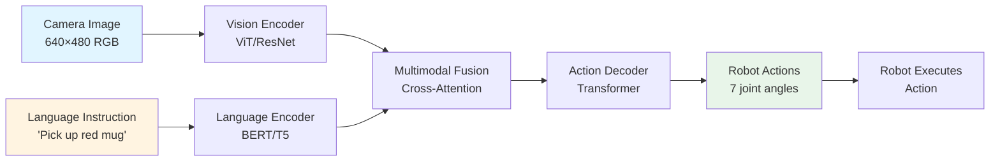

# Introduction to VLA Models

## Prerequisites

Before diving into this chapter, ensure you have:

- Completed **Module 3** (NVIDIA Isaac Sim and Isaac Gym)
- Understanding of **transformer architecture** basics (self-attention, encoder-decoder)
- Familiarity with **multimodal AI** concepts (vision + language models like CLIP, GPT-4V)
- Basic knowledge of **deep learning frameworks** (PyTorch or TensorFlow)
- Experience with **robot control fundamentals** from Module 1

## Introduction

Vision-Language-Action (VLA) models represent the cutting edge of physical AI, combining computer vision, natural language understanding, and robot control into unified end-to-end systems. Unlike traditional robotics pipelines that separate perception, planning, and control into discrete modules, VLA models learn direct mappings from visual observations and language instructions to robot actions.

This chapter introduces the foundational concepts of VLA models, their evolution from early multimodal systems to state-of-the-art architectures like RT-1, RT-2, and PaLM-E. You'll understand why VLA models are transforming robotics, explore real-world use cases from household tasks to industrial automation, and compare VLA approaches to traditional robotics paradigms.

**Learning Objectives:**
- Understand what VLA models are and how they unify vision, language, and action
- Identify use cases where VLA models excel compared to traditional approaches
- Trace the evolution from early robot learning to modern transformer-based VLA systems
- Compare VLA advantages and limitations against classical robotics methods

---

## What are VLA Models?

**Vision-Language-Action (VLA)** models are a class of deep learning architectures that process **multimodal inputs** (images from robot cameras + natural language instructions from humans) and directly output **robot actions** (joint positions, gripper commands, end-effector velocities). VLA models are **embodied AI systems**—they don't just perceive and reason about the world; they act in it through physical robot bodies.

### Core Components

A typical VLA model consists of three integrated components:

1. **Vision Encoder**: Processes camera images (RGB, depth, segmentation) to extract visual features. Modern VLA models use Vision Transformers (ViT) or convolutional backbones pretrained on large-scale datasets (ImageNet, CLIP).

2. **Language Encoder**: Encodes natural language instructions (e.g., "pick up the red mug") into semantic embeddings. Leverages pretrained language models like BERT, T5, or GPT to understand task goals and constraints.

3. **Action Decoder**: Maps fused vision-language representations to robot action sequences. Outputs discrete action tokens (for classification) or continuous action vectors (joint angles, end-effector poses).

### Multimodal Learning

VLA models learn **joint embeddings** across vision, language, and action spaces. During training, the model observes:

- **Visual observations**: Camera feeds showing the robot's workspace
- **Language instructions**: Task descriptions like "open the drawer" or "sort objects by color"
- **Demonstrated actions**: Expert teleoperation trajectories or successful task executions

By training on thousands of task demonstrations across diverse environments, VLA models learn generalizable policies that can:

- **Follow new language instructions** not seen during training (zero-shot generalization)
- **Adapt to novel objects** with similar visual properties (object generalization)
- **Transfer across environments** with different lighting, backgrounds, or clutter (domain robustness)

### Embodied AI

VLA models are a form of **embodied artificial intelligence**—AI systems that learn through interaction with physical environments. Unlike disembodied language models (ChatGPT, GPT-4) that only process text, embodied AI must:

- **Ground language in physical states**: Understanding "above the table" requires visual perception of table surfaces
- **Predict action consequences**: Knowing that "grasp" requires closing the gripper around an object
- **Handle sensor noise and uncertainty**: Robot cameras have occlusions, motion blur, and lighting variations
- **Operate under real-time constraints**: Actions must be computed within 10-50ms for smooth robot control

VLA models bridge the gap between high-level human communication (language) and low-level robot control (motor commands), enabling intuitive human-robot collaboration.

---

## VLA Use Cases

VLA models excel in scenarios requiring **flexible task specification**, **rapid adaptation**, and **generalization to novel situations**. Here are key application domains:

### Manipulation Tasks

- **Pick-and-place operations**: "Move the blue block to the left bin" — VLA models parse language, identify the target object in cluttered scenes, and execute grasp-transport-release sequences.
- **Assembly tasks**: "Insert the peg into the hole" — Requires precise visual alignment and force-sensitive control, guided by language context.
- **Sorting and organization**: "Arrange fruits by color" — VLA models generalize across object categories (apples, oranges, bananas) without per-object programming.

**Example**: Google's RT-1 robot successfully performed 700+ different tasks in office kitchens, from "place the sponge in the sink" to "move the Coke can to the top drawer," achieving 97% success on seen tasks and 76% on novel instructions.

### Natural Language Control

VLA models enable **non-expert users** to command robots using everyday language instead of writing code or manually teaching waypoints:

- **Household robots**: "Clean up the toys and put them in the toy box" — The robot interprets multi-step instructions and sequences actions autonomously.
- **Assistive robotics**: "Fetch my medicine from the bathroom cabinet" — Useful for elderly or mobility-impaired users who can communicate verbally but not perform tasks physically.

### Industrial Automation

Beyond research labs, VLA models are being deployed in industrial settings:

- **Bin picking**: "Grasp the largest bolt from the bin" — Replaces rule-based systems with adaptive policies that handle part variations.
- **Quality inspection**: "Identify defective components and move them to the reject tray" — Combines visual anomaly detection with language-guided categorization.
- **Flexible manufacturing**: Quickly retool production lines by updating task instructions rather than reprogramming robot controllers.

**Advantage**: VLA models reduce setup time from hours (traditional programming) to minutes (language specification), enabling agile manufacturing for small-batch production.

---

## VLA Pipeline Architecture

The diagram below illustrates the typical VLA inference pipeline, showing how visual and language inputs flow through the model to produce robot actions:

**Alt text**: Flowchart showing VLA pipeline: Camera images and language instructions are encoded separately, fused via cross-attention, decoded into robot actions, and executed by the robot.

### Pipeline Steps

1. **Perception**: Robot camera captures RGB image of workspace (640×480 resolution at 10Hz).
2. **Vision encoding**: Image passes through Vision Transformer (ViT-B/16), producing 256-dimensional visual embeddings.
3. **Language encoding**: Instruction "pick up red mug" tokenized and encoded by BERT, producing 512-dimensional language embeddings.
4. **Multimodal fusion**: Cross-attention layers align visual features (red object regions) with language tokens ("red", "mug").
5. **Action decoding**: Transformer decoder generates 7-dimensional action vector (joint velocities for 7-DOF arm).
6. **Execution**: Action sent to robot controller at 20Hz; process repeats until task completion.

**Key insight**: The entire pipeline is **end-to-end differentiable**—gradients flow from action outputs back through fusion, vision, and language encoders, enabling the model to learn optimal representations for robotic control.

---

## Evolution of VLA Models

VLA models emerged from decades of research in robot learning, computer vision, and natural language processing. Here's a timeline of key milestones:

### Early Approaches (2010-2018)

**Behavioral Cloning**: Neural networks trained to imitate expert demonstrations. Limited generalization—robots could only repeat trained tasks in similar environments.

- **Example**: Learning grasping from 50,000 RGB images (Levine et al., 2016). Required extensive data collection per task.

**Reinforcement Learning**: Robots learned through trial-and-error in simulation (Gazebo, MuJoCo). Sim-to-real transfer was challenging due to domain gap.

- **Example**: DQN for block stacking (OpenAI, 2017). Took 10 million simulation steps to learn a single task.

### Transformer Revolution (2019-2021)

The success of **transformers** in NLP (BERT, GPT) and vision (ViT) sparked new approaches:

- **Decision Transformer** (Chen et al., 2021): Framed RL as sequence modeling—treating states, actions, and rewards as tokens in a sequence.
- **CLIP** (Radford et al., 2021): Demonstrated powerful vision-language alignment through contrastive learning on 400M image-text pairs.

These breakthroughs showed that **large-scale pretraining** on diverse data could produce generalizable representations for downstream tasks.

### Modern VLA Era (2022-Present)

**RT-1 (Robotics Transformer 1)** (Brohan et al., 2022):
- First large-scale VLA model trained on 130,000 robot demonstrations across 700 tasks.
- Achieved 97% success on seen tasks, 76% on novel instructions.
- Introduced **token learner** to compress visual inputs and **action tokenization** for discrete control.

**RT-2 (Robotics Transformer 2)** (Brohan et al., 2023):
- Built on top of vision-language model (PaLI-X with 55B parameters).
- Demonstrated **emergent capabilities**: reasoning about object properties, chain-of-thought planning.
- Improved generalization: 62% success on novel objects vs. 32% for RT-1.

**PaLM-E (Embodied Language Model)** (Driess et al., 2023):
- Largest VLA model (562B parameters) integrating PaLM language model with visual observations.
- Handles **long-horizon tasks**: "Prepare a meal" decomposed into 20+ steps.
- Multimodal reasoning: "Why is the drawer stuck?" → "Because the spoon is blocking it."

**Trend**: VLA models are growing in scale (billions of parameters), training data (millions of trajectories), and capabilities (zero-shot generalization, emergent reasoning).

---

## VLA vs Traditional Robotics

How do VLA models compare to classical robotics approaches? The table below highlights key differences:

| Aspect | Traditional Robotics | VLA Models |
|--------|---------------------|-----------|
| **Task Specification** | Code robot programs (RAPID, KRL, Python scripts) | Natural language instructions |
| **Perception** | Hand-engineered features (edge detection, object templates) | End-to-end learned visual encoders (ViT, ResNet) |
| **Planning** | Motion planners (RRT, MoveIt) with explicit constraints | Implicit planning through sequence modeling |
| **Control** | PID controllers, impedance control | Learned policies (actions as transformer outputs) |
| **Generalization** | Task-specific—new tasks require new code | Few-shot or zero-shot generalization to novel instructions |
| **Data Requirements** | Minimal (kinematic models, CAD files) | Large-scale (thousands of task demonstrations) |
| **Setup Time** | Hours to days (programming + testing) | Minutes (provide language instruction) |
| **Failure Modes** | Predictable (sensor failures, kinematic limits) | Unpredictable (distribution shift, adversarial inputs) |

### Advantages of VLA Models

1. **Rapid task specification**: Describe tasks in language rather than coding low-level behaviors.
2. **Generalization**: Transfer learned knowledge across object categories, environments, and instructions.
3. **Multimodal reasoning**: Leverage language priors (e.g., "fragile objects should be handled gently") without explicit rules.
4. **Scalability**: Fine-tune a single pretrained model for diverse tasks instead of developing per-task controllers.

### Challenges of VLA Models

1. **Data hunger**: Require 10,000-1,000,000 demonstrations vs. 10-100 for traditional methods.
2. **Interpretability**: Hard to debug failures—no explicit motion plans or constraint equations.
3. **Safety guarantees**: Difficult to prove safety bounds for learned policies in safety-critical applications (surgery, human-robot collaboration).
4. **Computational cost**: Inference requires GPU (RT-2 runs at 3Hz on NVIDIA A100), traditional controllers run at 1000Hz on microcontrollers.

### Future Directions

The robotics community is moving toward **hybrid approaches** that combine the best of both worlds:

- **VLA for high-level planning** ("grasp the mug") + **classical control for low-level execution** (impedance control during contact).
- **Formal verification** of VLA policies using tools like neural network verification (Marabou, ERAN).
- **Sim-to-real transfer** using Isaac Gym domain randomization to reduce real-world data requirements.
- **Foundation models for robotics**: Pretrain VLA models on internet-scale video data (YouTube manipulation videos, WikiHow instructions) to enable better generalization.

---

## Hands-On Exercises

### Exercise 1: Analyze a VLA Paper
Read the original RT-1 paper ([Brohan et al., 2022](https://arxiv.org/abs/2212.06817)) and answer:
1. How many demonstration trajectories were collected for training?
2. What is the architecture of the token learner module?
3. How does RT-1 tokenize continuous actions into discrete action tokens?
4. What was the success rate on novel instructions vs. seen instructions?

**Expected time**: 45 minutes
**Learning goal**: Understand VLA model design decisions and evaluation metrics.

### Exercise 2: Compare VLA Architectures
Create a comparison table with the following models: RT-1, RT-2, PaLM-E. Include:
- Number of parameters
- Pretraining dataset size
- Supported task types (pick-and-place, long-horizon, reasoning)
- Generalization capabilities (object, instruction, environment)
- Inference speed (actions per second)

**Expected time**: 30 minutes
**Learning goal**: Differentiate between VLA model families and their trade-offs.

### Exercise 3: Identify VLA Use Cases
For each scenario below, determine if a VLA model is appropriate or if traditional robotics is better. Justify your answer.

Scenarios:
1. **Assembly line**: Insert 1000 identical screws per hour with 99.99% precision.
2. **Home cleaning robot**: "Clean up the living room and put toys in the toy box."
3. **Surgical robot**: Perform laparoscopic surgery with sub-millimeter accuracy.
4. **Warehouse robot**: "Move all red boxes from aisle 3 to the shipping zone."
5. **Research lab**: Test 50 different grasping strategies on novel objects daily.

**Expected time**: 20 minutes
**Learning goal**: Apply VLA strengths/weaknesses to real-world scenarios.

---

## Key Takeaways

- **VLA models unify vision, language, and action** into end-to-end learned systems that map camera images and natural language instructions directly to robot actions, enabling flexible task specification and rapid deployment.

- **Multimodal learning** allows VLA models to generalize across object categories, task instructions, and environments by learning joint embeddings of visual features, language semantics, and action sequences from diverse demonstration data.

- **VLA use cases** span household robotics (cleaning, fetch tasks), industrial automation (bin picking, assembly), and assistive applications (elderly care, accessibility), excelling where task variety is high and adaptation speed is critical.

- **Modern VLA models** (RT-1, RT-2, PaLM-E) leverage transformer architectures and large-scale pretraining on vision-language datasets, achieving emergent capabilities like zero-shot generalization, chain-of-thought reasoning, and long-horizon planning.

- **VLA evolution** progressed from early behavioral cloning (narrow task performance) to transformer-based systems (broad generalization), driven by advances in self-attention, vision-language pretraining (CLIP), and massive robot demonstration datasets.

- **VLA advantages** include rapid task specification via language, generalization to novel objects and instructions, multimodal reasoning, and scalability through fine-tuning pretrained models, but challenges remain in data efficiency, interpretability, safety guarantees, and computational cost.

- **Hybrid approaches** combining VLA high-level planning with classical low-level control, formal verification of learned policies, sim-to-real transfer techniques, and foundation models pretrained on internet-scale data represent the future direction of practical VLA deployment.

---

## Navigation

**Previous Chapter**: [Reinforcement Learning with Isaac Gym](/docs/module-3-isaac/isaac-gym-rl)
**Next Chapter**: [VLA Architectures: RT-1, RT-2, PaLM-E](/docs/module-4-vla/vla-architectures)
