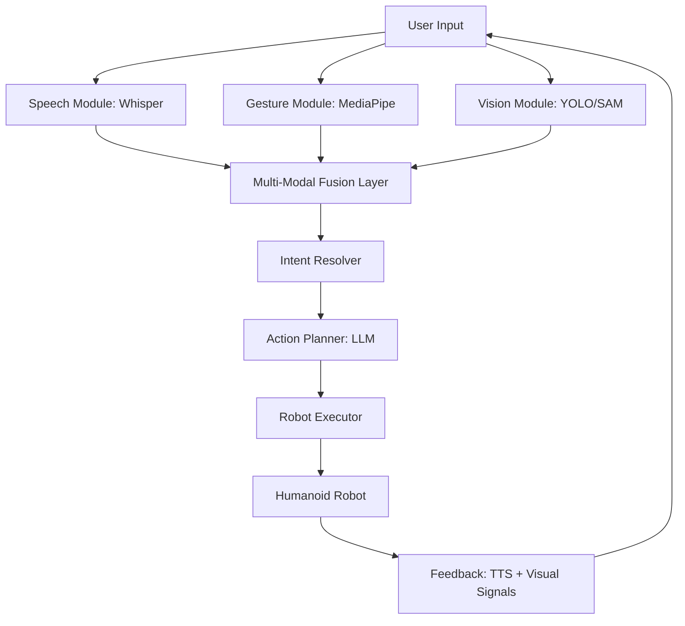
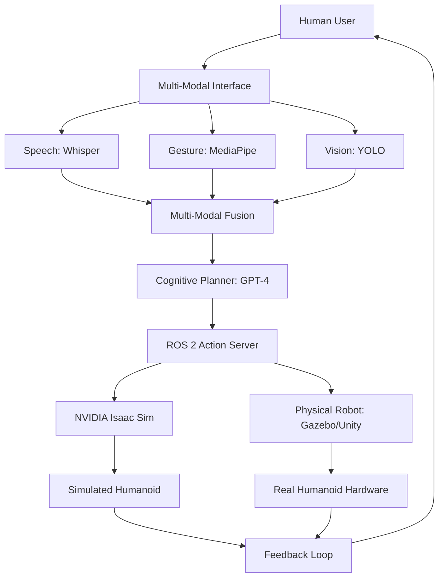

# Multi-modal Interaction (Speech, Gesture, Vision)

## Prerequisites

Before starting this chapter, you should have:

- ✅ Completed Voice-to-Action and Cognitive Planning chapters
- ✅ Understanding of computer vision basics (OpenCV, object detection)
- ✅ Familiarity with sensor fusion concepts
- ✅ Experience with real-time systems and asynchronous processing
- ✅ ROS 2 tf2 (transformations) knowledge

**Estimated Reading Time**: 25-30 minutes

---

## Introduction

Human communication is inherently **multi-modal**. When we ask someone to "pick up that red cup over there," we combine **speech** ("pick up"), **gesture** (pointing), and **visual reference** ("that red cup"). Single-modality interaction—voice-only or gesture-only—feels unnatural and error-prone.

**Multi-modal interaction** systems fuse multiple sensory inputs to understand user intent with higher accuracy, robustness, and naturalness. A humanoid robot equipped with multi-modal perception can:

- **Disambiguate commands**: "Grab this" (speech) + pointing gesture (vision) → identifies specific object
- **Confirm understanding**: "Move there" + hand wave → visual confirmation before navigation
- **Handle failures gracefully**: If speech recognition fails due to noise, gesture recognition provides backup
- **Enable richer interactions**: Combine voice commands with gaze tracking, facial expressions, and body language

This chapter demonstrates how to build a **unified multi-modal interaction framework** that integrates:
1. **Speech** (from Whisper + GPT-4 in Chapter 1)
2. **Gesture recognition** (hand tracking, pose estimation)
3. **Vision** (object detection, scene understanding)
4. **Sensor fusion** (combining modalities for robust decision-making)

**Learning Objectives**:
1. Implement gesture recognition using MediaPipe and OpenCV
2. Integrate vision models (YOLO, SAM) for object detection
3. Design sensor fusion architectures for multi-modal input
4. Build temporal alignment systems for speech-gesture synchronization
5. Create a capstone project: The Autonomous Humanoid

---

## Multi-Modal Architecture



**Key Components**:
1. **Input Modules**: Parallel processing of speech, gestures, and vision
2. **Fusion Layer**: Combines modalities with temporal alignment and confidence scoring
3. **Intent Resolver**: Extracts unified command from fused data
4. **Action Planner**: Uses LLM (from Chapter 2) to generate robot actions
5. **Executor**: Executes actions via ROS 2 (from previous modules)

---

## Gesture Recognition with MediaPipe

### Setting Up MediaPipe Hands

MediaPipe provides real-time hand tracking with 21 3D landmarks per hand.

```bash
# Install dependencies
pip install mediapipe opencv-python numpy

# Install ROS 2 vision packages
sudo apt install ros-humble-vision-opencv ros-humble-cv-bridge
```

### Hand Gesture Detector

```python
# gesture_detector.py
import cv2
import mediapipe as mp
import numpy as np
from enum import Enum

class GestureType(Enum):
    POINT = "point"
    GRAB = "grab"
    WAVE = "wave"
    STOP = "stop"
    THUMBS_UP = "thumbs_up"
    UNKNOWN = "unknown"

class GestureDetector:
    def __init__(self):
        self.mp_hands = mp.solutions.hands
        self.hands = self.mp_hands.Hands(
            static_image_mode=False,
            max_num_hands=2,
            min_detection_confidence=0.7,
            min_tracking_confidence=0.5
        )
        self.mp_draw = mp.solutions.drawing_utils

    def detect_gesture(self, frame):
        """
        Detect hand gestures in video frame.

        Returns:
            {
                "gesture": GestureType,
                "hand": "left" | "right",
                "position": (x, y, z),
                "confidence": float
            }
        """
        # Convert BGR to RGB
        rgb_frame = cv2.cvtColor(frame, cv2.COLOR_BGR2RGB)
        results = self.hands.process(rgb_frame)

        if not results.multi_hand_landmarks:
            return {"gesture": GestureType.UNKNOWN, "confidence": 0.0}

        # Process first detected hand
        hand_landmarks = results.multi_hand_landmarks[0]
        hand_label = results.multi_handedness[0].classification[0].label  # "Left" or "Right"

        # Extract landmark positions
        landmarks = []
        for lm in hand_landmarks.landmark:
            landmarks.append((lm.x, lm.y, lm.z))

        # Classify gesture
        gesture = self._classify_gesture(landmarks)

        # Get pointing direction (index finger tip)
        pointing_pos = landmarks[8]  # Index finger tip

        return {
            "gesture": gesture,
            "hand": hand_label.lower(),
            "position": pointing_pos,
            "confidence": results.multi_handedness[0].classification[0].score,
            "landmarks": landmarks
        }

    def _classify_gesture(self, landmarks):
        """Classify gesture from hand landmarks"""
        # Extract finger tip and base positions
        thumb_tip = np.array(landmarks[4])
        index_tip = np.array(landmarks[8])
        middle_tip = np.array(landmarks[12])
        ring_tip = np.array(landmarks[16])
        pinky_tip = np.array(landmarks[20])

        # Finger base positions (MCP joints)
        index_mcp = np.array(landmarks[5])
        middle_mcp = np.array(landmarks[9])
        ring_mcp = np.array(landmarks[13])
        pinky_mcp = np.array(landmarks[17])

        # Check which fingers are extended
        def is_extended(tip, mcp):
            return tip[1] < mcp[1]  # y-axis inverted in image

        index_extended = is_extended(index_tip, index_mcp)
        middle_extended = is_extended(middle_tip, middle_mcp)
        ring_extended = is_extended(ring_tip, ring_mcp)
        pinky_extended = is_extended(pinky_tip, pinky_mcp)

        # Gesture classification rules
        if index_extended and not middle_extended and not ring_extended:
            return GestureType.POINT

        elif not index_extended and not middle_extended and not ring_extended and not pinky_extended:
            return GestureType.GRAB

        elif index_extended and middle_extended and ring_extended and pinky_extended:
            return GestureType.WAVE

        elif all([not index_extended, not middle_extended, not ring_extended, not pinky_extended]):
            # Closed fist
            return GestureType.STOP

        elif thumb_tip[1] < index_mcp[1] and not index_extended:
            return GestureType.THUMBS_UP

        return GestureType.UNKNOWN

    def draw_landmarks(self, frame, landmarks):
        """Visualize hand landmarks on frame"""
        # Draw connections between landmarks
        for hand_landmarks in landmarks:
            self.mp_draw.draw_landmarks(
                frame,
                hand_landmarks,
                self.mp_hands.HAND_CONNECTIONS
            )
        return frame
```

---

## Vision Integration: Object Detection

### YOLO-Based Object Detector

```python
# object_detector.py
from ultralytics import YOLO
import cv2
import numpy as np

class ObjectDetector:
    def __init__(self, model_path="yolov8n.pt"):
        """Initialize YOLO model"""
        self.model = YOLO(model_path)
        self.class_names = self.model.names

    def detect_objects(self, frame, confidence_threshold=0.5):
        """
        Detect objects in frame.

        Returns:
            List of {
                "class": str,
                "confidence": float,
                "bbox": (x1, y1, x2, y2),
                "center": (x, y)
            }
        """
        results = self.model(frame, conf=confidence_threshold)

        detections = []
        for result in results:
            boxes = result.boxes
            for box in boxes:
                x1, y1, x2, y2 = box.xyxy[0].cpu().numpy()
                conf = box.conf[0].cpu().numpy()
                cls = int(box.cls[0].cpu().numpy())

                center_x = int((x1 + x2) / 2)
                center_y = int((y1 + y2) / 2)

                detections.append({
                    "class": self.class_names[cls],
                    "confidence": float(conf),
                    "bbox": (int(x1), int(y1), int(x2), int(y2)),
                    "center": (center_x, center_y)
                })

        return detections

    def find_object_at_position(self, detections, point_x, point_y, tolerance=50):
        """
        Find object closest to pointed position.

        Args:
            detections: List of detected objects
            point_x, point_y: Pointing coordinates (normalized 0-1)
            tolerance: Distance tolerance in pixels

        Returns:
            Best matching object or None
        """
        best_match = None
        min_distance = float('inf')

        for obj in detections:
            obj_x, obj_y = obj["center"]
            distance = np.sqrt((obj_x - point_x)**2 + (obj_y - point_y)**2)

            if distance < min_distance and distance < tolerance:
                min_distance = distance
                best_match = obj

        return best_match
```

---

## Multi-Modal Fusion Layer

### Temporal Alignment and Fusion

```python
# multimodal_fusion.py
import time
from collections import deque
from dataclasses import dataclass
from typing import Optional

@dataclass
class MultiModalInput:
    timestamp: float
    speech_text: Optional[str] = None
    gesture: Optional[dict] = None
    vision_objects: Optional[list] = None
    confidence: float = 0.0

class MultiModalFusion:
    def __init__(self, temporal_window=2.0):
        """
        Fuse multi-modal inputs within temporal window.

        Args:
            temporal_window: Time window (seconds) for aligning inputs
        """
        self.temporal_window = temporal_window
        self.speech_buffer = deque(maxlen=10)
        self.gesture_buffer = deque(maxlen=30)  # Higher framerate
        self.vision_buffer = deque(maxlen=30)

    def add_speech(self, text: str):
        """Add speech input"""
        self.speech_buffer.append({
            "timestamp": time.time(),
            "text": text
        })

    def add_gesture(self, gesture_data: dict):
        """Add gesture input"""
        self.gesture_buffer.append({
            "timestamp": time.time(),
            **gesture_data
        })

    def add_vision(self, detections: list):
        """Add vision input"""
        self.vision_buffer.append({
            "timestamp": time.time(),
            "objects": detections
        })

    def fuse_inputs(self):
        """
        Fuse inputs within temporal window.

        Returns:
            MultiModalInput with fused data
        """
        current_time = time.time()

        # Get recent inputs within window
        recent_speech = self._get_recent(self.speech_buffer, current_time)
        recent_gestures = self._get_recent(self.gesture_buffer, current_time)
        recent_vision = self._get_recent(self.vision_buffer, current_time)

        if not recent_speech and not recent_gestures:
            return None

        # Combine modalities
        fused = MultiModalInput(timestamp=current_time)

        # Speech component
        if recent_speech:
            fused.speech_text = recent_speech[-1]["text"]

        # Gesture component
        if recent_gestures:
            # Get most confident gesture
            best_gesture = max(recent_gestures, key=lambda g: g.get("confidence", 0))
            fused.gesture = best_gesture

        # Vision component
        if recent_vision:
            fused.vision_objects = recent_vision[-1]["objects"]

        # Calculate overall confidence
        fused.confidence = self._calculate_confidence(fused)

        return fused

    def _get_recent(self, buffer, current_time):
        """Get entries within temporal window"""
        return [
            entry for entry in buffer
            if current_time - entry["timestamp"] <= self.temporal_window
        ]

    def _calculate_confidence(self, fused: MultiModalInput):
        """Calculate confidence score for fused input"""
        scores = []

        if fused.speech_text:
            scores.append(0.8)  # Speech is highly reliable

        if fused.gesture:
            scores.append(fused.gesture.get("confidence", 0.5))

        if fused.vision_objects:
            avg_vision_conf = sum(obj["confidence"] for obj in fused.vision_objects) / len(fused.vision_objects)
            scores.append(avg_vision_conf)

        return sum(scores) / len(scores) if scores else 0.0
```

---

## Intent Resolution with Context

### Resolving Multi-Modal Commands

```python
# intent_resolver.py
from openai import OpenAI
import json

class IntentResolver:
    def __init__(self, api_key: str):
        self.client = OpenAI(api_key=api_key)

    def resolve_intent(self, fused_input: MultiModalInput) -> dict:
        """
        Resolve user intent from multi-modal input.

        Returns:
            {
                "action": str,
                "target_object": str,
                "location": (x, y, z),
                "parameters": dict
            }
        """
        # Build context from fused input
        context = self._build_context(fused_input)

        prompt = f"""You are a multi-modal robot command interpreter.

User provided these inputs simultaneously:
{json.dumps(context, indent=2)}

Interpret the user's intent and output a structured robot command.

Available actions: navigate_to, grasp, place, point_at, wait, confirm

Output JSON format:
{{
  "action": "action_name",
  "target_object": "object name or null",
  "location": [x, y, z] or null,
  "parameters": {{}}
}}

Example:
Input: Speech: "pick up the cup", Gesture: pointing at (0.5, 0.3), Vision: [cup, plate]
Output: {{"action": "grasp", "target_object": "cup", "location": [0.5, 0.3, 0], "parameters": {{"hand": "right"}}}}
"""

        response = self.client.chat.completions.create(
            model="gpt-4",
            messages=[{"role": "user", "content": prompt}],
            temperature=0.0,
            response_format={"type": "json_object"}
        )

        result = json.loads(response.choices[0].message.content)
        return result

    def _build_context(self, fused_input: MultiModalInput) -> dict:
        """Build context dictionary from fused input"""
        context = {}

        if fused_input.speech_text:
            context["speech"] = fused_input.speech_text

        if fused_input.gesture:
            context["gesture"] = {
                "type": fused_input.gesture["gesture"].value,
                "position": fused_input.gesture["position"]
            }

        if fused_input.vision_objects:
            context["visible_objects"] = [
                obj["class"] for obj in fused_input.vision_objects
            ]

        return context
```

---

## Complete Multi-Modal System

### ROS 2 Integration Node

```python
# multimodal_robot_node.py
import rclpy
from rclpy.node import Node
from sensor_msgs.msg import Image
from cv_bridge import CvBridge
import cv2
import os

from gesture_detector import GestureDetector
from object_detector import ObjectDetector
from multimodal_fusion import MultiModalFusion
from intent_resolver import IntentResolver
from whisper_asr import WhisperASR  # From Chapter 1
from robot_action_server import RobotActionServer  # From Chapter 1

class MultiModalRobotNode(Node):
    def __init__(self):
        super().__init__('multimodal_robot')

        # Initialize components
        self.gesture_detector = GestureDetector()
        self.object_detector = ObjectDetector()
        self.fusion = MultiModalFusion(temporal_window=2.0)

        api_key = os.getenv("OPENAI_API_KEY")
        self.whisper = WhisperASR(api_key)
        self.intent_resolver = IntentResolver(api_key)

        # ROS 2 subscribers
        self.image_sub = self.create_subscription(
            Image,
            '/camera/image_raw',
            self.image_callback,
            10
        )

        self.bridge = CvBridge()

        # Create timer for fusion and execution
        self.create_timer(0.5, self.process_multimodal_input)

        self.get_logger().info("Multi-modal robot node initialized")

    def image_callback(self, msg):
        """Process camera images for vision and gesture"""
        frame = self.bridge.imgmsg_to_cv2(msg, desired_encoding='bgr8')

        # Gesture detection
        gesture_result = self.gesture_detector.detect_gesture(frame)
        if gesture_result["confidence"] > 0.7:
            self.fusion.add_gesture(gesture_result)

        # Object detection
        detections = self.object_detector.detect_objects(frame)
        if detections:
            self.fusion.add_vision(detections)

    def process_speech(self, audio_data: bytes):
        """Process speech input (called externally)"""
        text = self.whisper.transcribe(audio_data)
        if text:
            self.get_logger().info(f"Speech: {text}")
            self.fusion.add_speech(text)

    def process_multimodal_input(self):
        """Fuse inputs and execute actions"""
        fused = self.fusion.fuse_inputs()

        if not fused or fused.confidence < 0.5:
            return  # Not enough confident input

        self.get_logger().info(f"Fused input (confidence: {fused.confidence:.2f})")

        # Resolve intent
        intent = self.intent_resolver.resolve_intent(fused)
        self.get_logger().info(f"Resolved intent: {intent}")

        # Execute action
        self.execute_action(intent)

    def execute_action(self, intent: dict):
        """Execute robot action from resolved intent"""
        action = intent.get("action")

        if action == "grasp":
            target = intent.get("target_object")
            self.get_logger().info(f"Grasping {target}")
            # Call robot action server

        elif action == "navigate_to":
            location = intent.get("location")
            self.get_logger().info(f"Navigating to {location}")

        # Add more action handlers...

def main():
    rclpy.init()
    node = MultiModalRobotNode()

    try:
        rclpy.spin(node)
    except KeyboardInterrupt:
        pass
    finally:
        node.destroy_node()
        rclpy.shutdown()

if __name__ == "__main__":
    main()
```

---

## Exercise 1: Pointing-Based Object Selection

**Objective**: Build a system where users point at objects and say "pick up this" to select targets.

**Requirements**:
1. Detect pointing gesture with MediaPipe
2. Project pointing ray onto camera frame
3. Find nearest object to pointing direction
4. Confirm selection with visual feedback (bounding box highlight)

**Starter Code**:
```python
def find_pointed_object(gesture_position, detections, frame_width, frame_height):
    """
    Find object user is pointing at.

    Args:
        gesture_position: (x, y, z) normalized coordinates
        detections: List of detected objects
        frame_width, frame_height: Camera resolution

    Returns:
        Selected object or None
    """
    # Convert normalized to pixel coordinates
    point_x = int(gesture_position[0] * frame_width)
    point_y = int(gesture_position[1] * frame_height)

    # TODO: Find closest object to pointing position
    # TODO: Add visual confirmation (draw bounding box)
    pass
```

**Acceptance Criteria**:
- [ ] Accurately selects objects within 100px of pointing direction
- [ ] Provides visual feedback (green bounding box)
- [ ] Handles multiple objects in scene
- [ ] Works in real-time (under 100ms latency)

---

## Exercise 2: Gesture-Controlled Navigation

**Objective**: Control robot navigation using hand gestures.

**Gesture Mappings**:
- **Point**: Navigate to pointed location
- **Wave**: Stop current motion
- **Thumbs up**: Confirm destination
- **Stop (fist)**: Emergency stop

**Implementation Hints**:
```python
def gesture_navigation_control(gesture_type, position):
    """Map gestures to navigation commands"""
    if gesture_type == GestureType.POINT:
        # Convert 2D point to 3D world coordinates
        world_coords = camera_to_world(position)
        return {"action": "navigate_to", "location": world_coords}

    elif gesture_type == GestureType.WAVE:
        return {"action": "stop"}

    # TODO: Add more gesture mappings
```

---

## Capstone Project: The Autonomous Humanoid

**Project Goal**: Build a fully autonomous humanoid robot that integrates all four modules of this textbook.

### System Architecture



### Key Components Integration

| Module | Component | Integration Point |
|--------|-----------|-------------------|
| **Module 1: ROS 2** | Action servers, tf2 transforms | Robot control layer |
| **Module 2: Simulation** | Gazebo/Unity environments | Testing and validation |
| **Module 3: NVIDIA Isaac** | Isaac Sim, Isaac Gym | RL training, physics simulation |
| **Module 4: VLA** | Multi-modal interaction | User interface and cognitive planning |

### Implementation Steps

1. **Environment Setup** (Week 1)
   - Configure ROS 2 workspace with all dependencies
   - Set up Gazebo/Unity simulation environment
   - Install NVIDIA Isaac Sim and Isaac Gym
   - Configure camera, microphone, and sensors

2. **Module Integration** (Week 2)
   - Integrate speech recognition (Whisper)
   - Add gesture detection (MediaPipe)
   - Implement object detection (YOLO)
   - Create multi-modal fusion layer

3. **Cognitive Planning** (Week 3)
   - Connect LLM planner from Chapter 2
   - Implement task decomposition
   - Add failure handling and replanning
   - Create self-critique loops

4. **Robot Execution** (Week 4)
   - Implement navigation using Nav2
   - Add manipulation with MoveIt 2
   - Integrate with Isaac Sim for training
   - Deploy to physical hardware (if available)

5. **Testing and Refinement** (Week 5)
   - Test in simulation with various scenarios
   - Collect user feedback
   - Optimize latency and accuracy
   - Create demonstration videos

### Sample Scenarios

**Scenario 1: Household Assistant**
- User: *"Clean up the living room"* (speech)
- Robot: Uses cognitive planner to decompose task
- Robot: Navigates, detects objects (vision), picks up items (manipulation)
- User: Points at specific object + *"put this in the drawer"* (gesture + speech)
- Robot: Confirms with visual feedback, executes command

**Scenario 2: Collaborative Cooking**
- User: Gestures at ingredients + *"pass me the tomatoes"*
- Robot: Detects tomatoes (vision), grasps, hands to user
- User: *"chop these vegetables"* (speech)
- Robot: Explains it cannot use knives (safety), suggests alternative

**Scenario 3: Industrial Inspection**
- User: Points at machinery + *"inspect this component"*
- Robot: Navigates to location, captures images
- Robot: Uses vision model to detect defects
- Robot: Reports findings via speech synthesis

---

## Common Challenges and Solutions

| Challenge | Cause | Solution |
|-----------|-------|----------|
| **Modality desynchronization** | Different sensor framerates | Use temporal alignment with buffering |
| **Conflicting inputs** | Speech says "left", gesture points right | Implement confidence-weighted fusion |
| **Latency issues** | Processing multiple AI models | Parallelize inference, use edge TPU/GPU |
| **Gesture ambiguity** | Similar hand poses for different gestures | Add temporal context, require confirmation |
| **Lighting variations** | Vision and gesture fail in poor light | Add infrared camera, use robust models |

---

## Advanced: Cross-Modal Attention

For state-of-the-art systems, implement **cross-modal attention** to learn which modality to prioritize:

```python
class CrossModalAttention:
    def __init__(self):
        # Learnable attention weights
        self.speech_weight = 0.5
        self.gesture_weight = 0.3
        self.vision_weight = 0.2

    def attend(self, speech_features, gesture_features, vision_features):
        """
        Compute attention-weighted fusion.

        Returns:
            Weighted combination of features
        """
        attended = (
            self.speech_weight * speech_features +
            self.gesture_weight * gesture_features +
            self.vision_weight * vision_features
        )
        return attended

    def update_weights(self, feedback: float):
        """Update attention weights based on task success"""
        # TODO: Implement reinforcement learning update
        pass
```

---

## Key Takeaways

- **Multi-modal systems** are more robust than single-modality interfaces
- **Temporal alignment** is critical for fusing asynchronous sensor inputs
- **Gesture recognition** enables intuitive spatial commands (pointing, waving)
- **Vision integration** grounds language in the physical world (object reference)
- **Sensor fusion** combines modalities for higher accuracy and fault tolerance
- **LLM-based intent resolution** handles ambiguity in natural human communication

Multi-modal interaction transforms humanoid robots from tools into collaborative partners. By understanding speech, gestures, and visual context, robots can participate in natural human workflows.

---

## Congratulations!

**You've completed the Physical AI & Humanoid Robotics textbook!** 🎉

You've learned:
- **Module 1**: ROS 2 fundamentals (nodes, topics, actions, lifecycle management)
- **Module 2**: Simulation environments (Gazebo, Unity, physics engines)
- **Module 3**: NVIDIA Isaac platform (Isaac Sim, Isaac Gym, reinforcement learning)
- **Module 4**: Vision-Language-Action models (speech recognition, cognitive planning, multi-modal interaction)

**Next Steps**:
1. Build your capstone project: The Autonomous Humanoid
2. Contribute to open-source robotics projects (ROS 2, MoveIt, Nav2)
3. Explore research papers on VLA models (RT-1, RT-2, PaLM-E, Octo)
4. Join robotics communities (ROS Discourse, Humanoids subreddit, AI alignment forums)
5. Apply for robotics internships or research positions

**Resources for Further Learning**:
- [ROS 2 Documentation](https://docs.ros.org/en/humble/)
- [NVIDIA Isaac Documentation](https://docs.omniverse.nvidia.com/isaacsim/latest/)
- [OpenAI Robotics Research](https://openai.com/research/robotics)
- [Google DeepMind Robotics](https://deepmind.google/discover/blog/shaping-the-future-of-advanced-robotics/)

---

**Previous Chapter**: [Cognitive Planning with LLMs](./cognitive-planning.md)
**Return to**: [Preface](/docs/preface) | [Introduction to Physical AI](/docs/intro-physical-ai)

Thank you for learning with us. Go build amazing robots! 🤖
