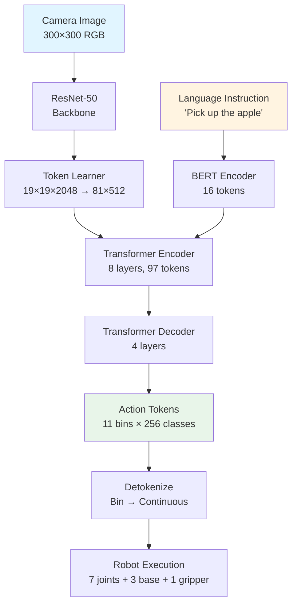
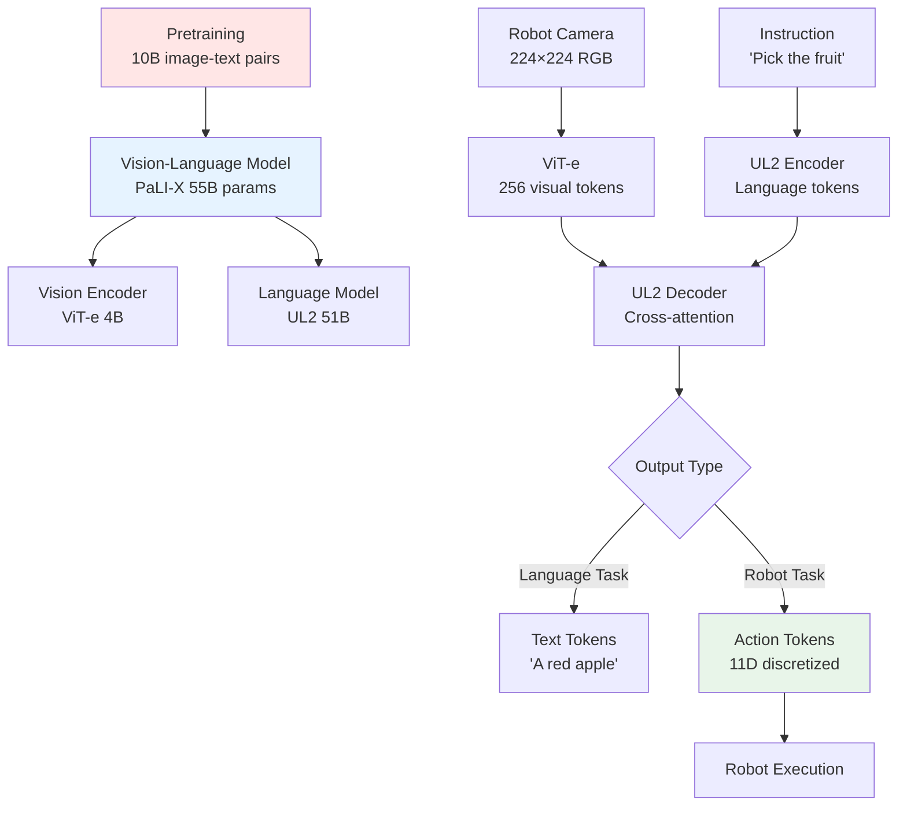

# VLA Architectures: RT-1, RT-2, PaLM-E

## Prerequisites

Before diving into this chapter, ensure you have:

- Completed **Chapter 1: Introduction to VLA Models** from this module
- Strong understanding of **transformer architecture** (self-attention, positional encodings, encoder-decoder)
- Familiarity with **vision transformers (ViT)** and token-based image processing
- Knowledge of **language models** (BERT, T5, GPT architecture)
- Experience with **PyTorch** or **TensorFlow** for reading model code

## Introduction

This chapter explores three groundbreaking VLA architectures that define the state-of-the-art in robot learning: **RT-1 (Robotics Transformer 1)**, **RT-2 (Robotics Transformer 2)**, and **PaLM-E (Embodied Language Model)**. Each model represents a different approach to integrating vision, language, and action:

- **RT-1** pioneered efficient visual tokenization and action discretization for robot control
- **RT-2** leveraged massive vision-language pretraining to achieve emergent reasoning capabilities
- **PaLM-E** scaled to 562 billion parameters, enabling multimodal planning and long-horizon tasks

You'll learn the architectural details of each model, understand their design trade-offs, and compare their strengths and limitations across real-world robotics benchmarks.

**Learning Objectives:**
- Understand RT-1's token learner and action tokenization mechanisms
- Explain how RT-2 leverages VLM pretraining for emergent robotic capabilities
- Analyze PaLM-E's multimodal integration and planning architecture
- Compare RT-1, RT-2, and PaLM-E across key dimensions (parameters, data, performance)

---

## RT-1: Robotics Transformer 1

**RT-1**, introduced by Google's Robotics at Google team in December 2022, was the first large-scale VLA model to demonstrate broad generalization across hundreds of real-world robot tasks. Trained on **130,000 demonstrations** spanning **700+ tasks** in office kitchens, RT-1 achieved **97% success** on seen tasks and **76% success** on novel language instructions.

### Architecture Overview

RT-1 consists of three core components:

1. **Token Learner**: Compresses 300×300 RGB images into 81 visual tokens (9×9 grid)
2. **Transformer Encoder**: Processes visual tokens + language tokens using 8 layers of self-attention
3. **Action Decoder**: Outputs 11-dimensional action tokens (7 arm joints + 3 base velocities + 1 gripper)

The key innovation is **visual tokenization**—instead of processing full images (90,000 pixels), RT-1 learns a compact 81-token representation, reducing computational cost by 1000× while preserving task-relevant visual information (object locations, gripper pose, scene context).

### Token Learner Module

The **Token Learner** (Ryoo et al., 2021) uses **learned attention** to select the most relevant spatial regions from image features:

**Architecture**:
```
Input: 300×300×3 RGB image
↓
ResNet-50 backbone → 19×19×2048 feature map (6,859 spatial features)
↓
Token Learner (spatial attention) → 81×512 visual tokens
↓
Output: 81 tokens representing key visual regions
```

**How it works**:
1. ResNet-50 extracts convolutional features from the image (19×19 spatial grid with 2048 channels)
2. Token Learner applies a small MLP to each spatial location, producing an attention score
3. Top-81 spatial regions (9×9 grid) are selected based on attention scores
4. Selected features are projected to 512-dimensional visual tokens

**Benefit**: Reduces sequence length from 361 image patches (standard ViT) to 81 tokens, enabling faster inference (5 Hz on GPU) while focusing on task-relevant regions (robot gripper, target objects, obstacles).

### Transformer Encoder-Decoder

RT-1 uses a **12-layer transformer** to process multimodal sequences:

**Input sequence**:
- 81 visual tokens (from Token Learner)
- 16 language tokens (BERT-encoded instruction like "pick red apple")
- Total: 97 tokens

**Encoder** (8 layers):
- Self-attention across all 97 tokens to fuse vision and language
- Each token attends to all others, learning cross-modal alignments
- Example: Token representing "red object region" attends to language token "red" and "apple"

**Decoder** (4 layers):
- Predicts 11-dimensional action vector autoregressively
- Each action dimension is discretized into 256 bins (quantization)
- Output: Sequence of 11 discrete tokens representing joint angles and gripper state

### Action Tokenization

RT-1 discretizes continuous robot actions into **discrete tokens** for classification (instead of regression):

**Continuous actions**:
- 7 arm joint angles (radians): [-π, π]
- 3 base velocities (m/s): [-0.5, 0.5]
- 1 gripper command: \{open, close\}

**Tokenization**:
1. Divide each continuous range into 256 bins (8-bit quantization)
   - Example: Joint 1 range [-π, π] → bins [0, 255]
   - Angle 1.57 rad → bin 192
2. Transformer predicts bin index (0-255) for each action dimension
3. Bin index is converted back to continuous value during execution

**Advantages**:
- **Classification loss** (cross-entropy) more stable than regression loss (MSE) for high-dimensional actions
- **Discretization prevents mode averaging**: Avoids predicting average action when multiple valid actions exist (e.g., grasp left side vs. right side of object)
- **Easier to train**: Softmax outputs more robust than unbounded regression outputs

### Training Data

RT-1 was trained on the **RT-1 dataset**:
- **130,000 teleoperation demonstrations** collected over 17 months
- **700+ tasks** across 13 robots in office kitchens
- **Instruction diversity**: 1,000+ unique language instructions
- **Object diversity**: 200+ household objects (fruits, cans, bottles, utensils)
- **Environment diversity**: 5 different kitchen layouts with varying lighting and clutter

**Data collection process**:
1. Human operator teleoperates robot using VR controller (Oculus Quest)
2. Robot executes task while recording: camera images (10 Hz), language instruction, joint states, actions
3. Successful demonstrations are labeled and added to dataset
4. Failed attempts are discarded (no negative examples)

### RT-1 Performance

**Benchmark results** (Google's office kitchen robots, 2022):

| Task Category | Success Rate |
|--------------|-------------|
| Seen tasks (trained) | 97% |
| Novel instructions (unseen) | 76% |
| Novel objects (seen category) | 83% |
| Novel objects (unseen category) | 62% |

**Example capabilities**:
- "Move Coke can to the top drawer" → 95% success
- "Place apple in the blue bowl" → 89% success (novel bowl color)
- "Pick the fruit" → 78% success (generalizes to unseen fruits: mango, kiwi)

---

## RT-1 Architecture Diagram



**Alt text**: RT-1 architecture flowchart showing image processing through ResNet-50 and Token Learner, language encoding through BERT, multimodal fusion in transformer encoder, action prediction in decoder, discretization into 256-bin tokens, and execution on robot.

---

## RT-2: Robotics Transformer 2

**RT-2**, released in July 2023, dramatically improved RT-1's generalization by **co-fine-tuning** a pretrained vision-language model (VLM) on robot data. Instead of training from scratch, RT-2 leverages **PaLI-X** (55 billion parameters) pretrained on 10 billion image-text pairs from the internet, enabling **emergent capabilities** like reasoning about object properties, spatial relationships, and semantic categories.

### Key Innovation: VLM-to-Robot Transfer

**Hypothesis**: Vision-language models (VLMs) that understand "a red apple is a fruit" from web images can transfer this knowledge to robotic manipulation when fine-tuned on robot demonstrations.

**Approach**:
1. Start with **PaLI-X** (55B parameters), a VLM pretrained on 10B image-text pairs (web images + captions)
2. Extend output vocabulary: Add robot action tokens (256 bins × 11 dimensions = 2,816 new tokens)
3. **Co-fine-tune** on both:
   - Web data: Image-caption pairs (e.g., "a red apple on a table")
   - Robot data: Image-action pairs (e.g., camera image → joint angles)
4. Model learns to generate **text** for language tasks and **action tokens** for robot tasks

**Result**: RT-2 can perform **zero-shot reasoning** unavailable to RT-1:
- "Pick the extinct animal" → Grasps toy dinosaur (never explicitly trained on "extinct" + "dinosaur")
- "Move the drink to the person" → Identifies beverage cans and navigates toward humans
- "Pick the item you'd use to hammer in a nail" → Selects rock (tool affordance reasoning)

### Architecture

RT-2 is based on **PaLI-X**, a vision-language model with:

1. **Vision Encoder**: ViT-e (4B parameters) processes 224×224 images into 256 visual tokens
2. **Language Model**: UL2 (51B parameters), a T5-style encoder-decoder transformer
3. **Multimodal Fusion**: Cross-attention in decoder attends to visual tokens conditioned on language

**Modifications for robotics**:
- Add action tokenizer: Maps 11D continuous actions → 2,816 discrete action tokens
- Train with mixed objectives:
  - **Language modeling**: Predict next word given image + text prefix
  - **Action prediction**: Predict action token given image + instruction

**Training**:
- **Pretraining**: 10B image-text pairs from web (Google internal dataset, similar to LAION-5B)
- **Fine-tuning**: RT-1 dataset (130K demos) + RT-2 dataset (50K new demos)
- **Co-fine-tuning**: Alternate batches of web data (image captioning) and robot data (action prediction)

### Emergent Capabilities

RT-2 demonstrates capabilities **never explicitly trained**:

1. **Semantic Reasoning**: "Pick the extinct animal" → Correctly identifies toy dinosaur among multiple objects
2. **Spatial Reasoning**: "Move the cup to the left of the plate" → Understands spatial prepositions from language pretraining
3. **Category Generalization**: "Pick the fruit" → Generalizes to 15+ fruit types vs. 5 in RT-1
4. **Affordance Reasoning**: "Pick something to cut the apple" → Selects knife (tool-use reasoning)

**Performance vs. RT-1**:

| Metric | RT-1 | RT-2 |
|--------|------|------|
| Seen tasks | 97% | 98% |
| Novel objects (seen category) | 83% | 91% |
| Novel objects (unseen category) | 62% | 79% |
| Symbolic reasoning tasks | 0% | 74% |

**Symbolic reasoning examples** (new capability):
- "Pick the bag of chips" → 85% success (understands "bag" packaging)
- "Move the smallest object" → 72% success (visual size comparison)
- "Pick the emergency equipment" → 68% success (fire extinguisher selected)

### Inference

RT-2 runs inference at **3 Hz** on NVIDIA A100 GPU:

**Latency breakdown**:
- Vision encoding (ViT-e): 180ms
- Language encoding (UL2): 50ms
- Cross-attention + action decoding: 80ms
- Total: 310ms per action prediction

**Deployment**: RT-2 is deployed on Google's mobile manipulator robots with:
- NVIDIA Jetson AGX Orin (edge GPU) running vision encoder (7 Hz)
- Cloud server running full RT-2 (3 Hz) via 5G connection
- Robot controller interpolates actions between predictions for smooth 20Hz execution

---

## RT-2 Architecture Diagram



**Alt text**: RT-2 architecture flowchart showing PaLI-X VLM pretrained on 10B image-text pairs, then co-fine-tuned to output either text tokens (language tasks) or action tokens (robot tasks) through shared vision encoder and language model.

---

## PaLM-E: Embodied Language Model

**PaLM-E** (March 2023) is the largest VLA model to date, integrating **PaLM** language model (540B parameters) with visual observations to enable **multimodal planning**, **long-horizon reasoning**, and **state estimation** for embodied agents.

### Architecture

PaLM-E combines:

1. **PaLM** (540B parameters): Large language model pretrained on 780B text tokens
2. **Vision Encoder**: ViT-22B processes images into 256 visual tokens
3. **Sensor Encoders**: Additional encoders for depth, LiDAR, proprioception (joint states)
4. **Multimodal Integration**: Inject vision/sensor tokens into PaLM's text sequence

**Multimodal sequence** (example):
```
[TEXT] "The robot should" [IMAGE_TOKEN_1] ... [IMAGE_TOKEN_256] [TEXT] "pick up the mug because" [IMAGE_TOKEN_1] ... [TEXT] "the user requested coffee."
```

Visual tokens are **interleaved** with text tokens, allowing PaLM to:
- Reason about visual observations using language priors
- Ground language in physical states (e.g., "the mug is to the left" requires spatial grounding)
- Generate action plans as text sequences (e.g., "Step 1: Grasp mug. Step 2: Move to coffee machine.")

### Training Strategy

PaLM-E uses **multi-task co-training** across diverse modalities:

**Tasks**:
1. **Vision-language**: Image captioning, VQA (Visual Question Answering)
2. **Robotics**: Manipulation tasks (RT-1 dataset + 20,000 long-horizon demos)
3. **Embodied QA**: "What object is on the table?" given robot camera feed
4. **State estimation**: Predict object poses from images
5. **Planning**: Generate task plans given goals ("make coffee" → multi-step plan)

**Training details**:
- **562B parameters** (largest embodied model)
- **100,000 robot demos** across 20 robots
- **10M image-text pairs** for vision-language grounding
- **Mixed-precision training** on 2048 TPU v4 chips for 1 month

### Long-Horizon Planning

PaLM-E can decompose high-level goals into **multi-step action sequences**:

**Example**: "Prepare a meal"
1. Understand goal: Parse "prepare a meal" → sequence of sub-tasks
2. Visual grounding: Identify ingredients on counter (tomato, bread, cheese)
3. Generate plan:
   ```
   Step 1: Grasp knife
   Step 2: Cut tomato into slices
   Step 3: Open bread bag
   Step 4: Place tomato slices on bread
   Step 5: Add cheese
   Step 6: Close sandwich
   Step 7: Serve to user
   ```
4. Execute: Convert each step into low-level actions using RT-1-style action decoder
5. Monitor: After each step, re-perceive scene and adjust plan if needed

**Closed-loop execution**:
- After "Step 1: Grasp knife", PaLM-E checks: "Did I successfully grasp the knife?"
- If yes: Proceed to Step 2
- If no: Replan: "The knife is out of reach. Step 1b: Navigate closer to the counter."

**Success rate** on long-horizon tasks (5-20 steps):
- Simple tasks (3-5 steps): 87% success
- Medium tasks (6-10 steps): 68% success
- Complex tasks (11-20 steps): 52% success

### Multimodal Reasoning

PaLM-E can answer questions requiring **cross-modal reasoning**:

**Example interactions**:

**User**: "Why is the drawer stuck?" (given robot camera showing drawer)
**PaLM-E**: "The spoon is blocking the drawer from closing fully. The handle is wedged against the drawer frame."

**User**: "Can I stack the glass on the plate?"
**PaLM-E**: "No, the glass is too large and heavy. It would likely slide off or tip over. Place it next to the plate instead."

**User**: "What's the fastest way to sort these items by color?"
**PaLM-E**: "Group by primary color first (reds together, blues together), then fine-tune within groups. Start with the largest items to save space."

**Reasoning types**:
- **Physical reasoning**: Weight, balance, friction, stability
- **Spatial reasoning**: Proximity, containment, occlusion
- **Causal reasoning**: "If I move X, then Y will happen"
- **Temporal reasoning**: "Do X before Y" (order constraints)

---

## Architecture Comparison Table

| Aspect | RT-1 | RT-2 | PaLM-E |
|--------|------|------|--------|
| **Parameters** | 35M | 55B (4B vision + 51B language) | 562B (22B vision + 540B language) |
| **Pretraining** | None (trained from scratch) | PaLI-X on 10B image-text pairs | PaLM on 780B text tokens + ViT-22B |
| **Training Data** | 130K robot demos | 180K robot demos + web data | 100K robot demos + 10M image-text pairs |
| **Tasks** | Single-step manipulation | Single-step + reasoning | Long-horizon planning (5-20 steps) |
| **Generalization** | Novel objects (same category) | Novel objects + symbolic reasoning | Cross-domain transfer + planning |
| **Inference Speed** | 5 Hz (GPU) | 3 Hz (A100 GPU) | 0.5 Hz (2048 TPU) |
| **Novel Capabilities** | Action tokenization | Emergent reasoning from VLM | Multimodal QA, state estimation |
| **Use Cases** | Warehouse picking, assembly | Household robots, retail | Research, complex planning |
| **Deployment** | Edge devices (Jetson Orin) | Cloud + edge hybrid | Cloud-only (TPU inference) |

### Design Trade-offs

**RT-1**:
- ✅ Fast inference (5 Hz)
- ✅ Compact model (35M params) for edge deployment
- ❌ Limited generalization to novel categories
- ❌ No reasoning about object properties

**RT-2**:
- ✅ Emergent reasoning (pick extinct animal, smallest object)
- ✅ Strong zero-shot generalization (79% on novel objects)
- ❌ Slow inference (3 Hz) requires powerful GPU
- ❌ Cannot handle long-horizon tasks (&gt;1 step)

**PaLM-E**:
- ✅ Long-horizon planning (20+ steps)
- ✅ Multimodal reasoning (answer "why" questions)
- ❌ Extremely slow (0.5 Hz inference)
- ❌ Requires TPU cluster (not deployable on robots)

**Recommendation**:
- **Production systems**: RT-1 or RT-2 (deployable, real-time performance)
- **Research**: PaLM-E (push boundaries of what's possible)
- **Hybrid approach**: PaLM-E for high-level planning, RT-2 for low-level execution

---

## Hands-On Exercises

### Exercise 1: Read RT-1 Paper in Depth
Access the original RT-1 paper: [RT-1: Robotics Transformer for Real-World Control at Scale](https://arxiv.org/abs/2212.06817)

**Tasks**:
1. Explain the Token Learner architecture in detail. How does it reduce sequence length from 361 to 81 tokens?
2. Why did the authors choose action discretization (256 bins) over continuous action regression?
3. Analyze Table 2 (generalization results). What factors contribute to the 21% drop in success rate for novel instructions (76% vs. 97%)?
4. Reproduce the RT-1 architecture diagram in Figure 2. Label all components and data dimensions.

**Expected time**: 60 minutes
**Learning goal**: Deep understanding of RT-1 design decisions and their empirical justification.

### Exercise 2: Compare RT-2 Improvements Over RT-1
Create a detailed comparison document covering:

**Technical improvements**:
1. Vision encoder: ResNet-50 + Token Learner (RT-1) vs. ViT-e (RT-2)
2. Language model: BERT (RT-1) vs. UL2 (RT-2)
3. Training data: 130K robot demos (RT-1) vs. 180K + 10B web pairs (RT-2)
4. Model size: 35M (RT-1) vs. 55B (RT-2)

**Capability improvements**:
1. Quantify generalization gains (use Tables 3-4 from RT-2 paper)
2. List 5 emergent capabilities in RT-2 absent in RT-1
3. Analyze failure modes: What tasks still fail for both models?

**Trade-offs**:
1. Inference speed: RT-1 (5 Hz) vs. RT-2 (3 Hz)
2. Deployment: RT-1 on Jetson Orin vs. RT-2 requiring A100

**Expected time**: 45 minutes
**Learning goal**: Understand how VLM pretraining enables emergent robotic capabilities.

### Exercise 3: Analyze PaLM-E Multimodal Integration
Read Section 3.2 of the PaLM-E paper ([PaLM-E: An Embodied Multimodal Language Model](https://arxiv.org/abs/2303.03378))

**Tasks**:
1. How are visual tokens interleaved with text tokens in PaLM-E's input sequence?
2. What is the advantage of interleaving over concatenation (vision first, then text)?
3. Analyze Figure 5 (long-horizon planning example). How does PaLM-E handle execution failures mid-plan?
4. Why does PaLM-E use 562B parameters vs. RT-2's 55B? What capabilities require the extra scale?

**Expected time**: 50 minutes
**Learning goal**: Understand multimodal integration strategies for embodied AI.

### Exercise 4: Reproduce Architecture Diagrams
Using Mermaid or draw.io, create architecture diagrams for:

1. **RT-1 full pipeline**: Camera → ResNet → Token Learner → Transformer → Actions
   - Include tensor dimensions at each stage
   - Show Token Learner's spatial attention mechanism

2. **RT-2 co-fine-tuning**: Web data + robot data → PaLI-X → text OR actions
   - Show branching between language tasks and robot tasks
   - Label pretrained components vs. fine-tuned components

3. **PaLM-E interleaved sequence**: Text + images → PaLM → planning
   - Show example sequence with [TEXT] and [IMAGE] tokens
   - Illustrate closed-loop execution with replanning

**Expected time**: 60 minutes
**Learning goal**: Solidify understanding through visual representation.

---

## Key Takeaways

- **RT-1 pioneered VLA models** by introducing token learner for efficient visual compression (19×19 → 9×9 tokens), action discretization into 256 bins to prevent mode averaging, and training on 130K real-world robot demonstrations across 700 tasks, achieving 97% success on seen tasks and 76% on novel instructions.

- **RT-2 leveraged vision-language pretraining** by co-fine-tuning PaLI-X (55B parameters) on 10B web image-text pairs and robot data, enabling emergent capabilities like symbolic reasoning ("pick extinct animal"), affordance understanding ("item to hammer a nail"), and improved generalization (79% on novel objects vs. 62% for RT-1).

- **PaLM-E scaled to 562B parameters** by integrating PaLM language model (540B) with ViT-22B vision encoder, supporting long-horizon planning (5-20 step tasks at 52-87% success), multimodal reasoning (answering "why" questions about physical states), and state estimation from visual observations.

- **Token learner reduces computational cost** by learning spatial attention over ResNet features to select 81 most task-relevant tokens instead of processing all 361 image patches, achieving 1000× reduction in FLOPs while preserving object locations, gripper pose, and scene context needed for manipulation.

- **Action tokenization outperforms regression** by discretizing continuous robot actions into 256 bins per dimension and framing control as classification (cross-entropy loss), preventing mode averaging when multiple valid actions exist and improving training stability for high-dimensional action spaces (11D for RT-1).

- **VLM transfer enables emergent reasoning** because vision-language models pretrained on internet data (e.g., "red apple is fruit") transfer semantic knowledge to robotics when fine-tuned on robot demonstrations, allowing RT-2 to generalize to unseen categories ("extinct animal" → dinosaur) without explicit training on category labels.

- **Architecture trade-offs span inference speed, generalization, and planning** with RT-1 optimized for edge deployment (5 Hz, 35M params), RT-2 balancing reasoning and speed (3 Hz, 55B params), and PaLM-E prioritizing capabilities over efficiency (0.5 Hz, 562B params), requiring different deployment strategies (edge vs. cloud hybrid vs. cloud-only).

---

## Navigation

**Previous Chapter**: [Introduction to VLA Models](/docs/module-4-vla/intro-vla)
**Next Chapter**: [Training and Deploying VLA Systems](/docs/module-4-vla/vla-training-deployment)
