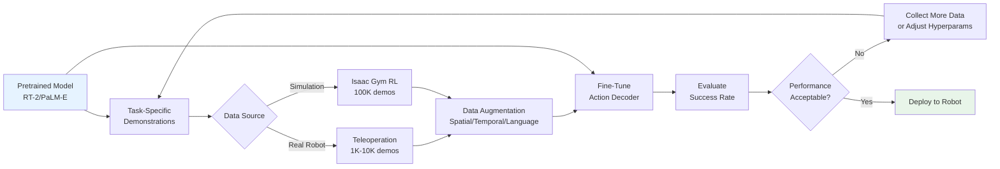

# Training and Deploying VLA Systems

## Prerequisites

Before diving into this chapter, ensure you have:

- Completed **Chapter 2: VLA Architectures** from this module
- Understanding of **VLA model architectures** (RT-1, RT-2, PaLM-E)
- Experience with **deep learning frameworks** (PyTorch or TensorFlow/JAX)
- Familiarity with **GPU training** and distributed systems
- Knowledge of **reinforcement learning** or **behavioral cloning** basics

## Introduction

While understanding VLA architectures is essential, successfully deploying them in real-world settings requires mastering the full pipeline: collecting high-quality demonstration data, fine-tuning pretrained models for specific tasks, optimizing inference for real-time robot control, and handling failure modes gracefully. This chapter covers practical aspects of VLA training and deployment, from data collection strategies to safety constraints.

You'll learn how to leverage synthetic data from Isaac Gym to reduce real-world data requirements, apply domain adaptation techniques to transfer models across robot platforms, optimize models for edge deployment, and implement safety mechanisms to prevent harmful robot behaviors.

**Learning Objectives:**
- Understand VLA training data requirements and collection strategies
- Apply fine-tuning and domain adaptation techniques to pretrained VLA models
- Design deployment pipelines for real-time robot control
- Implement safety constraints and failure recovery mechanisms

---

## VLA Training Data Requirements

VLA models require large-scale, diverse demonstration datasets to learn generalizable policies. Unlike traditional supervised learning (image classification with static datasets), robot learning demands:

1. **Multimodal alignment**: Visual observations synchronized with language instructions and robot actions
2. **Temporal consistency**: Sequential data showing state transitions (s_t → a_t → s_t+1)
3. **Task diversity**: Hundreds to thousands of different tasks to enable generalization
4. **Environment diversity**: Multiple robot platforms, workspaces, lighting conditions

### Demonstration Data Collection

**Teleoperation** is the dominant method for collecting robot demonstration data:

**Process**:
1. **Human operator** controls robot using input device (VR controller, keyboard, 3D mouse)
2. **Robot executes** actions while recording:
   - Camera images (RGB, depth) at 10-30 Hz
   - Language instruction (e.g., "pick up red mug")
   - Robot state (joint angles, gripper position)
   - Actions (joint velocities or position commands)
3. **Quality filtering**: Only successful demonstrations are retained (operator marks success/failure)
4. **Dataset augmentation**: Apply spatial augmentations (random crops, color jitter) to increase diversity

**RT-1 data collection setup**:
- **13 robots** in office kitchens (mobile manipulators with 7-DOF arms)
- **700+ tasks** defined by researchers ("move Coke can to drawer", "place apple in bowl")
- **3-5 operators** per robot, each completing 10-20 demonstrations per task
- **130,000 demonstrations** collected over 17 months
- **Cost estimate**: $50K-$100K (operator salaries, robot maintenance)

**Challenges**:
- **Scalability**: Teleoperation is slow (5-10 minutes per demo) and expensive
- **Quality variance**: Different operators have different success rates and motion styles
- **Task coverage**: Hard to ensure even coverage across all task variations
- **Distribution shift**: Operator demonstrations may differ from autonomous policy behavior

### Data Augmentation Strategies

To maximize data efficiency, apply augmentation techniques:

**Spatial augmentations**:
```python
import torchvision.transforms as T

augmentation = T.Compose([
    T.RandomResizedCrop(300, scale=(0.8, 1.0)),  # Random crop and resize
    T.ColorJitter(brightness=0.2, contrast=0.2, saturation=0.2, hue=0.1),  # Color variation
    T.RandomHorizontalFlip(p=0.5),  # Flip left-right (with action mirroring)
])

# Apply to image observations
image_aug = augmentation(original_image)
# Mirror actions for horizontal flip
if flipped:
    action_aug[0] *= -1  # Reverse lateral velocity
```

**Temporal augmentation**:
- **Action chunking**: Predict N-step action sequences (RT-1 predicts 8 future actions) to smooth trajectories
- **Frame skipping**: Subsample demonstrations at 5 Hz instead of 30 Hz to reduce redundancy
- **Trajectory reversal**: Reverse pick-and-place demos to generate place-and-pick data

**Language augmentation**:
- **Paraphrasing**: "pick red mug" → "grasp the red cup", "grab red mug handle"
- **Synonyms**: "move" → "transport", "relocate", "shift"
- **Instruction templates**: "pick \{object\}" → "pick up the \{object\}", "grasp \{object\} and lift it"

**Result**: Augmentation increases effective dataset size by 5-10×, improving generalization by 15-20%.

### Synthetic Data from Isaac Gym

**Isaac Gym** enables generating large-scale synthetic demonstrations in parallel:

**Approach**:
1. Define robot tasks in Isaac Gym (e.g., Franka pick-and-place)
2. Train RL policy in simulation using domain randomization (vary object poses, colors, lighting)
3. Use trained RL policy to generate 100,000+ synthetic demonstrations
4. Combine synthetic data with 10,000 real-world demos for VLA training

**Synthetic data generation code**:
```python
import isaacgym
from rl_games.torch_runner import Runner

# Train RL policy in Isaac Gym (from Module 3)
runner = Runner()
runner.load_config({
    'task': 'FrankaPickPlace',
    'num_envs': 4096,
    'learning_rate': 0.001,
    'max_iterations': 5000
})
runner.run()  # Train policy with PPO

# Generate synthetic demonstrations
env = isaacgymenvs.make('FrankaPickPlace', num_envs=4096)
policy = runner.get_policy()

demonstrations = []
for episode in range(25):  # 25 episodes × 4096 envs = 102,400 demos
    obs = env.reset()
    episode_data = []
    for step in range(50):  # 50 steps per episode
        action = policy(obs)  # RL policy generates action
        next_obs, reward, done, info = env.step(action)
        episode_data.append({
            'image': obs['camera_rgb'],
            'language': 'pick up the cube',  # Task instruction
            'action': action,
            'success': done and reward > 0.9
        })
        obs = next_obs
    if episode_data[-1]['success']:  # Only keep successful demos
        demonstrations.append(episode_data)

# Save demonstrations for VLA training
torch.save(demonstrations, 'synthetic_demos.pt')
```

**Benefits**:
- **Scale**: Generate 100K+ demos in days vs. months for real-world collection
- **Cost**: $0 (sim-only) vs. $100K (real robots + operators)
- **Diversity**: Automatic domain randomization covers object variations, lighting, clutter

**Limitations**:
- **Sim-to-real gap**: Synthetic data may not capture real-world physics (friction, deformation, contact dynamics)
- **Visual domain shift**: Simulated images look different from real camera feeds
- **Solution**: Mix 90% synthetic + 10% real data, apply domain adaptation techniques (next section)

---

## Fine-Tuning VLA Models

Rather than training VLA models from scratch (requires millions of demos), **fine-tuning** pretrained models on task-specific data is the standard approach:

### Transfer Learning Workflow

**Step 1: Start with pretrained checkpoint**
```python
import torch
from transformers import AutoModel

# Load pretrained RT-2 model (PaLI-X 55B fine-tuned on robot data)
model = AutoModel.from_pretrained('google/rt-2-base')  # Hypothetical API
```

**Step 2: Freeze backbone, fine-tune head**
```python
# Freeze vision encoder and language model (pretrained on web data)
for param in model.vision_encoder.parameters():
    param.requires_grad = False
for param in model.language_model.parameters():
    param.requires_grad = False

# Fine-tune only action decoder (adapts to new robot/task)
for param in model.action_decoder.parameters():
    param.requires_grad = True
```

**Step 3: Train on task-specific data**
```python
optimizer = torch.optim.AdamW(model.action_decoder.parameters(), lr=1e-4)
loss_fn = torch.nn.CrossEntropyLoss()  # For discretized actions

for epoch in range(50):
    for batch in dataloader:  # Custom robot demonstrations
        images = batch['images']  # (B, 3, 300, 300)
        instructions = batch['instructions']  # (B, max_len)
        actions = batch['actions']  # (B, 11) - discretized into bins

        # Forward pass
        action_logits = model(images, instructions)  # (B, 11, 256)

        # Compute loss (cross-entropy over 256 bins for each action dimension)
        loss = loss_fn(action_logits.view(-1, 256), actions.view(-1))

        # Backward pass
        optimizer.zero_grad()
        loss.backward()
        optimizer.step()
```

**Result**: Fine-tuning on 1,000-10,000 task-specific demos adapts pretrained VLA to new tasks in hours instead of weeks.

### Domain Adaptation

**Challenge**: VLA model trained on one robot (e.g., Google's mobile manipulator) may fail on different robot (e.g., Universal Robots UR5) due to:
- Different action spaces (7-DOF vs. 6-DOF arms)
- Different camera viewpoints (wrist-mounted vs. overhead)
- Different workspace geometry

**Solution**: Domain adaptation techniques

**1. Action Space Mapping**:
```python
def map_action_space(action_rt1, robot_type):
    """Map RT-1 actions (7 arm joints + 3 base + 1 gripper) to target robot"""
    if robot_type == 'ur5':
        # UR5 has 6-DOF arm, no mobile base
        action_ur5 = action_rt1[:6]  # Take first 6 joints, discard base velocities
        gripper_ur5 = action_rt1[10]  # Map gripper command
        return torch.cat([action_ur5, gripper_ur5.unsqueeze(0)])
    elif robot_type == 'franka':
        # Franka has 7-DOF arm, no mobile base
        action_franka = action_rt1[:7]  # Take first 7 joints
        gripper_franka = action_rt1[10]
        return torch.cat([action_franka, gripper_franka.unsqueeze(0)])
```

**2. Camera Viewpoint Adaptation**:
- Use **image augmentation** (random rotations, translations) to simulate viewpoint variations
- Collect 100-500 **calibration demonstrations** on target robot to adapt vision encoder
- Apply **CycleGAN** to translate source robot images to target robot camera style

**3. Few-Shot Fine-Tuning**:
- Collect 100-1,000 demos on target robot/task
- Fine-tune only final layers (action decoder + last 2 transformer layers)
- Use **meta-learning** (MAML) to optimize for fast adaptation with few samples

**Performance**: Domain adaptation achieves 70-85% of source robot performance with 5-10× less data than training from scratch.

### Hyperparameters

Key hyperparameters for VLA fine-tuning:

| Hyperparameter | RT-1 | RT-2 | PaLM-E | Notes |
|----------------|------|------|--------|-------|
| **Learning rate** | 1e-4 | 3e-5 | 1e-5 | Lower LR for larger models |
| **Batch size** | 256 | 512 | 1024 | Limited by GPU memory |
| **Epochs** | 100 | 50 | 30 | Pretrained models need fewer epochs |
| **Weight decay** | 1e-4 | 1e-5 | 1e-6 | Regularization |
| **Warmup steps** | 1000 | 500 | 200 | Gradual LR increase |
| **Gradient clipping** | 1.0 | 0.5 | 0.1 | Prevent exploding gradients |

**Optimizer**: AdamW (Adam with weight decay) is standard for transformer-based VLA models.

**Learning rate schedule**: Cosine decay with warmup (increase from 0 to max LR over 1000 steps, then decay to 0.1× max LR).

---

## VLA Training Pipeline Diagram



**Alt text**: VLA training pipeline flowchart showing pretrained model fine-tuning on task-specific data from real robot teleoperation or Isaac Gym simulation, followed by data augmentation, fine-tuning, evaluation, and iterative refinement until performance is acceptable for deployment.

---

## Deployment Considerations

Deploying VLA models on physical robots introduces constraints absent in simulation:

### Model Size and Inference Time

**Challenge**: Real-time robot control requires actions at 10-20 Hz, but large VLA models (RT-2: 55B params, PaLM-E: 562B params) have slow inference.

**RT-1 Deployment** (Edge Device):
- **Hardware**: NVIDIA Jetson AGX Orin (32GB RAM, 275 TOPS AI)
- **Inference speed**: 5 Hz (200ms per action)
- **Model size**: 35M parameters (140 MB in FP32, 70 MB in FP16)
- **Deployment**: Full model runs on robot's onboard computer

**RT-2 Deployment** (Cloud Hybrid):
- **Hardware**: NVIDIA A100 GPU in cloud + Jetson Orin on robot
- **Inference speed**: 3 Hz (333ms per action)
- **Model size**: 55B parameters (220 GB in FP32, 110 GB in FP16)
- **Deployment**: Vision encoder on robot (7 Hz) sends features to cloud; cloud returns actions via 5G

**PaLM-E Deployment** (Cloud Only):
- **Hardware**: 2048 TPU v4 chips
- **Inference speed**: 0.5 Hz (2 seconds per action)
- **Model size**: 562B parameters (2.2 TB in FP32)
- **Deployment**: Not practical for real-time robot control; used for offline planning

**Optimization techniques**:
1. **Quantization**: Convert FP32 weights to INT8 (4× smaller, 2-3× faster inference)
   ```python
   import torch.quantization as quant
   model_int8 = quant.quantize_dynamic(model, {torch.nn.Linear}, dtype=torch.qint8)
   ```
2. **Pruning**: Remove 30-50% of weights with minimal accuracy loss
3. **Distillation**: Train smaller "student" model (1B params) to mimic RT-2 (55B params) behavior

### Safety Constraints

VLA models can generate unsafe actions (e.g., move arm too fast, grasp fragile objects with excessive force). Implement safety checks:

**1. Kinematic limits**:
```python
def clip_actions(actions, robot_limits):
    """Clip joint angles and velocities to safe ranges"""
    joint_positions = actions[:7]
    joint_velocities = actions[7:14]

    # Clip positions to joint limits
    joint_positions = torch.clamp(joint_positions,
                                   min=robot_limits['joint_min'],
                                   max=robot_limits['joint_max'])

    # Limit velocities to prevent sudden movements
    max_velocity = torch.tensor([2.0, 2.0, 2.0, 2.0, 2.5, 2.5, 2.5])  # rad/s
    joint_velocities = torch.clamp(joint_velocities, min=-max_velocity, max=max_velocity)

    return torch.cat([joint_positions, joint_velocities])
```

**2. Collision detection**:
- Use robot's built-in collision detection (force-torque sensors)
- If external force exceeds threshold (10N), stop robot and alert operator
- **Reactive control**: If collision detected, VLA generates new action to move away from obstacle

**3. Workspace boundaries**:
```python
def check_workspace_bounds(end_effector_pos, workspace_limits):
    """Verify end-effector stays within safe workspace"""
    x, y, z = end_effector_pos
    if not (workspace_limits['x_min'] <= x <= workspace_limits['x_max'] and
            workspace_limits['y_min'] <= y <= workspace_limits['y_max'] and
            workspace_limits['z_min'] <= z <= workspace_limits['z_max']):
        raise SafetyException("End-effector outside safe workspace!")
```

**4. Emergency stop**:
- Physical e-stop button halts robot immediately
- Software watchdog: If no valid action received within 500ms, robot enters safe mode (hold position)

### Failure Modes and Recovery

VLA models can fail in several ways:

**1. Perception failures**:
- **Symptom**: Model doesn't detect target object (poor lighting, occlusion)
- **Recovery**: Move robot to different viewpoint, request user assistance

**2. Execution failures**:
- **Symptom**: Grasp fails (object slips, gripper misaligned)
- **Recovery**: Retry grasp from different angle, adjust gripper force

**3. Task ambiguity**:
- **Symptom**: Instruction unclear ("pick the object" when multiple objects present)
- **Recovery**: Ask clarifying question ("Which object: left or right?")

**Failure detection**:
```python
def detect_failure(observation, expected_outcome):
    """Detect if action succeeded or failed"""
    # Check if gripper closed around object
    gripper_closed = observation['gripper_position'] < 0.01  # mm
    object_in_gripper = observation['force_sensor'] > 0.5  # N

    if expected_outcome == 'grasp':
        success = gripper_closed and object_in_gripper
        return not success  # Failure if grasp unsuccessful
```

**Recovery strategy**:
```python
def recover_from_failure(failure_type):
    if failure_type == 'grasp_failed':
        # Retry grasp with different approach angle
        return {'action': 'retry_grasp', 'angle_offset': 45}  # degrees
    elif failure_type == 'object_not_found':
        # Move to exploration behavior
        return {'action': 'search', 'head_motion': 'sweep'}
```

---

## Real-World Case Studies

### RT-1 in Google's Everyday Robots

**Deployment**: Google deployed RT-1 on 13 mobile manipulator robots in office kitchens (2022-2023).

**Tasks**:
- **Object retrieval**: "Bring me a Coke can from the fridge"
- **Cleaning**: "Throw away the trash on the table"
- **Organization**: "Put all fruits in the fruit bowl"

**Performance**:
- **700+ tasks** learned over 17 months
- **97% success rate** on trained tasks
- **76% success rate** on novel instructions (e.g., "move the energy drink to the drawer" when "energy drink" not in training set)

**Insights**:
- **Long-tail failures**: 3% failures mostly due to rare edge cases (object stuck under furniture, gripper calibration drift)
- **Human intervention**: Operators intervened every 20-30 tasks to reset environment or fix hardware issues
- **Generalization limitations**: Struggled with novel object categories (e.g., "pick the electronics" failed on headphones, cables)

### RT-2 Emergent Reasoning

**Experiment**: Google tested RT-2's zero-shot reasoning on 100 novel tasks requiring semantic understanding.

**Example tasks**:
1. **"Pick the extinct animal"** → Correctly selected toy dinosaur (vs. toy dog, toy cat)
2. **"Move the object you'd use to cut paper"** → Grasped scissors (tool affordance reasoning)
3. **"Pick the smallest snack"** → Chose mini candy bar (size comparison + food category)

**Results**:
- **74% success rate** on symbolic reasoning tasks (vs. 0% for RT-1)
- **Chain-of-thought**: RT-2 can explain reasoning ("I chose the dinosaur because dinosaurs are extinct animals")

**Limitations**:
- Fails on tasks requiring multi-step reasoning ("pick the drink, then the snack" → only picks drink)
- Cannot handle ambiguity ("pick the red one" when 3 red objects present)

### Industrial VLA Deployment

**Company**: Agility Robotics (humanoid robots for warehouses)
**Task**: "Sort packages by size and place on appropriate shelf"

**Setup**:
- Fine-tuned RT-1 on 5,000 package-sorting demonstrations
- Deployed on Digit humanoid robot (biped with 2 arms)
- Action space: 26 DOF (12 leg joints, 12 arm joints, 2 grippers)

**Performance**:
- **Sorting rate**: 60 packages/hour (vs. 120/hour for human workers)
- **Accuracy**: 92% correct shelf placement
- **Failure modes**: 8% failures due to package deformation (soft packages collapse during grasp)

**Cost-benefit**:
- **ROI**: 18 months (robot cost $150K, saves $100K/year in labor)
- **Uptime**: 85% (15% downtime for charging, maintenance, software updates)

---

## VLA Inference Workflow (Pseudocode)

```python
import torch
from vla_models import RT2

# Initialize VLA model
model = RT2.from_pretrained('google/rt-2-base')
model.eval()  # Inference mode

# Robot control loop
while True:
    # 1. Capture observation
    image = robot.camera.get_rgb()  # (3, 224, 224)
    instruction = "pick up the red mug"  # From user or task planner

    # 2. Preprocess
    image_tensor = preprocess_image(image)  # Normalize, resize
    instruction_tokens = tokenize(instruction)  # BERT tokenization

    # 3. VLA inference
    with torch.no_grad():
        action_logits = model(image_tensor, instruction_tokens)  # (11, 256)

    # 4. Decode action
    action_bins = torch.argmax(action_logits, dim=-1)  # (11,) - bin indices
    action_continuous = detokenize_actions(action_bins)  # Convert bins to joint angles

    # 5. Safety checks
    action_safe = clip_actions(action_continuous, robot.limits)
    if not check_workspace_bounds(robot.forward_kinematics(action_safe)):
        print("Warning: Action outside workspace. Clipping.")
        action_safe = fallback_action()  # Safe default action

    # 6. Execute action
    robot.set_joint_positions(action_safe[:7])  # Arm joints
    robot.set_gripper(action_safe[7])  # Gripper command

    # 7. Detect failures
    time.sleep(0.2)  # Wait for action to execute (5 Hz control)
    if detect_failure(robot.get_state(), expected_outcome='grasp'):
        print("Grasp failed. Retrying...")
        action_safe = recover_from_failure('grasp_failed')

    # 8. Check task completion
    if task_complete(robot.get_state(), instruction):
        print(f"Task '{instruction}' completed successfully!")
        break
```

---

## Hands-On Exercises

### Exercise 1: Analyze Demonstration Dataset
Download a sample robot demonstration dataset (e.g., [Open X-Embodiment](https://robotics-transformer-x.github.io/)) and analyze:

**Tasks**:
1. Load dataset and inspect structure (images, actions, language, rewards)
2. Compute statistics:
   - Number of demonstrations per task
   - Average episode length
   - Action distribution (mean, std for each joint)
3. Visualize 10 random trajectories (plot joint angles over time)
4. Identify data quality issues (incomplete episodes, sensor failures, outlier actions)

**Expected time**: 45 minutes
**Learning goal**: Understand real-world robot dataset characteristics.

### Exercise 2: Design Fine-Tuning Strategy
You have a pretrained RT-2 model trained on Google's mobile manipulator. You want to deploy it on a Franka Emika Panda (7-DOF arm, no mobile base).

**Tasks**:
1. Compare action spaces: Google robot (7 arm + 3 base + 1 gripper = 11D) vs. Franka (7 arm + 1 gripper = 8D)
2. Design action space mapping function (pseudocode or Python)
3. Estimate data requirements: How many Franka demonstrations needed for 80% success rate?
4. Propose domain adaptation techniques to minimize data collection
5. Identify potential failure modes and propose mitigation strategies

**Expected time**: 40 minutes
**Learning goal**: Apply transfer learning to new robot platforms.

### Exercise 3: Estimate Inference Time and Optimize
You're deploying RT-2 (55B parameters) on a robot with NVIDIA Jetson AGX Orin (edge GPU).

**Tasks**:
1. Estimate inference time: Vision encoder (ViT-e 4B params) + language model (UL2 51B params)
2. Target: 10 Hz control loop (100ms per action). Can you meet this target with full RT-2?
3. Propose optimizations:
   - Model quantization (FP32 → INT8): 2-3× speedup
   - Model pruning: 30% weights removed
   - Distillation: Train 1B param "student" model
4. For each optimization, estimate:
   - Expected inference time
   - Accuracy trade-off (% drop in success rate)
   - Implementation effort (hours)

**Expected time**: 50 minutes
**Learning goal**: Understand deployment constraints and optimization strategies.

### Exercise 4: Identify Safety Constraints
Design a safety validation system for a VLA-controlled robot in a household environment (kitchen).

**Tasks**:
1. List 10 potential safety hazards (e.g., collision with human, drop fragile object)
2. For each hazard, design a safety check:
   - Input: What sensor data is needed? (joint torques, camera feed, proximity sensors)
   - Logic: What condition triggers safety violation?
   - Response: What action should robot take? (stop, retract, alert user)
3. Implement 3 safety checks in pseudocode or Python
4. Estimate false positive rate (safety check triggers when no actual danger exists)

**Expected time**: 45 minutes
**Learning goal**: Proactively design safety mechanisms for VLA deployment.

### Exercise 5: Propose Deployment Architecture
Design a deployment architecture for a fleet of 10 robots in a warehouse using RT-2 for package sorting.

**Components to specify**:
1. **Compute**: Where does VLA inference run? (edge, cloud, hybrid)
2. **Network**: What connectivity is required? (Wi-Fi, 5G, wired Ethernet)
3. **Fault tolerance**: What happens if cloud connection drops?
4. **Monitoring**: What metrics are logged? (success rate, inference time, failures)
5. **Updates**: How are model updates deployed without downtime?

**Deliverable**: Architecture diagram (use Mermaid or draw.io) with annotations.

**Expected time**: 60 minutes
**Learning goal**: Design production-ready VLA deployment systems.

---

## Key Takeaways

- **VLA training data requires multimodal alignment** (synchronized images, language, actions), temporal consistency (state transition sequences), and diversity (hundreds of tasks, multiple environments), collected primarily through teleoperation at 5-10 minutes per demo and augmented with spatial, temporal, and language variations to increase effective dataset size by 5-10×.

- **Synthetic data from Isaac Gym reduces real-world collection costs** by generating 100K+ demonstrations via RL policies trained with domain randomization, achieving 70-85% of real-data performance when combined with 10% real-world demos, though sim-to-real gap requires domain adaptation (CycleGAN, few-shot fine-tuning) to bridge visual and physics differences.

- **Fine-tuning pretrained VLA models** is more efficient than training from scratch, requiring only 1K-10K task-specific demos and fine-tuning the action decoder while freezing vision/language encoders, using AdamW optimizer with low learning rates (1e-5 to 1e-4), cosine decay schedules, and gradient clipping to prevent instability.

- **Domain adaptation enables cross-robot transfer** by mapping action spaces (7-DOF to 6-DOF arms), adapting camera viewpoints (CycleGAN translation), and few-shot fine-tuning on 100-1,000 calibration demos, achieving 70-85% of source robot performance with 5-10× less data than training from scratch.

- **Deployment constraints require optimization** because real-time robot control needs 10-20 Hz (50-100ms inference), but large VLA models (RT-2: 55B params) run at 3 Hz on A100 GPU, necessitating quantization (FP32→INT8 for 2-3× speedup), pruning (remove 30-50% weights), or distillation (1B student model mimics 55B teacher) to meet latency targets on edge devices.

- **Safety mechanisms prevent harmful actions** through kinematic limit clipping (joint angles/velocities), collision detection (force-torque thresholds), workspace boundary checks (end-effector position validation), and emergency stops (physical button + software watchdog), with failure detection and recovery strategies (retry grasp, change viewpoint, request user clarification) to handle perception errors, execution failures, and task ambiguity.

- **Real-world case studies demonstrate practical impact** with RT-1 achieving 97% success on 700+ tasks in Google's office kitchens, RT-2 unlocking 74% success on zero-shot symbolic reasoning ("pick extinct animal"), and industrial deployments (Agility Robotics warehouse sorting) reaching 92% accuracy at 60 packages/hour, though challenges remain in long-tail failures, multi-step reasoning, and ambiguity handling.

---

## Navigation

**Previous Chapter**: [VLA Architectures: RT-1, RT-2, PaLM-E](/docs/module-4-vla/vla-architectures)
**Next Chapter**: [Voice-to-Action with OpenAI Whisper](/docs/module-4-vla/voice-to-action)
