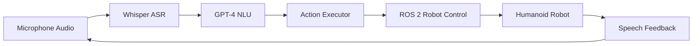

# Voice-to-Action with OpenAI Whisper

## Prerequisites

Before starting this chapter, you should have:

- ✅ Completed Modules 1-3 (ROS 2, Simulation, NVIDIA Isaac)
- ✅ Understanding of audio processing basics
- ✅ Familiarity with large language models (LLMs)
- ✅ Python programming experience with async/await
- ✅ OpenAI API access (for Whisper and GPT models)

**Estimated Reading Time**: 25-30 minutes

---

## Introduction

Voice interaction represents the most natural interface between humans and robots. While traditional robot control requires joysticks, keyboards, or programmed sequences, voice commands enable intuitive, hands-free operation. Imagine instructing a humanoid robot: *"Pick up the red cup from the table and place it in the recycling bin"* — and watching the robot execute the task autonomously.

This chapter demonstrates how to build a complete voice-to-action pipeline using **OpenAI Whisper** for speech recognition, **GPT-4** for natural language understanding, and **ROS 2** for robot control. You'll learn to process audio input, translate speech to text, extract actionable commands, and trigger robot behaviors.

**Why Whisper?** OpenAI's Whisper is a state-of-the-art automatic speech recognition (ASR) model trained on 680,000 hours of multilingual data. Unlike traditional ASR systems that require wake words or limited vocabulary, Whisper handles natural speech, accents, background noise, and 99 languages. This makes it ideal for real-world robotics applications where environmental conditions vary.

**Learning Objectives**:
1. Integrate OpenAI Whisper for real-time speech recognition
2. Process voice commands and extract robot actions
3. Implement natural language understanding (NLU) pipelines
4. Handle multi-lingual voice interactions
5. Build error handling and confirmation workflows

---

## Voice-to-Action Architecture

The voice-to-action system consists of four main stages:



**Pipeline Stages**:

1. **Audio Capture**: Record user speech via microphone (ReSpeaker, USB mic)
2. **Speech Recognition (ASR)**: Convert audio → text using Whisper
3. **Natural Language Understanding (NLU)**: Extract intent and parameters using GPT-4
4. **Action Execution**: Map commands to ROS 2 actions (move, grasp, navigate)
5. **Feedback Loop**: Confirm execution via text-to-speech (TTS)

---

## Setting Up the Development Environment

### 1. Install Dependencies

```bash
# Create a ROS 2 workspace for voice control
mkdir -p ~/robot_ws/src
cd ~/robot_ws/src

# Install Python dependencies
pip install openai pyaudio numpy soundfile

# Install ROS 2 audio packages
sudo apt install ros-humble-audio-common portaudio19-dev

# Install Whisper (local option - optional)
pip install openai-whisper
```

### 2. Configure OpenAI API

```python
# config.py
import os

OPENAI_API_KEY = os.getenv("OPENAI_API_KEY")  # Set via: export OPENAI_API_KEY="sk-..."
WHISPER_MODEL = "whisper-1"  # API model
GPT_MODEL = "gpt-4"

# Audio settings
SAMPLE_RATE = 16000  # 16 kHz (Whisper requirement)
CHUNK_SIZE = 1024
CHANNELS = 1  # Mono
```

### 3. Test Microphone Access

```python
# test_mic.py
import pyaudio
import numpy as np

def test_microphone():
    p = pyaudio.PyAudio()

    # List available devices
    print("Available audio devices:")
    for i in range(p.get_device_count()):
        info = p.get_device_info_by_index(i)
        print(f"{i}: {info['name']} (Channels: {info['maxInputChannels']})")

    # Record 3 seconds
    stream = p.open(format=pyaudio.paInt16, channels=1, rate=16000,
                    input=True, frames_per_buffer=1024)
    print("\nRecording for 3 seconds...")
    frames = [stream.read(1024) for _ in range(int(16000 / 1024 * 3))]
    stream.close()
    p.terminate()

    audio = np.frombuffer(b''.join(frames), dtype=np.int16)
    print(f"Recorded {len(audio)} samples. Max amplitude: {np.max(np.abs(audio))}")

if __name__ == "__main__":
    test_microphone()
```

---

## Building the Speech Recognition Module

### Core Whisper Integration

```python
# whisper_asr.py
import openai
from openai import OpenAI
import soundfile as sf
import io

class WhisperASR:
    def __init__(self, api_key: str):
        self.client = OpenAI(api_key=api_key)

    def transcribe(self, audio_data: bytes, language: str = "en") -> str:
        """
        Convert audio bytes to text using Whisper API.

        Args:
            audio_data: Raw audio bytes (WAV format)
            language: ISO language code (en, ur, es, fr, etc.)

        Returns:
            Transcribed text string
        """
        try:
            # Create in-memory file-like object
            audio_file = io.BytesIO(audio_data)
            audio_file.name = "audio.wav"

            # Call Whisper API
            transcript = self.client.audio.transcriptions.create(
                model="whisper-1",
                file=audio_file,
                language=language,
                response_format="text"
            )

            return transcript.strip()

        except Exception as e:
            print(f"Whisper API error: {e}")
            return ""

    def transcribe_with_timestamps(self, audio_data: bytes):
        """Get word-level timestamps (useful for alignment)"""
        audio_file = io.BytesIO(audio_data)
        audio_file.name = "audio.wav"

        response = self.client.audio.transcriptions.create(
            model="whisper-1",
            file=audio_file,
            response_format="verbose_json",
            timestamp_granularities=["word"]
        )

        return response  # Contains words array with timestamps
```

### Real-Time Audio Capture

```python
# audio_capture.py
import pyaudio
import wave
import numpy as np
from collections import deque

class AudioCapture:
    def __init__(self, sample_rate=16000, chunk_size=1024):
        self.sample_rate = sample_rate
        self.chunk_size = chunk_size
        self.p = pyaudio.PyAudio()
        self.stream = None
        self.buffer = deque(maxlen=int(sample_rate * 10))  # 10-sec buffer

    def start_stream(self):
        self.stream = self.p.open(
            format=pyaudio.paInt16,
            channels=1,
            rate=self.sample_rate,
            input=True,
            frames_per_buffer=self.chunk_size,
            stream_callback=self._audio_callback
        )
        self.stream.start_stream()

    def _audio_callback(self, in_data, frame_count, time_info, status):
        audio_chunk = np.frombuffer(in_data, dtype=np.int16)
        self.buffer.extend(audio_chunk)
        return (in_data, pyaudio.paContinue)

    def get_audio_segment(self, duration_sec=5):
        """Extract last N seconds of audio"""
        samples = int(self.sample_rate * duration_sec)
        audio = np.array(list(self.buffer)[-samples:], dtype=np.int16)

        # Convert to WAV bytes
        wav_buffer = io.BytesIO()
        with wave.open(wav_buffer, 'wb') as wf:
            wf.setnchannels(1)
            wf.setsampwidth(2)  # 16-bit
            wf.setframerate(self.sample_rate)
            wf.writeframes(audio.tobytes())

        wav_buffer.seek(0)
        return wav_buffer.read()

    def stop(self):
        if self.stream:
            self.stream.stop_stream()
            self.stream.close()
        self.p.terminate()
```

---

## Natural Language Understanding with GPT-4

Once we have the transcribed text, we need to extract **actionable commands**. For example:
- User says: *"Move forward 2 meters and turn left"*
- Expected output: `[{action: "move", distance: 2.0, direction: "forward"}, {action: "turn", angle: 90, direction: "left"}]`

### Command Extraction Pipeline

```python
# nlu_processor.py
from openai import OpenAI
import json

class NLUProcessor:
    def __init__(self, api_key: str):
        self.client = OpenAI(api_key=api_key)
        self.system_prompt = """You are a robot command interpreter.
Extract robot actions from natural language commands.

Available actions:
- move(direction, distance_meters)
- turn(direction, angle_degrees)
- grasp(object_name, hand)
- release(hand)
- navigate_to(location_name)
- wait(seconds)

Output JSON array of actions. Example:
User: "Go forward 3 meters then pick up the red cup"
Output: [{"action": "move", "direction": "forward", "distance": 3.0},
         {"action": "grasp", "object": "red cup", "hand": "right"}]
"""

    def extract_actions(self, text: str) -> list:
        """Convert natural language → structured actions"""
        try:
            response = self.client.chat.completions.create(
                model="gpt-4",
                messages=[
                    {"role": "system", "content": self.system_prompt},
                    {"role": "user", "content": text}
                ],
                temperature=0.0,  # Deterministic output
                response_format={"type": "json_object"}
            )

            result = json.loads(response.choices[0].message.content)
            return result.get("actions", [])

        except Exception as e:
            print(f"NLU error: {e}")
            return []
```

---

## ROS 2 Integration

### Action Server for Robot Control

```python
# robot_action_server.py
import rclpy
from rclpy.action import ActionServer
from rclpy.node import Node
from geometry_msgs.msg import Twist
from std_msgs.msg import String
import time

class RobotActionServer(Node):
    def __init__(self):
        super().__init__('robot_action_server')
        self.cmd_vel_pub = self.create_publisher(Twist, '/cmd_vel', 10)
        self.status_pub = self.create_publisher(String, '/robot/status', 10)

    def execute_move(self, direction: str, distance: float):
        """Execute linear movement"""
        twist = Twist()

        # Map direction to velocity
        speed = 0.5  # m/s
        if direction == "forward":
            twist.linear.x = speed
        elif direction == "backward":
            twist.linear.x = -speed

        # Calculate duration
        duration = distance / speed

        # Publish velocity
        start_time = time.time()
        while time.time() - start_time < duration:
            self.cmd_vel_pub.publish(twist)
            time.sleep(0.1)

        # Stop
        self.cmd_vel_pub.publish(Twist())
        self.get_logger().info(f"Moved {direction} {distance}m")

    def execute_turn(self, direction: str, angle: float):
        """Execute rotation"""
        twist = Twist()
        angular_speed = 0.5  # rad/s

        if direction == "left":
            twist.angular.z = angular_speed
        elif direction == "right":
            twist.angular.z = -angular_speed

        # Convert degrees to radians and calculate duration
        angle_rad = angle * (3.14159 / 180.0)
        duration = angle_rad / angular_speed

        start_time = time.time()
        while time.time() - start_time < duration:
            self.cmd_vel_pub.publish(twist)
            time.sleep(0.1)

        self.cmd_vel_pub.publish(Twist())
        self.get_logger().info(f"Turned {direction} {angle}°")
```

---

## Complete Voice Control System

### Main Application

```python
# voice_robot_control.py
import rclpy
from whisper_asr import WhisperASR
from nlu_processor import NLUProcessor
from robot_action_server import RobotActionServer
from audio_capture import AudioCapture
import os

def main():
    # Initialize ROS 2
    rclpy.init()
    robot = RobotActionServer()

    # Initialize AI models
    api_key = os.getenv("OPENAI_API_KEY")
    whisper = WhisperASR(api_key)
    nlu = NLUProcessor(api_key)

    # Start audio capture
    audio = AudioCapture()
    audio.start_stream()

    print("🎤 Voice control active. Say commands (Ctrl+C to exit):")

    try:
        while rclpy.ok():
            input("Press Enter to record command...")

            # Capture 5 seconds of audio
            audio_data = audio.get_audio_segment(duration_sec=5)

            # Speech → Text
            text = whisper.transcribe(audio_data)
            print(f"📝 Heard: {text}")

            if not text:
                continue

            # Text → Actions
            actions = nlu.extract_actions(text)
            print(f"🤖 Actions: {actions}")

            # Execute actions
            for action in actions:
                if action["action"] == "move":
                    robot.execute_move(action["direction"], action["distance"])
                elif action["action"] == "turn":
                    robot.execute_turn(action["direction"], action["angle"])
                # Add more action handlers...

            print("✅ Command completed\n")

    except KeyboardInterrupt:
        print("\nShutting down...")
    finally:
        audio.stop()
        robot.destroy_node()
        rclpy.shutdown()

if __name__ == "__main__":
    main()
```

---

## Exercise 1: Voice-Controlled Navigation

**Task**: Create a voice-controlled robot that can navigate a simple environment.

**Requirements**:
1. Accept commands: "Go to the kitchen", "Move to the bedroom"
2. Use Nav2 for path planning
3. Provide voice feedback: "Navigating to kitchen..."

**Starter Code**:
```python
def navigate_to_location(location: str):
    """Navigate to named location using Nav2"""
    # TODO: Implement Nav2 goal publisher
    # TODO: Add location name → coordinates mapping
    pass
```

**Acceptance Criteria**:
- [ ] Robot responds to at least 5 location names
- [ ] Handles obstacles using Nav2
- [ ] Provides audio confirmation

---

## Exercise 2: Multi-Lingual Voice Control

**Task**: Extend the system to support Urdu voice commands.

**Example Commands**:
- Urdu: *"آگے بڑھو"* (Move forward)
- Urdu: *"دائیں مڑو"* (Turn right)

**Implementation Hints**:
```python
# Detect language and transcribe
transcript = whisper.transcribe(audio_data, language="ur")

# Add Urdu action mapping
URDU_ACTIONS = {
    "آگے": "forward",
    "پیچھے": "backward",
    "دائیں": "right",
    "بائیں": "left"
}
```

---

## Common Issues and Solutions

| Issue | Cause | Solution |
|-------|-------|----------|
| High latency (>5s) | Cloud API round-trip | Use local Whisper model: `whisper.load_model("base")` |
| Background noise | Poor microphone | Use noise cancellation: `noisereduce` library |
| Misrecognition | Accent/unclear speech | Add confirmation step: "Did you say: move forward?" |
| Command timeouts | Network issues | Implement retry logic with exponential backoff |

---

## Key Takeaways

- **Whisper** provides state-of-the-art speech recognition with 99-language support
- **GPT-4** enables flexible natural language understanding without hard-coded grammars
- **ROS 2** provides the robot control layer for action execution
- **Confirmation loops** prevent dangerous misinterpretations
- **Local models** (Whisper base) reduce latency for real-time applications

Voice control transforms robot interaction from technical to conversational. By combining ASR, NLU, and robot control, you create systems that feel truly intelligent.

---

**Previous Chapter**: [Training and Deploying VLA Systems](/docs/module-4-vla/vla-training-deployment)
**Next Chapter**: [Cognitive Planning with LLMs](./cognitive-planning.md)

In the next chapter, we'll explore how LLMs can reason about complex tasks, break them into subtasks, and adapt plans when the environment changes.
