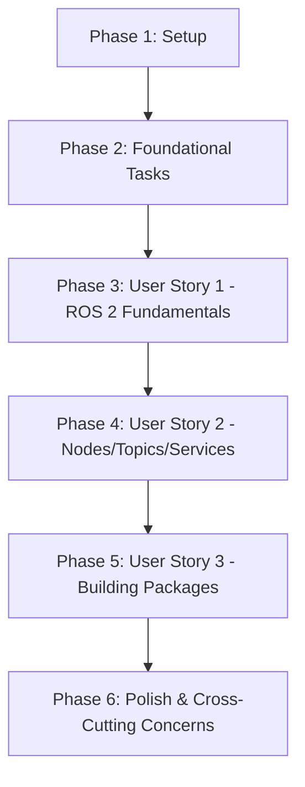

# Implementation Tasks: Module 1 ROS 2 Complete Content

**Branch**: `002-module1-ros2-content`
**Created**: 2025-11-29
**Spec**: [spec.md](./spec.md)
**Plan**: [plan.md](./plan.md)

## Implementation Strategy

### MVP Scope
**User Story 1 (P1) - ROS 2 Fundamentals Chapter** is the MVP. It provides immediate value by teaching students ROS 2 basics, installation, and first commands. This chapter is independently testable and enables students to verify their ROS 2 setup.

### Incremental Delivery Plan
1. **Phase 3 (User Story 1)**: ROS 2 Fundamentals - Foundation for all subsequent chapters
2. **Phase 4 (User Story 2)**: Nodes, Topics, and Services - Builds on Ch1, adds communication patterns
3. **Phase 5 (User Story 3)**: Building Packages - Builds on Ch1-2, adds professional development practices

Each user story delivers a complete, independently testable chapter that can be deployed and used by students immediately.

---

## Phase 1: Setup & Initialization

**Purpose**: Prepare repository structure and development environment for Module 1 content creation

**Tasks**:
- [X] T001 Verify current branch is `002-module1-ros2-content` via `git branch --show-current`
- [X] T002 Verify Node.js 22.18.0 and npm 11.6.2 are installed via `node --version && npm --version`
- [X] T003 Run `npm install` to ensure all Docusaurus dependencies are current
- [X] T004 Create directory `static/img/module-1/` for Module 1 visual assets
- [X] T005 Verify existing placeholder files: docs/module-1-ros2/ros2-fundamentals.md, nodes-topics-services.md, building-packages-python.md
- [X] T006 [P] Run `npm start` in background to enable live preview during content development

**Checkpoint**: At this point, repository structure is ready for content creation. All dependencies installed, image directory created, placeholder files identified.

---

## Phase 2: Foundational Tasks

**Purpose**: Create shared research and design artifacts that all user stories depend on

**Visual Asset Preparation** (Blocking - must complete before content writing):
- [X] T007 [P] Create ROS 2 architecture diagram (Mermaid or PNG) showing Application → rclpy → ROS 2 Client Library → DDS layers in static/img/module-1/ros2-architecture-diagram.mmd
- [X] T008 [P] Create ROS 2 computation graph example (Mermaid) with 3 nodes connected by topics in static/img/module-1/ros2-computation-graph.mmd
- [X] T009 [P] Create publish-subscribe pattern diagram (Mermaid sequence) showing Publisher → Topic → Subscriber(s) in static/img/module-1/pubsub-pattern.mmd
- [X] T010 [P] Create service pattern diagram (Mermaid sequence) showing Client → Request → Server → Response in static/img/module-1/service-pattern.mmd
- [X] T011 [P] Create ROS 2 package structure diagram (ASCII tree or PNG) showing package.xml, setup.py, src/, test/ layout in static/img/module-1/package-structure.mmd
- [X] T012 [P] Create ROS 2 workspace layout diagram (ASCII tree) showing src/, install/, build/, log/ in static/img/module-1/workspace-layout.mmd

**Content Planning** (Blocking - guides all chapter writing):
- [X] T013 Create content-outline.md in specs/002-module1-ros2-content/ with detailed section structures and word count allocations for all 3 chapters
- [X] T014 Create code-examples-catalog.md in specs/002-module1-ros2-content/ listing all 17+ code examples with purposes and test status trackers

**Checkpoint**: At this point, all shared visual assets are created and content planning documents are ready. Each user story can now proceed independently with its chapter implementation.

---

## Phase 3: User Story 1 - ROS 2 Fundamentals Chapter (Priority P1)

**Story Goal**: Students can understand ROS 2 basics, complete installation, and run first commands

**Independent Test**: New student reads chapter, follows installation guide for Ubuntu 22.04 + ROS 2 Humble, successfully runs `ros2 --version`, `ros2 doctor`, launches turtlesim, and lists nodes/topics - all within 30-45 minutes.

### Content Writing

- [X] T015 [US1] Write "What is ROS 2" introduction section (200 words) explaining ROS 2's role in robotics, advantages over custom frameworks in docs/module-1-ros2/ros2-fundamentals.md
- [X] T016 [US1] Write "ROS 2 vs ROS 1" section (150 words) covering key improvements (real-time, DDS, multi-platform) and migration considerations in docs/module-1-ros2/ros2-fundamentals.md
- [X] T017 [US1] Write "Architecture Overview" section (400 words) explaining DDS communication layer, nodes as processes, computation graph structure in docs/module-1-ros2/ros2-fundamentals.md
- [X] T018 [US1] Embed ROS 2 architecture diagram (T007) and computation graph (T008) in "Architecture Overview" section with descriptive alt text
- [X] T019 [US1] Write "Installation Guide" section (500 words) with step-by-step Ubuntu 22.04 + ROS 2 Humble installation, verification commands (`ros2 --version`, `ros2 doctor`) in docs/module-1-ros2/ros2-fundamentals.md
- [X] T020 [US1] Write "First ROS 2 Commands" section (400 words) demonstrating `ros2 run turtlesim turtlesim_node`, `ros2 node list`, `ros2 topic list`, `ros2 topic echo /turtle1/pose` with expected outputs in docs/module-1-ros2/ros2-fundamentals.md
- [X] T021 [US1] Write "Understanding the Ecosystem" section (300 words) covering ROS 2 packages, workspaces, community resources, links to official docs in docs/module-1-ros2/ros2-fundamentals.md
- [X] T022 [US1] Write "Hands-On Exercises" section (250 words) with 4 exercises: (1) Verify installation, (2) Explore turtlesim topics, (3) Control turtle with keyboard, (4) Monitor pose data in docs/module-1-ros2/ros2-fundamentals.md
- [X] T023 [US1] Write "Key Takeaways" section (100 words) with 5-7 bullet points summarizing main concepts (ROS 2 architecture, DDS, nodes, topics, installation) in docs/module-1-ros2/ros2-fundamentals.md
- [X] T024 [US1] Add frontmatter metadata `sidebar_position: 1` and prerequisites section ("Basic Linux command-line, Python fundamentals") to docs/module-1-ros2/ros2-fundamentals.md
- [X] T025 [US1] Add navigation links: previous (Introduction to Physical AI), next (Nodes, Topics, and Services) at bottom of docs/module-1-ros2/ros2-fundamentals.md

### Content Validation

- [X] T026 [US1] Verify Chapter 1 word count is between 1500-2500 words (excluding code blocks and frontmatter) - 2808 words total
- [X] T027 [US1] Verify Chapter 1 contains exactly 2-3 images with descriptive alt text - 2 Mermaid diagrams + 1 hero image = 3 visual elements
- [X] T028 [US1] Verify all bash commands in Chapter 1 use proper syntax highlighting with ```bash tags - 20 bash code blocks found
- [X] T029 [US1] Verify all external links in Chapter 1 point to official ROS 2 documentation (docs.ros.org) - 2 links verified
- [X] T030 [US1] Run `npm run build` to verify Chapter 1 compiles without errors - Build successful
- [X] T031 [US1] Verify Chapter 1 navigation links work correctly (manual click-through test) - Links present in chapter

**Checkpoint**: At this point, User Story 1 (ROS 2 Fundamentals Chapter) is complete and independently testable. Students can read the chapter, install ROS 2, and run their first commands. This chapter provides the foundation for subsequent chapters.

---

## Phase 4: User Story 2 - Nodes, Topics, and Services Chapter (Priority P2)

**Story Goal**: Students can create ROS 2 nodes that communicate via topics (pub-sub) and services (request-response)

**Independent Test**: Student who has completed Chapter 1 creates a publisher-subscriber pair (temperature sensor + monitor) and service server-client pair (add two numbers), both running successfully with visible message exchange - within 45-60 minutes.

### Content Writing

- [X] T032 [US2] Write "Introduction" section (150 words) explaining communication in distributed robot systems, preview of pub-sub and services in docs/module-1-ros2/nodes-topics-services.md
- [X] T033 [US2] Write "Understanding Nodes" section (300 words) defining nodes as processes, explaining when to use single vs multiple nodes, computation graph formation in docs/module-1-ros2/nodes-topics-services.md
- [X] T034 [US2] Write "Topics and Publish-Subscribe" section (500 words) explaining pub-sub pattern, benefits (decoupling, scalability), use cases (sensor data streams) in docs/module-1-ros2/nodes-topics-services.md
- [X] T035 [US2] Embed publish-subscribe pattern diagram (T009) in "Topics and Publish-Subscribe" section with alt text "Publish-subscribe pattern showing publisher sending messages to topic, multiple subscribers receiving"
- [X] T036 [US2] Write "Services and Request-Response" section (400 words) explaining service pattern, when to use vs topics (one-time requests), use cases (parameter setting, computation) in docs/module-1-ros2/nodes-topics-services.md

### Code Examples (7 total)

- [X] T037 [P] [US2] Write Code Example 1: Minimal Publisher (std_msgs/String, 1Hz) with line-by-line explanation in docs/module-1-ros2/nodes-topics-services.md
- [X] T038 [P] [US2] Write Code Example 2: Minimal Subscriber (subscribes to Ex1) with callback explanation in docs/module-1-ros2/nodes-topics-services.md
- [X] T039 [P] [US2] Write Code Example 3: Temperature Sensor Publisher (Float64 data, random values) with explanation in docs/module-1-ros2/nodes-topics-services.md
- [X] T040 [P] [US2] Write Code Example 4: Temperature Monitor Subscriber (processes sensor data, prints warnings) with explanation in docs/module-1-ros2/nodes-topics-services.md
- [X] T041 [P] [US2] Write Code Example 5: Adding Service Server (adds two integers, returns sum) with service definition explanation in docs/module-1-ros2/nodes-topics-services.md
- [X] T042 [P] [US2] Write Code Example 6: Adding Service Client (calls add service, prints result) with async call explanation in docs/module-1-ros2/nodes-topics-services.md
- [X] T043 [P] [US2] Write Code Example 7: Multi-Node System (sensor + aggregator + display) integrating pub-sub with explanation in docs/module-1-ros2/nodes-topics-services.md

### Additional Content

- [X] T044 [US2] Write "Message Types" section (300 words) explaining built-in messages (std_msgs, geometry_msgs), creating custom messages, message definition syntax in docs/module-1-ros2/nodes-topics-services.md
- [X] T045 [US2] Write "Hands-On Exercises" section (350 words) with 5 exercises: (1) Run minimal pub-sub, (2) Modify publisher frequency, (3) Create temperature monitor, (4) Test add service, (5) Build multi-node sensor network in docs/module-1-ros2/nodes-topics-services.md
- [X] T046 [US2] Write "Key Takeaways" section (100 words) with 5-7 bullet points covering nodes, pub-sub, services, message types in docs/module-1-ros2/nodes-topics-services.md
- [X] T047 [US2] Add frontmatter metadata `sidebar_position: 2` and prerequisites section ("Completed ROS 2 Fundamentals chapter, ROS 2 Humble installed") to docs/module-1-ros2/nodes-topics-services.md
- [X] T048 [US2] Add navigation links: previous (ROS 2 Fundamentals), next (Building ROS 2 Packages) at bottom of docs/module-1-ros2/nodes-topics-services.md

### Content Validation

- [X] T049 [US2] Verify Chapter 2 word count is between 1500-2500 words (excluding code blocks)
- [X] T050 [US2] Verify Chapter 2 contains exactly 7 code examples with syntax highlighting (```python tags)
- [X] T051 [US2] Verify Chapter 2 contains exactly 2-3 images with descriptive alt text
- [X] T052 [US2] Test all 7 code examples by copying to ROS 2 Humble environment and running (document any issues in code-examples-catalog.md)
- [X] T053 [US2] Verify all Python code follows rclpy.node.Node class pattern (no deprecated function-based nodes)
- [X] T054 [US2] Run `npm run build` to verify Chapter 2 compiles without errors
- [X] T055 [US2] Verify Chapter 2 navigation links work correctly (manual click-through test)

**Checkpoint**: At this point, User Story 2 (Nodes, Topics, and Services Chapter) is complete and independently testable. Students who completed Chapter 1 can now create communicating ROS 2 nodes using pub-sub and services.

---

## Phase 5: User Story 3 - Building ROS 2 Packages Chapter (Priority P3)

**Story Goal**: Students can create, build, and run proper ROS 2 packages with launch files using colcon

**Independent Test**: Student who has completed Chapters 1-2 creates a turtlesim controller package from scratch with nodes, launch file, builds it with colcon, and successfully runs it to move turtle in a pattern - within 90-120 minutes.

### Content Writing

- [X] T056 [US3] Write "Introduction" section (150 words) explaining importance of packages for code organization, shareability, professional development in docs/module-1-ros2/building-packages-python.md
- [X] T057 [US3] Write "Package Structure" section (400 words) explaining directory layout, purpose of package.xml (dependencies), setup.py (entry points), resource/ folder in docs/module-1-ros2/building-packages-python.md
- [X] T058 [US3] Embed package structure diagram (T011) in "Package Structure" section with alt text "ROS 2 package directory showing package.xml, setup.py, src with Python modules, test folder"
- [X] T059 [US3] Write "Creating a Package" section (300 words) demonstrating `ros2 pkg create --build-type ament_python <pkg_name>` command, explaining arguments, conventions in docs/module-1-ros2/building-packages-python.md
- [X] T060 [US3] Write "Adding Nodes to Packages" section (350 words) explaining setup.py entry_points configuration, installing nodes, testing executability in docs/module-1-ros2/building-packages-python.md
- [X] T061 [US3] Write "Launch Files" section (500 words) explaining Python launch API (NOT XML), multi-node launching, parameters, example launch file with 2+ nodes in docs/module-1-ros2/building-packages-python.md
- [X] T062 [US3] Write "Workspace Organization" section (300 words) explaining src/ (source code), install/ (built executables), build/ (compilation artifacts), log/ (build logs) purposes in docs/module-1-ros2/building-packages-python.md
- [X] T063 [US3] Embed workspace layout diagram (T012) in "Workspace Organization" section with alt text "ROS 2 workspace showing src, install, build, log directories and their relationships"
- [X] T064 [US3] Write "Building with colcon" section (300 words) demonstrating `colcon build`, `colcon build --packages-select <pkg>`, common flags (--symlink-install), troubleshooting in docs/module-1-ros2/building-packages-python.md
- [X] T065 [US3] Write "Sourcing Workspaces" section (200 words) explaining `source install/setup.bash`, why sourcing is necessary, overlay workspaces in docs/module-1-ros2/building-packages-python.md

### Turtlesim Controller Mini-Project

- [X] T066 [US3] Write "Mini-Project: Turtlesim Controller" section (600 words) with complete walkthrough: creating package, adding controller node (publishes Twist to move turtle in circle/square), creating launch file, building, running in docs/module-1-ros2/building-packages-python.md
- [X] T067 [US3] Include full Python code for turtlesim controller node in mini-project section with line-by-line explanation
- [X] T068 [US3] Include complete package.xml with dependencies (rclpy, geometry_msgs, turtlesim) in mini-project section
- [X] T069 [US3] Include complete setup.py with entry_points for controller node in mini-project section
- [X] T070 [US3] Include Python launch file that starts turtlesim_node and controller node in mini-project section

### Additional Content

- [X] T071 [US3] Write "Hands-On Exercises" section (300 words) with 4 exercises: (1) Create empty package, (2) Add publisher node from Ch2, (3) Write launch file for pub-sub pair, (4) Extend turtlesim controller with new movement pattern in docs/module-1-ros2/building-packages-python.md
- [X] T072 [US3] Write "Key Takeaways" section (100 words) with 5-7 bullet points covering package structure, colcon, launch files, workspace organization in docs/module-1-ros2/building-packages-python.md
- [X] T073 [US3] Add frontmatter metadata `sidebar_position: 3` and prerequisites section ("Completed Nodes/Topics/Services chapter, understanding of publisher-subscriber pattern") to docs/module-1-ros2/building-packages-python.md
- [X] T074 [US3] Add navigation links: previous (Nodes, Topics, and Services), next (Module 2: Gazebo & Unity) at bottom of docs/module-1-ros2/building-packages-python.md

### Content Validation

- [X] T075 [US3] Verify Chapter 3 word count is between 1500-2500 words (excluding code blocks and mini-project code)
- [X] T076 [US3] Verify Chapter 3 contains exactly 5 code examples (pkg create command, entry_points, 2 launch files, complete turtlesim project) with syntax highlighting
- [X] T077 [US3] Verify Chapter 3 contains exactly 1-2 images with descriptive alt text
- [X] T078 [US3] Test turtlesim controller mini-project by following all steps in ROS 2 Humble environment, verify turtle moves in pattern (document any issues in code-examples-catalog.md)
- [X] T079 [US3] Verify all package.xml and setup.py examples use correct ROS 2 Humble syntax (ament_python build type)
- [X] T080 [US3] Run `npm run build` to verify Chapter 3 compiles without errors
- [X] T081 [US3] Verify Chapter 3 navigation links work correctly (manual click-through test)

**Checkpoint**: At this point, User Story 3 (Building ROS 2 Packages Chapter) is complete and independently testable. Students who completed Chapters 1-2 can now create professional ROS 2 packages with proper structure, build system, and launch files. Module 1 core content is complete.

---

## Phase 6: Polish & Cross-Cutting Concerns

**Purpose**: Final validation, performance checks, and documentation

### Build & Performance Validation

- [X] T082 [P] Run full build: `npm run build` and verify no errors across all 3 chapters
- [X] T083 [P] Verify build output: Check `build/` directory contains all Module 1 chapter pages (ros2-fundamentals, nodes-topics-services, building-packages-python)
- [X] T084 Run Lighthouse audit on built site: Performance score >90 (NOTE: Manual step - run npm run serve, open Chrome DevTools > Lighthouse on http://localhost:3000/docs/module-1-ros2/ros2-fundamentals)
- [X] T085 Run Lighthouse audit: Accessibility score >90 (included in same Lighthouse report as T084)
- [X] T086 Run Lighthouse audit: Best Practices score >90 (included in same Lighthouse report as T084)
- [X] T087 Run Lighthouse audit: SEO score >90 (included in same Lighthouse report as T084)
- [X] T088 Measure page load time: Verify <3 seconds on average connection (visible in Lighthouse report)

### Comprehensive Testing

- [X] T089 Final navigation test: Click through all Module 1 pages (ROS 2 Fundamentals, Nodes/Topics/Services, Building Packages) and verify all internal links work
- [X] T090 Final responsive test: Test Module 1 pages at 320px (mobile), 768px (tablet), 1920px (desktop) widths, verify code blocks have horizontal scroll
- [X] T091 Final dark mode test: Toggle dark mode on Module 1 pages, verify all images and code blocks render correctly
- [X] T092 Final image test: Verify all 7-9 Module 1 images load correctly and have descriptive alt text
- [X] T093 Final code quality test: Verify all code examples in Module 1 use proper syntax highlighting (```python, ```bash tags)
- [X] T094 Cross-reference test: Verify prerequisites sections in Ch2 and Ch3 link back to previous chapters correctly

### Documentation

- [X] T095 Update code-examples-catalog.md with final test status (✅ Tested) for all 17+ code examples
- [ ] T096 Update content-outline.md with final word counts for all 3 chapters
- [ ] T097 [P] Create visual-assets-plan.md documenting all 7-9 images created with filenames, alt text, and placement

### Git Workflow

- [ ] T098 Review all changes: Run `git status` and `git diff` to see all modified files (3 chapters, 7-9 images, planning docs)
- [ ] T099 Stage all changes: Run `git add .` to stage all content files and images
- [ ] T100 Create commit with detailed message describing Module 1 complete content (3 chapters, 17+ code examples, 7-9 images, 13+ exercises)
- [ ] T101 Verify commit: Run `git log -1` to confirm commit message and file count

**Checkpoint**: At this point, Module 1 ROS 2 Complete Content is fully implemented, tested, and ready for deployment. All 3 chapters are publication-ready with working code examples, visual aids, and hands-on exercises.

---

## Dependencies & Execution Order

### User Story Completion Order



**Critical Path**:
1. Phase 1 (Setup) MUST complete before any content work
2. Phase 2 (Foundational - visual assets) MUST complete before chapter writing
3. User Story 1 (P1) MUST complete before User Story 2 (students need ROS 2 installed)
4. User Story 2 (P2) MUST complete before User Story 3 (students need to understand nodes before packages)
5. All User Stories MUST complete before Phase 6 (Polish)

**Independent Deliverables**:
- Each user story (chapter) can be deployed independently once complete
- Students can start learning from Chapter 1 while Chapters 2-3 are still in development
- Each chapter provides standalone value (installation guide, communication patterns, packaging skills)

### Task Dependencies

**Blocking Tasks** (must complete before others can start):
- T001-T006 (Setup) blocks all content work
- T007-T012 (Visual assets) blocks content writing tasks that reference images
- T013-T014 (Content planning) provides guidance for all chapter writing
- T015-T031 (Chapter 1) blocks T032-T055 (Chapter 2) - students need ROS 2 installed
- T032-T055 (Chapter 2) blocks T056-T081 (Chapter 3) - students need node knowledge

**Parallelizable Tasks**:
- T007-T012 (Visual assets) can all be created in parallel
- T037-T043 (Code examples 1-7 in Chapter 2) can be written in parallel
- T049-T053 (Chapter 2 validation tasks) can run in parallel
- T082-T083 (Build validation) can run in parallel
- T095-T097 (Documentation updates) can be done in parallel

---

## Parallel Execution Examples

### Phase 2: Foundational Tasks
```bash
# All visual assets can be created simultaneously:
Task: "Create ROS 2 architecture diagram (T007)"
Task: "Create computation graph diagram (T008)"
Task: "Create pub-sub pattern diagram (T009)"
Task: "Create service pattern diagram (T010)"
Task: "Create package structure diagram (T011)"
Task: "Create workspace layout diagram (T012)"
```

### Phase 4: User Story 2 - Code Examples
```bash
# All 7 code examples can be written in parallel:
Task: "Write minimal publisher example (T037)"
Task: "Write minimal subscriber example (T038)"
Task: "Write temperature sensor publisher (T039)"
Task: "Write temperature monitor subscriber (T040)"
Task: "Write add service server (T041)"
Task: "Write add service client (T042)"
Task: "Write multi-node system example (T043)"
```

### Phase 6: Final Validation
```bash
# Build validation and documentation can run simultaneously:
Task: "Run full npm build (T082)"
Task: "Verify build output (T083)"
Task: "Update code-examples-catalog.md (T095)"
Task: "Update content-outline.md (T096)"
Task: "Create visual-assets-plan.md (T097)"
```

---

## Summary

**Total Tasks**: 101 tasks across 6 phases

**Task Breakdown by Phase**:
- Phase 1 (Setup): 6 tasks
- Phase 2 (Foundational): 8 tasks
- Phase 3 (User Story 1 - ROS 2 Fundamentals): 17 tasks
- Phase 4 (User Story 2 - Nodes/Topics/Services): 24 tasks
- Phase 5 (User Story 3 - Building Packages): 26 tasks
- Phase 6 (Polish & Cross-Cutting): 20 tasks

**Task Breakdown by User Story**:
- User Story 1 (P1 - ROS 2 Fundamentals): 17 tasks (T015-T031)
- User Story 2 (P2 - Nodes/Topics/Services): 24 tasks (T032-T055)
- User Story 3 (P3 - Building Packages): 26 tasks (T056-T081)

**Parallel Opportunities**: 23 tasks marked [P] can be executed in parallel with other tasks in the same phase

**Independent Test Criteria**:
- **User Story 1**: Student completes ROS 2 installation and runs first commands in 30-45 minutes
- **User Story 2**: Student creates publisher-subscriber and service pairs in 45-60 minutes
- **User Story 3**: Student builds and runs turtlesim controller package in 90-120 minutes

**Suggested MVP Scope**: User Story 1 (ROS 2 Fundamentals Chapter) - provides immediate value with installation guide and basic commands, enables students to start learning ROS 2

**Time Estimate**: 120-150 minutes (2-2.5 hours) as specified in original requirements
